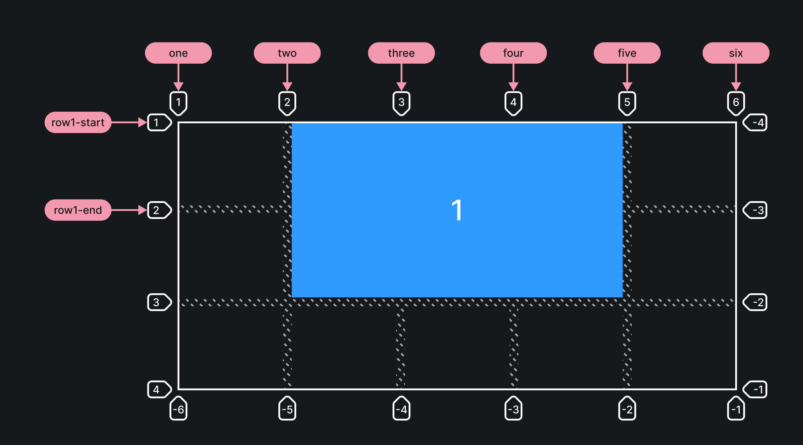

## Кратко

Определяют положение элемента внутри грид-сетки при помощи указания на конкретные направляющие линии.

## Пример

Элемент разместился по горизонтали от второй грид-линии до линии под названием `[five]`, а по вертикали — от линии с именем `[row1-start]` до линии с номером 3:

```css
.container {
  display: grid;
  grid-template-columns: [one] 1fr [two] 1fr [three] 1fr [four] 1fr [five] 1fr [six];
  grid-template-rows: [row1-start] 1fr [row1-end] 1fr 1fr;
}

.item1 {
  grid-column-start: 2;
  grid-column-end: five;
  grid-row-start: row1-start;
  grid-row-end: 3;
}
```



## Как пишется

- `[name]` или `1` — порядковый номер или название конкретной линии.
- `span 2` — элемент растянется на указанное количество ячеек.
- `span [name]` — элемент будет растягиваться до следующей указанной линии.
- `auto` — означает автоматическое размещение, автоматический диапазон ячеек или дефолтное растягивание элемента, равное одному.

## Подсказки

💡 Ключевое слово `span` работает только с положительными значениями.

💡 Если не указать значения для свойств `grid-column-end` и `grid-row-end`, то элемент по умолчанию будет размером в одну грид-ячейку.

💡 Элементы могут перекрывать друг друга, накладываться друг на друга. Можно использовать свойство `z-index` для управления порядком следования элементов.

<aside>

📝 Полный список свойств гридов можно посмотреть в [гайде по grid](/css/grid-guide/).

</aside>
