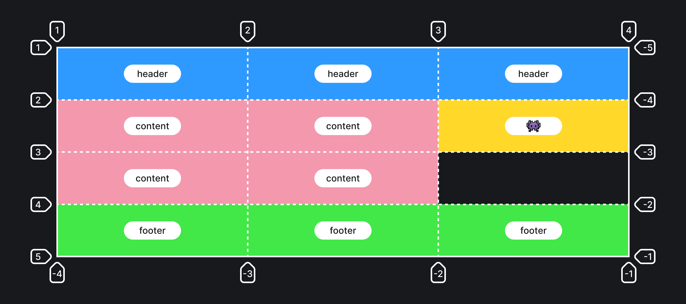

## Кратко

Позволяет задать шаблон сетки расположения элементов внутри грид-контейнера. Имена областей задаются при помощи свойства [`grid-area`](/css/grid-area/). Текущее свойство `grid-template-areas` просто указывает, где должны располагаться эти грид-области.

## Пример

```css
.container {
  display: grid;
  grid-template-columns: 1fr 200px 1fr;
  grid-template-rows: repeat(4, 150px);
  grid-template-areas:
    "header header header"
    "content content 👾"
    "content content ."
    "footer footer footer";
}
```

## Как пишется

- `none` (значение по умолчанию) — области сетки не задано имя.
- `.` — означает пустую ячейку.
- `name` — собственно название области, может быть абсолютно любым словом или даже эмодзи! 🤯

Обратите внимание, что нужно называть каждую из ячеек. Например, если шапка или подвал нашего сайта будут занимать все три существующие колонки, то нужно будет написать трижды названия этих областей. Удобнее всего будет подписывать области в виде некой таблицы. Подобный способ записи чем-то похож на [таблицы в Markdown](https://github.com/adam-p/markdown-here/wiki/Markdown-Cheatsheet#tables):

```css
.container {
  display: grid;
  grid-template-columns: 1fr 200px 1fr;
  grid-template-rows: repeat(4, 150px);
  grid-template-areas:
    "header header header"
    "content content 👾"
    "content content ."
    "footer footer footer";
}

.item1 {
  grid-area: header;
  background-color: purple;
}

.item2 {
  grid-area: content;
  background-color: gray;
}

.item3 {
  grid-area: 👾;
  background-color: pink;
}

.item4 {
  grid-area: footer;
  background-color: #bada55;
}
```

Обратите внимание, что между строками не ставятся запятые или какие-то другие символы, имена разделяются пробелами.

Получится такая раскладка:



## Подсказки

💡 Имена областей должны разделяться пробелами. Это важно, особенно в том случае, если вы хотите расположить рядом две пустых ячейки. Разделите точки пробелами, иначе браузер подумает, что это одна пустая ячейка.

<aside>

📝 Полный список свойств гридов можно посмотреть в [гайде по grid](/css/grid-guide/).

</aside>
