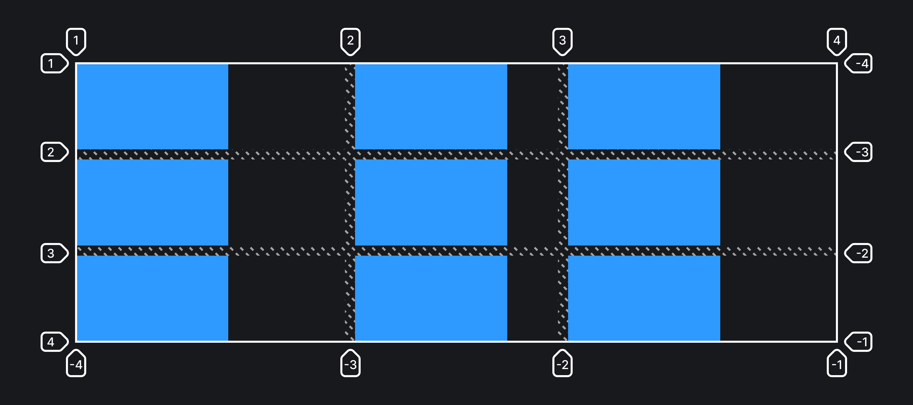

## Кратко

Свойство, с помощью которого задаётся выравнивание грид-элементов по горизонтальной оси. Применяется ко всем элементам внутри грид-родителя.

## Пример

```css
.container {
  display: grid;
  grid-template-columns: 1fr 200px 1fr;
  grid-template-rows: repeat(3, 150px);
  gap: 20px;

  justify-items: start;
}

.item {
  min-width: 150px;
}
```



## Как пишется

- `start` — выравнивает элемент по начальной (левой) линии.
- `end` — выравнивает элемент по конечной (правой) линии.
- `center` — выравнивает элемент по центру грид-ячейки.
- `stretch` — растягивает элемент на всю ширину грид-ячейки.

## Подсказки

💡 Можно управлять выравниванием отдельных грид-элементов при помощи свойства `justify-self`.

<aside>

📝 Полный список свойств гридов можно посмотреть в [гайде по grid](/css/grid-guide/).

</aside>
