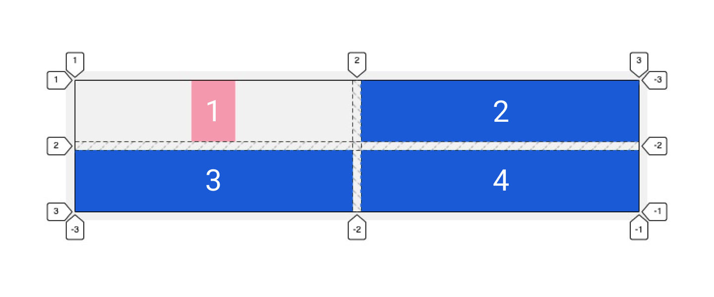

## Кратко

С помощью этого свойства можно установить горизонтальное выравнивание для отдельного элемента, отличное от выравнивания, заданного грид-родителю.

## Пример

```css
.container {
  justify-items: stretch;
}

.item1 {
  justify-self: center;
}
```



## Как пишется

Возможные значения аналогичны значениям свойства [`justify-items`](/css/justify-items/).

## Подсказки

<aside>

📝 Полный список свойств гридов можно посмотреть в [гайде по grid](/css/grid-guide/).

</aside>
