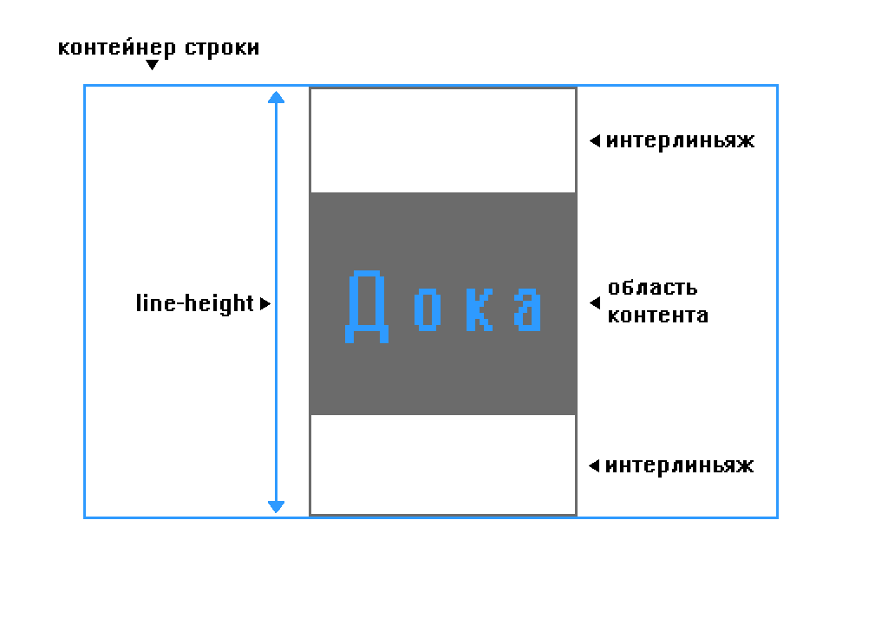

## Кратко

`line-height` задаёт интервал между строчками текста, который называют _интерлиньяж_.

## Примеры

Стандартный интервал:

```css
.selector {
  line-height: normal;
}
```

Множитель — расстояние будет в 3.5 раза больше, чем размер текста:

```css
.selector {
  line-height: 3.5;
}
```

Условные единицы — значение, относительно стандартного интервала.
В данном случае, интервал будет в 3 раза больше интервала родительского элемента.

```css
.selector {
  line-height: 3em;
}
```

Проценты — размер интервала высчитывается относительно размера шрифта:

```css
.selector {
  line-height: 34%;
}
```

## Как понять

С помощью `line-height` можно выбрать, насколько большое расстояние будет между строчками текста. Обычно это расстояние немного больше, чем высота шрифта.

Браузеры понимают `line-height` по-своему: как высоту контейнера строки. Символы внутри образуют область контента, а участки между этой областью и границей контейнера и есть _интерлиньяж_. Такая особенность может легко запутать, ведь обычно расстояние между строчками измеряется по базовым линиям текста.


Как браузеры понимают свойство `line-height`

## Как пишется

Задать свойство `line-height` можно одним из нескольких значений. Самый предсказуемый вариант — с помощью числа. У свойства `line-height` не может быть отрицательного значения.

- `normal` — значение по умолчанию. Немного отличается в разных браузерах, но, как правило, равно 1.2. Это значит, что расстояние между строчками будет равно размеру шрифта `font-family`, помноженному на 1.2.
- **число** — число без единиц измерения. Например, значение 1.5 значит, что высота строчки будет равна размеру шрифта `font-family`, помноженному на 1.5.
- **длина** — например, пиксели `px`, условные единицы шрифта `em`, дюймы `in`, пункты `pt` и так далее.
- **проценты** — например, `line-height: 120%`. За 100% берётся размера шрифта `font-size`.

Лучше задавать интерлиньяж числом, чтобы, при увеличении размера шрифта, увеличивалось и расстояние между строчками.

Задавать высоту строки в каких-то единицах измерения не самый лучший вариант, потому что тогда высота строки не подстраивается автоматически под размер шрифта и может выглядеть не так, как ожидается.

## Подсказки

💡 Самый надёжный способ задать интервал между строчками — с помощью числа, например, 1.5. При увеличении масштаба страницы этот интервал увеличится соответствующим образом.

💡 Для обычного текста чаще всего используют полуторный интервал `line-height: 1.5`. С таким интервалом текст удобнее читать.

💡 Ещё один способ задать интервал между строк — шорткат [`font`](/css/font/). При этом обязательно сразу указать семейство шрифтов [`font-family`](/css/font-family/). Например:

```css
div {
  font: 10px/1.2 Georgia, "Bitstream Charter", serif;
}
```

## Ещё примеры

Попробуем задать одно и то же расстояние между строчками с помощью разных значений. Каждое значение будет умножаться на размер шрифта [`font-size`](/css/font-size/):

Число:

```css
div {
  line-height: 1.2;
  font-size: 10px;
}
```

Длина:

```css
div {
  line-height: 1.2em;
  font-size: 10px;
}
```

Процент:

```css
div {
  line-height: 120%;
  font-size: 10px;
}
```

Другой пример показывает, почему лучше всего задавать расстояние между строчками с помощью числа.

Спойлер: простое число умножается на высоту шрифта того же элемента, а, например, значение `em` — на высоту шрифта родительского элемента:

```html
<div class="box box_green">
  <h1>Тут мы задали интервал с помощью числа 1.2</h1>
  Оно умножается на размер шрифта этого же элемента. Это удобно и предсказуемо.
</div>

<div class="box box_blue">
  <h1>А здесь мы ввели 1.2em</h1>
  Это значит, что 1.2 умножается на размер шрифта родительского элемента, в
  нашем случае
  <div>, а не на размер заголовка. Это вносит путаницу.</div>
</div>
```

```css
h1 {
  font-size: 30px;
}

.box {
  width: 18em;
  padding: 20px;
  display: inline-block;
  vertical-align: top;
  font-size: 15px;
}

.box_green {
  line-height: 1.2;
  background-color: #49a16c;
}

.box_blue {
  line-height: 1.2em;
  background-color: #1a5ad7;
}
```

<iframe title="Высота строки" src="demos/line-height/" height="470"></iframe>
