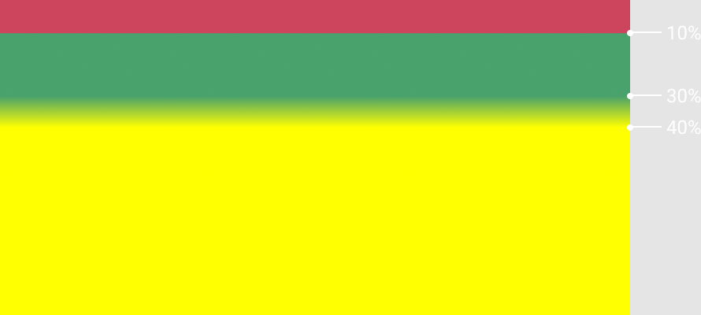

## Кратко

Функция `linear-gradient` используется для задания фона в виде линейного градиента.

## Пример

```css
.element {
  background-image: linear-gradient(#6e4aff, #49A16C);
}
```

## Как понять

Градиент — это плавный переход между цветами. Линейный градиент описывает изменение цвета вдоль прямой линии. В отличие от фоновых изображений градиент не может иметь конкретных размеров и его фактический размер совпадает с размером элемента.

## Как пишется

Самый простой вид градиента — переход между двумя цветами:

```css
.element {
  background-image: linear-gradient(#2E9AFF, #F498AD);
}
```

<iframe title="Линейный градиент" src="demos/gradient/" height="300"></iframe>

### Количество цветов

Градиент может состоять из любого количества цветов. Укажите нужное количество значений через запятую внутри круглых скобок.

Цвета могут быть указаны в любом доступном формате. Подробнее о возможных значениях цветов в статье «[Цвета в вебе](/css/web-colors/)».

### Точки остановки цвета

Через пробел после значения цвета можно задавать начальную и конечную точки цвета. Можно использовать любую единицу длины либо проценты. В начальной точке заканчивается плавный переход из предыдущего цвета. Конечная точка — это точка, с которой начинается плавный переход в следующий цвет.

<iframe title="Линейный градиент с остановками цвета" src="demos/gradient-stops/" height="300"></iframe>

Если конечная точка предыдущего цвета и начальная точка следующего совпадают, то переход будет в виде чёткой линии. Разберём пример.

```css
.element {
  background-image: linear-gradient(#F498AD 25%, #2E9AFF 25% 50%, #FFD829 75%);
}
```

По умолчанию градиент рисуется сверху вниз. В 25 процентах высоты от верха должен начаться плавный переход от цвета `#F498AD` в цвет `#2E9AFF`. Но начальная точка второго цвета тоже 25%, поэтому мы наблюдаем чёткую границу между цветами.

Конечная точка цвета `#2E9AFF` — 50% от верха. В этой точке начинается плавный переход в последний цвет. Конечная точка жёлтого цвета — 75% от верха. В этой точке заканчивается плавный переход между цветами, и дальше весь фон будет равномерно жёлтым. Таким образом, ширина плавного перехода между цветами `#2E9AFF` и `#FFD829` будет 25% (от 50 до 75%) высоты.



### Направление градиента

Первым параметром можно передать единицу измерения угла (`deg`, `turn`), и тогда линия, вдоль которой строится градиент, повернётся на нужный угол:

```css
.element-1 {
  background-image: linear-gradient(-30deg, #2E9AFF, #F498AD);
}

.element-2 {
  background-image: linear-gradient(0.25turn, #2E9AFF, #FFD829);
}
```

<iframe title="Линейный градиент с поворотом" src="demos/gradient-rotate/" height="300"></iframe>

Мы можем задавать направление градиента, используя ключевые слова с приставкой `to`: `to left`, `to top`, `to right`, `to bottom` (по умолчанию). Значения имеют следующие эквиваленты в углах:

- `to top` — `0deg`;
- `to bottom` — `180deg`;
- `to right` — `90deg`;
- `to left` — `270deg`;

Ключевые слова можно сочетать, чтобы направить градиент в нужный угол элемента: `to top left` будет рисовать градиент из правого нижнего в левый верхний угол.

<iframe title="Линейный градиент с направлением" src="demos/gradient-direction/" height="300"></iframe>

### Повторяющийся градиент

Если градиент должен многократно повторяться, можно использовать функцию [`repeating-linear-gradient()`](/css/repeating-linear-gradient/).

<iframe title="Повторяющийся линейный градиент" src="demos/gradient-repeat/" height="300"></iframe>

### Множественные градиенты

Множественный фон элемента может применяться и к градиентам.

<iframe title="Множественный линейный градиент" src="demos/gradient-multiple/" height="300"></iframe>

## Подсказки

💡 Градиент можно анимировать! 🥳
