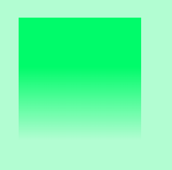
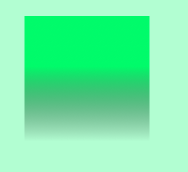

🛠 Если нужно создать линейный градиент, уходящий в прозрачность, то вы неминуемо столкнётесь с проблемой в Safari и iOS. Во всех браузерах ключевое слово `transparent` отрабатывает ожидаемо, плавно уводя градиент в прозрачность. А в Safari и iOS из-за особенностей реализации именно этого ключевого слова градиент будет уходить в грязный чёрный.

```css
.element {
  background: linear-gradient(#F498AD 10%, transparent);
}
```

Линейный градиент в Chrome, красиво растворяется



Ровно тот же самый градиент, но в Safari. Это вообще легально? 😐



Решить этот баг можно довольно просто, хоть немного и больно. Нужно вместо ключевого слова `transparent` указать предыдущий цвет градиента, но с нулевой прозрачностью. Визуально итог будет тот же, и даже в Safari всё заработает.

```css
.element {
  background: linear-gradient(#F498AD 10%, rgb(244 152 173 / 0));
}
```

🛠 Статьи и сборники классных паттернов, созданных при помощи градиентов:

- [CSS-паттерны](http://css.yoksel.ru/css-patterns/)
- [CSS3 Patterns Gallery](https://projects.verou.me/css3patterns/)
- [You Crazy? Patterns with CSS Gradients](https://cssgradient.io/blog/gradient-patterns/)
