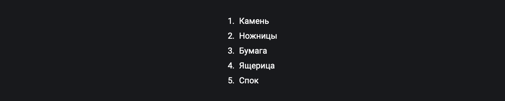

## Кратко

Свойство `list-style-type` пригодится, когда нужно стилизовать `<li>`-элемент [`<ul>`](/html/ul/)- или [`<ol>`](/html/ol/)-списка, если оформления по умолчанию (или через атрибут `type`) недостаточно. Ещё один популярный «приём» — вообще убрать маркер (или число, если это `<ol>`-список), чтобы скрыть внешний вид, но оставить семантику тегов.

Список возможных значений `list-style-type` ограничен. Если нужно больше возможностей: [`list-style-image`](/css/list-style-image/) позволяет задать изображение вместо маркера, а в скором времени в спецификацию добавят `@counter-style`. Stay tuned! 🤓

## Пример

По умолчанию маркированные списки имеют значение `list-style-type: disc` (маркер в виде точки), а нумерованные — `decimal` (арабские цифры с точкой):

<iframe title="Списки по умолчанию" src="demos/basic/" height="270"></iframe>

Вообще, свойство `list-style-type` можно задать как самому элементу `<ul>` или `<ol>` (благодаря тому, что это свойство наследуется «вглубь»), так и его `<li>`-элементу и вообще любой сущности, у которой задано свойство `display: list-item`.

### Демо разных значений `list-style-type`

<iframe title="Варианты list-style-type" src="demos/list-style-type/" height="880"></iframe>

## Как пишется

```css
ul {
  list-style-type: square;
}
```

Свойство `list-style-type` может принимать одно из нескольких _типов_ значений, которые имеют даже [целый раздел в спецификации](https://drafts.csswg.org/css-counter-styles-3), описывающий различные виды этих **счётчиков**.

### Числовые

- `decimal` западные десятичные числа (1, 2, 3, ..., 98, 99, 100);
- `decimal-leading-zero` десятичные числа с предшествующим нулём (01, 02, 03, ..., 98, 99, 100);

Другие числа в других языковых культурах:

- `lower-roman` строчная римская нумерация (i, ii, iii, ..., xcviii, xcix, c);
- `upper-roman` заглавная римская нумерация (I, II, III, ..., XCVIII, XCIX, C);
- `arabic-indic` арабские (индийские) цифры (١‎, ٢‎, ٣‎, ٤‎, ..., ٩٨‎, ٩٩‎, ١٠٠‎);
- `lower-armenian` строчная армянская нумерация (ա, բ, գ, ..., ղը, ղթ, ճ);
- `bengali` бенгальские цифры (১, ২, ৩, ..., ৯৮, ৯৯, ১০০);
- `cambodian` / `khmer` кхмерские цифры (១, ២, ៣, ..., ៩៨, ៩៩, ១០០);
- `cjk-decimal` ханские десятичные цифры (一, 二, 三, ..., 九八, 九九, 一〇〇);
- `georgian` традиционные грузинские цифры (ა, ბ, გ, ..., ჟჱ, ჟთ, რ);
- `devanagari` индийские цифры деванагари (१, २, ३, ..., ९८, ९९, १००);
- `gujarati` индийские цифры гуджарати (૧, ૨, ૩, ..., ૯૮, ૯૯, ૧૦૦);
- `gurmukhi` индийские цифры гурсукхи (੧, ੨, ੩, ..., ੯੮, ੯੯, ੧੦੦);
- `hebrew` традиционные еврейские цифры (א‎, ב‎, ג‎, ..., צח‎, צט‎, ק‎);
- `kannada` индийские цифры каннада (೧, ೨, ೩, ..., ೯೮, ೯೯, ೧೦೦);
- `malayalam` индийские цифры малаялам (൧, ൨, ൩, ..., ൯൮, ൯൯, ൧൦൦);
- `tamil` индийские тамильские цифры (௧, ௨, ௩, ..., ௯௮, ௯௯, ௧௦௦);
- `oriya` индийские цифры одия (ория) (୧, ୨, ୩, ..., ୯୮, ୯୯, ୧୦୦);
- `lao` лаосские цифры (໑, ໒, ໓, ..., ໙໘, ໙໙, ໑໐໐);
- `mongolian` монгольские цифры (᠑, ᠒, ᠓, ..., ᠙᠘, ᠙᠙, ᠑᠐᠐);
- `myanmar` бирманские (мьянманские) цифры (၁, ၂, ၃, ..., ၉၈, ၉၉, ၁၀၀);
- `persian` персидские цифры (۱, ۲, ۳, ۴, ..., ۹۸, ۹۹, ۱۰۰);
- `telugu` индийские цифры телугу (౧, ౨, ౩, ..., ౯౮, ౯౯, ౧౦౦);
- `thai` тайские цифры (๑, ๒, ๓, ..., ๙๘, ๙๙, ๑๐๐);
- `tibetan` тибетские цифры (༡, ༢, ༣, ..., ༩༨, ༩༩, ༡༠༠).

### Алфавитные

- `lower-alpha` / `lower-latin` строчные латинские буквы (a, b, c, ..., z, aa, ab);
- `upper-alpha` / `upper-latin` заглавные латинские буквы (A, B, C, ..., Z, AA, AB);

Другие алфавиты в других языковых культурах:

- `lower-greek` строчные греческие буквы (e.g., α, β, γ, ..., ω, αα, αβ);
- `hiragana` буквы на языке Хирагана (японская слоговая азбука) в алфавитном порядке (e.g., あ, い, う, ..., ん, ああ, あい);
- `hiragana-iroha` буквы на языке Хирагана-ироха (японская слоговая азбука) в алфавитном порядке (e.g., い, ろ, は, ..., す, いい, いろ);
- `katakana` буквы на языке Катакана (японская слоговая азбука) в алфавитном порядке (e.g., ア, イ, ウ, ..., ン, アア, アイ);
- `katakana-iroha` буквы на языке Катакана-ироха (японская слоговая азбука) в алфавитном порядке (e.g., イ, ロ, ハ, ..., ス, イイ, イロ).

### Символьные

- `disc` точка, похожая на символ на • U+2022 BULLET;
- `circle` кружок, похожий на символ ◦ U+25E6 WHITE BULLET;
- `square` закрашенный квадрат, похожий на символ ◾ U+25FE BLACK MEDIUM SMALL SQUARE;
- `disclosure-open` и `disclosure-closed` символы открытого и закрытого списка как у элемента `<details>`.

Для нумерованных списков (`<ol>`) можно задать стартовое значение с помощью атрибута `start` (например, для меню пагинации).

## Список без счётчика

Есть случаи, когда нам нужно иметь семантику списка, но не нужны никакие маркеры или числа, например, меню, список карточек товара или статей. Если мы зададим списку `list-style-type: none`, то сохраним порядок элементов (для скринридеров) без «лишнего» оформления:

```html
<ul style="list-style-type: none">
  <li>
    <a href="/articles">Статьи</a>
  </li>
  <li>
    <a href="/authors">Авторы</a>
  </li>
  <li>
    <a href="/contacts">Контакты</a>
  </li>
</ul>
```

<iframe title="Список без маркера" src="demos/ul-no-marker/" height="240"></iframe>

Пример вёрстки списка статей или товаров:

```html
<ol style="list-style-type: none">
  <li>
    <article>
      <h2>Обзор кафе «Тарелко эль Торреро»</h2>
      <address>Григорий Гаспатчев</address>
    </article>
  </li>
  <li>
    <article>
      <h2>Заказываем пиццу из «Саранчи»</h2>
      <address>Мария Пепперони</address>
    </article>
  </li>
  <li>
    <article>
      <h2>Где попробовать тэппанъяки?</h2>
      <address>Василиса Васаби</address>
    </article>
  </li>
</ol>
```

<iframe title="Список без маркера" src="demos/ol-no-marker/" height="350"></iframe>

Так же, устанавливая `list-style-type: none` можно создать стилизованные списки, главное не забыть прописать свойство [`content`](/css/content/):

```html
<ul>
  <li>Милый маленький грибочек</li>
  <li>Сколопендровый листочек</li>
  <li>Жёлтой пыльки чуть</li>
</ul>
```

```css
li {
  position: relative;
}

li::before {
  content: "";
  width: 15px;
  height: 15px;
  border-radius: 50%;
  background-color: #ed6742;
  position: absolute;
  left: -25px;
  top: 5px;
}
```

Не забывайте о свойстве [`content`](/css/content/) у псевдоэлемента [`::before`](/css/before/).

<iframe title="Пример со свойством content" src="demos/empty-content/" height="240"></iframe>

## Кастомные счётчики с `@counter-style`

С помощью @-правила мы можем создать свои счётчики, которые будут иметь свои правила отображения порядка или символы-маркеры:

```css
@counter-style circled-alpha {
  system: fixed;
  symbols: 😁 😇 😋 🤪 😎;
  suffix: " ";
}

.list {
  list-style: circled-alpha;
}
```

<iframe title="Кастомные маркеры" src="demos/custom/" height="340"></iframe>

Свойство `@counter-style` поддерживается не во всех браузерах. Например, в Safari пример отобразится некорректно и вместо заданных символов отрисует просто список по умолчанию:


