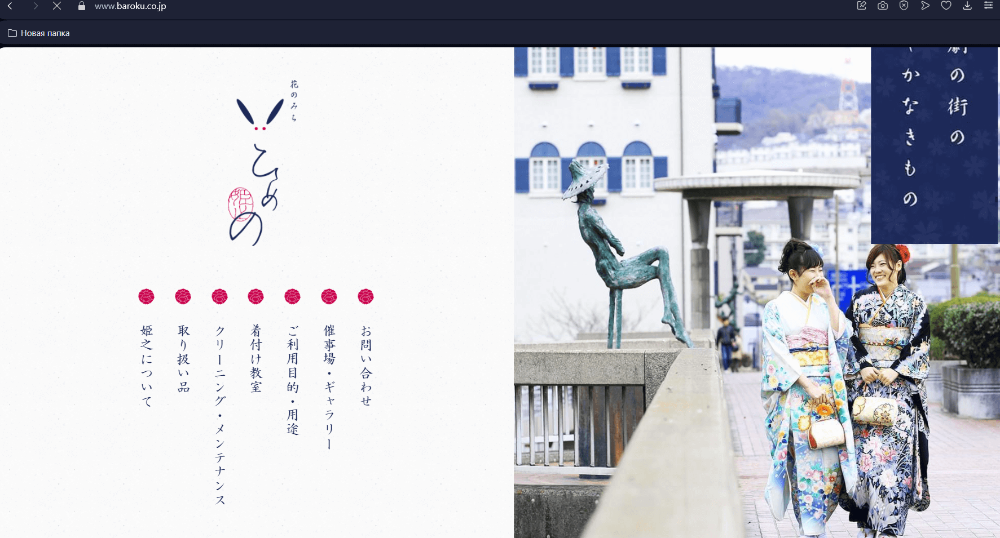

Изначально интернет основан на текстовых документах, интерфейсы были достаточно простыми. Никто не думал о потребностях многоязычных сайтах, которые могут следовать другим направлениям текста. Привычный CSS основан на физических понятиях **верх** (top), **низ** (bottom) и так далее. Но при изменении направления текста весь интерфейс должен менять раскладку. Верх может стать низом, лево и право поменяться местами, и вёрстка без логических свойств в итоге сломается.


В мире существует множество языков, и далеко не все они основаны на привычной западному миру системе (направление письма слева направо, сверху вниз). В арабском языке, иврите, фарси направление письма следует справа налево, а в Японии сверху вниз, столбцы располагаются справа налево. В традиционной монгольской письменности направление письма вертикальное сверху вниз, слева направо. Чтобы сайт адаптировался к разным вариантам направлений письменности, можно написать множество разных стилей в привычных физических выражениях для всех нужных кейсов, либо использовать логические свойства CSS. Новые свойства CSS являются воплощением нового подхода к стилям - более гибкого, отзывчивого, адаптивного под сложные макеты и различные устройства. Этот же подход выражен в флексах, гридах и container queries.




На этих скриншотах видно, что разметка сайта может быть разной — другое расположение элементов на странице, другие эстетические предпочтения в дизайне. Логические свойства помогают сделать хорошие интерфейсы без дополнительных усилий.

## Кратко

Помимо привычного расположения текста (справа налево, сверху вниз), существуют языки, в которых текст расположен слева направо, и даже сверху вниз. Соответственно, интерфейс должен подстраиваться под направление письма в языке. Логические свойства CSS, в отличие от привычных физических, опираются на модель, основанную на блочной оси. Поэтому сайт меняет расположение элементов при переключении раскладки сайта на другие стили написания (например, RTL - right-to-left) или другой подход к разметке интерфейса и не ломается.


На скриншотах видно, что сломанный интерфейс не просто выглядит сломанным, иногда им невозможно пользоваться. Из-за особенностей вёрстки пользователь не сможет рассмотреть товар, соответственно, меньше шансов, что купит его.

## Пример

```css
.card {
  padding-inline-start: 2.5rem;
  margin-inline-end: 1rem;
  border-inline-start: 6px solid blue;
}
```

## Как пишется

При написании новых CSS свойств следует опираться на два основных понятия - блок и строка. Если речь идёт о высоте элемента, это свойство будет со словом 'block', если о ширине - 'inline'.

### block

Это направление, в котором блоки контента, такие как абзацы 'p', заголовки и элементы 'div', располагаются на веб-странице, это 'block' (направление блока). В языках с письмом слева направо и справа налево направление блока — это вертикальное направление потока контента, идущее сверху вниз. 'block-start' и 'block-end' представляют собой начало и конец содержимого вдоль оси блока. Можно представить дерево  для упрощения понимания, где вершина будет началом, а корни - концом дерева.

### inline

Направление, в котором контент располагается внутри блока. Например, текст в элементе 'div'. Если сравнить направление текста с улицей или дорогой, то её начало будет слева в языках с написанием слева-направо, а конец справа. Соответственно, для западных пользователей 'margin-left' превратится в 'inline-start'.

### size

Вместо ширины и высоты ('width', 'height') мы смотрим на размер блока или строки, поэтому вместо 'width' пишем 'inline-size', вместо 'height' - 'block-size'.

### Как задать интерфейсу направление текста

Направление текста можно задать как через HTML, так и с помощью CSS. В HTML оно может быть задано через атрибут `dir`, который вешают на элемент [`<html>`](/html/html/). В CSS направление письма можно задать через свойство `direction`. Для вертикального текста можно использовать CSS свойство [`writing-mode`](/css/writing-mode/).

```html
<p dir="ltr">Главное правило реальности — не запутаться в своих иллюзиях.</p>
```

```css
.inner {
  direction: rtl;
  writing-mode: vertical-rl;
}
```

<iframe title="Разные направления текста" src="demos/dir/" height="340"></iframe>

### Разница в расположении интерфейсов на практике

Переключая языки интерфейса на сайте правительства Объединённых Арабских Эмиратов, можно увидеть, как меняется расположение текста и картинок, в зависимости от выбранного языка.


<iframe title="Как меняется направление интерфейса в зависимости от используемого языка" src="demos/languages/" height="340"></iframe>

## Как понять

Для понимания логических свойств нужно отбросить привычные термины 'top', 'bottom', 'left', 'right' и заменить их на 'inline-start', 'inline-end' и 'block-start', 'block-end'.

Например, в русском языке чтение свойств начинается слева и идёт направо. Это строчный аспект свойств. Это можно легко запомнить, рассмотрев ряд элементов с 'display: inline' или вспомнив написание свойств 'justify-content: start'.

Соответственно, привычное написание отступов будет выглядеть в разных языках так:

Русский: padding-inline-start = padding-left
Арабский: padding-inline-start = padding-right
Японский: padding-inline-start = padding-top

Названия логических свойств можно комбинировать в шорткаты, как мы это делаем в привычных 'padding', 'margin', 'border'.

В физическом CSS код выглядит так:
```css
.block {
  position: fixed;
  top: 0;
  bottom: 0;
  left: 0;
  right: 0;
}
```

В новой технике код превратится в такой:

```css
.block {
  position: fixed;
  inset-block-start: 0;  /* top — для русского */
  inset-block-end: 0;    /* bottom — для русского */
  inset-inline-start: 0; /* left — для русского */
  inset-inline-end: 0;   /* right — для русского */
}
```

В виде шортката код выглядит так:

```css
.popup {
  position: fixed;
  inset: 0; /* top, right, bottom, left — для русского */
}
```

Свойство `inset` может заменить сразу четыре свойства: `top`, `right`, `bottom` и `left`. `inset` позволяет показать смещение [позиционированного элемента](/css/position/) сразу со всех четырёх сторон.

Можно указать от одного до четырёх значений через пробел. Значения применяются к четырём сторонам соответственно, по часовой стрелке, начиная с верхнего края. Они могут быть в px, em, rem и %. Если указывать `left` и `right` в процентах, то они считаются от ширины элемента, если `top` и `bottom`, то от высоты.

## А как раньше?

Изначально адаптацию интерфейса под нужды мультиязычного сайта делали с помощью атрибута `dir`, размещая элементы интерфейса с помощью свойств [`float`](/css/float/). Либо использовали отдельный файл для стилей, который подключался для RTL сайтов. Потом на смену такому способу пришли переменные препроцессора SASS, которые больше подходили для поддержки сайтов с языками, пишущимися в разные стороны (RTL и LTR). Сейчас возможности нативного CSS достаточно развиты, для того, чтобы можно было справиться с задачей без помощи препроцессоров.

### Мыслить логическими CSS-свойствами

Для того, чтобы понять философию нового подхода, нужно немного поменять мышление и перестать опираться на привычный подход с ориентирами в виде физики, и перейти на строчно-блочную модель расположения элементов. 'inline' отвечает за ширину, а 'block' за высоту. Если вообразить, что есть две основные оси - x для горизонтали, а y для вертикали, то значения для x будут со словом 'inline', y - 'block'. Это основное правило для понимания.

### Преимущества логических свойств CSS

Логические свойства CSS обладают огромным количеством преимуществ, которые помогают создавать более универсальные, гибкие и адаптируемые дизайны. Рассмотрим эти преимущества более подробно:

**Повышенная гибкость в отзывчивом дизайне**: в отзывчивом дизайне позволяют сделать веб-макеты более гибкими и адаптивными к различным размерам экранов и устройств. Разработчики могут создавать отзывчивые дизайны, которые автоматически подстраиваются под доступное пространство и размеры экрана благодаря использованию логических свойств. Такая гибкость упрощает процесс разработки, поскольку логические свойства динамически адаптируют макет, уменьшая зависимость от медиазапросов и сложных вычислений.

**Лёгкая адаптация к различным режимам письма**: отлично справляются с различными режимами написания текста, например, слева-на-право (LTR) и справа-на-лево (RTL). Эти свойства легко адаптируются к режиму написания документа, обеспечивая согласованное позиционирование и стилизацию элементов. Можно создавать более сложные и гибкие интерфейсы, что способствует более широкому охвату и доступности пользователей.

**Экономия ресурсов на разработку**: позволяют создавать стили сразу для всех возможных направлений интерфейсов, не нужно писать дополнительные стили для разных вариантов направлений письма. Не нужно поддерживать и актуализировать отдельные файлы для стилей других версий сайта.


Если детально рассмотреть два скриншота с одного и того же сайта, можно увидеть в чём минус вёрстки, основанной на физических свойства. Она ломает интерфейс при переключении языка, элементы интерфейса отрисовываются вразнобой, перемешиваются слова и знаки пунктуации. Этих проблем можно было бы избежать, используя новые свойства CSS.

### Минусы логических свойств

Требуют изучения, непривычная методология написания.
Для поддержки старых браузеров всё ещё нужны физические свойства.


## Основные логически CSS-свойства

`margin-inline-start` и `margin-inline-end`: Эти свойства управляют полями с начальной (`inline-start`) и конечной (`inline-end`) стороны элемента в зависимости от направления текста.
`padding-inline-start` и `padding-inline-end`: Эти свойства управляют отступом от начальной (`inline-start`) и конечной (`inline-end`) сторон элемента.
`border-inline-start` и `border-inline-end`: Эти свойства управляют границами на начальной (`inline-start`) и конечной (`inline-end`) сторонах элемента.
`inline-size` и `block-size`: Эти свойства задают ширину и высоту элемента независимо от направления текста.

## Tailwind и логические свойства CSS

В Tailwind постепенно появилась поддержка логических свойств CSS, которая позволяет делает современные интерфейсы с гибкой раскладкой с помощью этого CSS-фреймворка.

## Инструменты для преобразования

Для преобразования обычного CSS в логические свойства (CSS Logical Properties) можно использовать следующие инструменты и подходы:

### Ручное преобразование.

Логические свойства заменяют физические (например, left, right, top, bottom) на свойства, основанные на направлении текста и `writing-mode`. Вот основные замены:

- margin-left → margin-inline-start
- margin-right → margin-inline-end
- padding-top → padding-block-start
- padding-bottom → padding-block-end
- width → inline-size
- height → block-size
- border-left → border-inline-start
- border-right → border-inline-end
- text-align: left → text-align: start
- text-align: right → text-align: end

### Плагины для редакторов кода

- VS Code: Используйте расширения, например, 'Logical Properties', это облегчит преобразование CSS.
- ESLint: С помощью правил ESLint можно проверять и автоматически исправлять CSS-код, включая логические свойства.

### Использование нейросетей

Нейросети могут быть обучены на большом объеме данных, чтобы распознавать паттерны использования физических свойств CSS и преобразовывать их в соответствующие логические свойства. Но сейчас они все еще находятся на этапе развития и требуют за собой перепроверки.