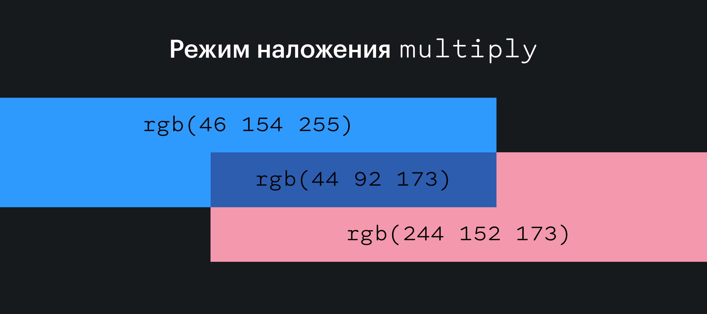

## Кратко

С помощью свойства `mix-blend-mode` можно смешать цвет элемента с расположенными ниже элементами или родительским фоном. Таким образом получаются интересные эффекты, а иногда это может помочь сохранить контрастность текста на разных фонах.

## Пример

```css
h1 {
  mix-blend-mode: exclusion;
}
```

<iframe title="Базовый пример" src="demos/base/" height="360"></iframe>

## Как пишется

- `normal` — значение по умолчанию, цвета элементов не смешиваются;
- `multiply` — цвет элемента умножается на цвет фона и заменяет его. Полученный цвет всегда будет таким же тёмным, как и фон;
- `screen` — умножает цвет фона и цвет элемента, а затем дополняет результат. Итоговый цвет элемента будет ярче, чем [`background-color`](/css/background-color/);
- `overlay` — умножает или осветляет цвет элемента в зависимости от цвета фона. Режим, противоположный значению `hard-light`;
- `darken` — цвет фона заменяется цветом элемента там, где элемент темнее, в остальных случаях цвет фона остаётся без изменений;
- `lighten` — цвет фона заменяется цветом элемента там, где элемент светлее;
- `color-dodge` — при этом значении цвет фона осветляется так, чтобы отразить цвет элемента;
- `color-burn` — цвет фона затемняется так, чтобы отразить естественный цвет элемента;
- `hard-light` — в зависимости от цвета элемента, это значение будет осветлять или умножать его;
- `soft-light` — в зависимости от цвета элемента, это значение будет его затемнять или осветлять;
- `difference` — вычитает более тёмный цвет из более светлого;
- `exclusion` — похоже на `difference`, но с более низким контрастом;
- `hue` — создаёт цвет, в котором оттенок берётся от элемента, а насыщенность и яркость — от фона;
- `saturation` — создаёт цвет, в котором насыщенность берётся от элемента, а оттенок и яркость — от фона;
- `color` — создаёт цвет с оттенком и насыщенностью элемента и яркостью фона;
- `luminosity` — создаёт цвет с яркостью элемента, а оттенок и насыщенность берёт от фона. Результат противоположен `color`.

<iframe title="Песочница" src="demos/playground/" height="450"></iframe>

<details>
  <summary>Что за математика под капотом?</summary>

  С технической точки зрения, режимы наложения это математические операции над цветовыми компонентами каждого пикселя изображения на экране.

  Давайте наложим голубой `rgb(46 154 255)` и розовый `rgb(244 152 173)` в режиме `multiply`.

  Перемножим значения каждого канала — red, green, blue — между собой и затем разделим на максимальное значение, которое может принимать канал — 255. Это делается для нормализации значений и получения результата в диапазоне от 0 до 255.

  R: (46 * 244) / 255 = 44.047 (округляем до 44)
  G: (154 * 152) / 255 = 92.075 (округляем до 92)
  B: (255 * 173) / 255 = 173

  Получится `rgb(44 92 173)`.

  

</details>
