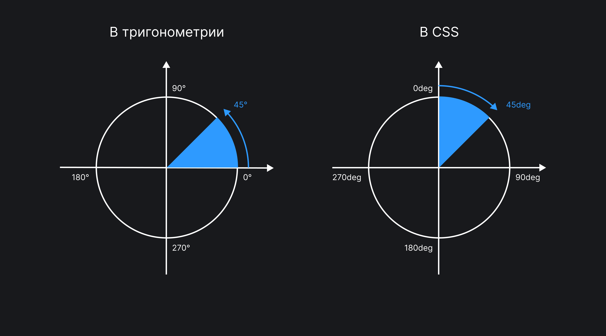

Каждое CSS-правило состоит из одной или нескольких пар «свойство-значение». В зависимости от свойства значение может быть, например, числом, или ключевым словом, или несколькими числами с единицами измерения (например, `45deg` или `100px`). Рассмотрим основные единицы измерения.

## Единицы измерения длины или расстояния

### Относительные величины

Используются для задания размера или расстояния относительно чего-либо. Например, `vh` считается относительно высоты вьюпорта (области просмотра страницы в окне браузера).

- [`em`](/css/rem-em/) задаёт величину относительно вычисленного размера шрифта элемента. Если для элемента `font-size: 20px`, то `2em` будут эквивалентны `40px`. При задании размера шрифта в `em` он считается относительно размера шрифта родительского блока.
- [`rem`](/css/rem-em/) рассчитывается относительно размера шрифта корневого элемента. Для веб-страницы это `<html>`. По умолчанию размер шрифта для `<html>` равен `16px`. При таких условиях `2rem` эквивалентны `32px`.
- [`vh`](/css/vw-vh/) задаёт размер в процентах от высоты вьюпорта. `1vh` составляет 1% от высоты.
- [`vw`](/css/vw-vh/) задаёт размер в процентах от ширины вьюпорта. `1vw` составляет 1% от ширины.
- [`vmin`](/css/vw-vh/) считается относительно меньшей стороны вьюпорта. Если ширина вьюпорта больше высоты, то `vmin` будет считаться относительно высоты. И наоборот. `1vmin` составляет 1% от меньшей стороны вьюпорта.
- [`vmax`](/css/vw-vh/) считается относительно большей стороны вьюпорта. `1vmax` составляет 1% от большей стороны.
- `ex` задаёт величину относительно метрики шрифта `x-height`. Так называется расстояние между базовой линией шрифта и средней линией строчных букв. Обычно это высота буквы `x` в шрифте, отсюда и название `x-height`. Эту экзотическую величину можно использовать, например, при стилизации верхних или нижних индексов. В примере ниже свойство `bottom` со значением `1ex` поднимет верхний индекс на высоту строчных букв:

```css
sup {
  position: relative;
  bottom: 1ex;
}
```

<iframe title="Единица измерения ex" src="demos/ex/" height="200"></iframe>

- `cap` считается относительно высоты заглавных букв шрифта.
- `ch` задаёт величину относительно ширины символа `0` (ноль) в шрифте. В моноширинных (с фиксированной шириной символа) шрифтах (Courier, Menlo, Monaco и других) указание размера `10ch` будет в точности соответствовать ширине 10 символов. В других шрифтах будет наблюдаться расхождение, ведь, например, ширина цифры 1 меньше, а ширина буквы Ш — больше ширины символа `0`.
- `ic` — это эквивалент `ch` в восточных языках (китайском, корейском, японском). Задаёт размер относительно размера иероглифа 水 (вода).
- `lh` задаёт размер относительно межстрочного интервала. Если прописано свойство `line-height: 16px`, то `2lh` эквивалентно `32px`.
- `rlh` то же, что и `lh`, но относительно `line-height` элемента `<html>`.

### Абсолютные величины

Абсолютные величины ни от чего не зависят и привязаны к физическим единицам измерения: дюймам или сантиметрам. Этот факт имеет исторические предпосылки. Когда появились первые программы предпечатной подготовки, возникла необходимость понимать, как картинка на экране будет соответствовать напечатанному варианту. Экраны мониторов в то время были примерно одинаковые, и оказалось, что одному дюйму на экране соответствуют 72 экранных точки. Именно это соотношение зафиксировано в единице измерения `pt`. С развитием технологий улучшались экраны и их разрешение, в один дюйм стало умещаться 96 точек, и это было зафиксировано в `px`.

- `px` соответствуют пикселям на экране. `1px` интерпретируется как 1/96 дюйма.
- `cm` — сантиметры. `1cm` = `96px / 2.54`.
- `in` — дюймы. `1in` = `96px` = `2.54cm`.
- `mm` — миллиметры. `1mm` = `1/10cm`.
- `Q` — четверть миллиметра. `1Q` = `1/40cm`.
- `pc` — пики. `1pc` = `1/16in`.
- `pt` — пункты. `1pt` = `1/72in`.

Абсолютные величины, отличные от пикселей, удобно использовать для вывода на печать.

На сегодняшний день существуют экраны с разной плотностью пикселей и разным разрешением, поэтому соотношение единиц измерения к точкам экрана утратило прежний смысл. Сантиметры и дюймы при выводе на экран не будут соответствовать своим реальным размерам.

## Единицы измерения углов

Используются, как правило, для задания угла поворота элемента, направления линейного градиента или угла поворота конического градиента.

- `deg` — градусы угла. Полная окружность содержит 360 градусов. В тригонометрии 0° соответствует пересечению окружности с осью _x_, и градусы отсчитываются против часовой стрелки. В CSS `0deg` соответствует пересечению окружности с осью _y_, а градусы отсчитываются по часовой стрелке:



- `grad` — градианы. 1/100 от прямого угла (0.9°). Полная окружность содержит 400 градиан. Эта единица измерения чуть удобнее градусов в плане практических расчётов.
- `rad` — радианы. Полная окружность содержит 2π (~6.2832) радиан.
- `turn` — оборот. Полная окружность соответствует одному обороту (`1turn`). Поворот элемента на 90 градусов соответствует `0.25turn`.

## Единицы измерения времени

Используются для задания длительности анимации или перехода в свойствах [`animation`](/css/animation/) и [`transition`](/css/transition/).

- `ms` — миллисекунда.
- `s` — секунда. `1s` = `1000ms`.

## Единицы, связанные с разрешением экрана

Используются для указания плотности пикселей (разрешения экрана) в медиавыражениях.

- `dpi` — указывает плотность пикселей в точках на дюйм (_dots per inch_). Обычные экраны имеют плотность пикселей 72 или 96dpi, но при печати это разрешение гораздо выше (300 и более точек на дюйм). `1dpi` = `0.39dpcm`. В примере ниже изменим размер шрифта при печати на устройствах с плотностью пикселей больше 300:

```css
@media print and (min-resolution: 300dpi) {
  .element {
    font-size: 8pt;
  }
}
```

- `dpcm` — плотность пикселей в точках на сантиметр. `1dpcm` = `2.54dpi`.
- `dppx`, `x` — описывает плотность в точках на `px`. Поскольку соотношение `in` и `px` равно 1/96, `1dppx` = `96dpi`.

## Проценты

Используются, чтобы указать, что значение представляет собой долю от другой величины. Исходное значение, от которого берётся часть, может относиться как к самому элементу, так и к его предку. Всё зависит от того, для какого свойства мы применяем проценты.

Например, при указании `width: 50%` ширина элемента будет высчитана как 50% (половина) от ширины родителя. Но если мы укажем в процентах положение фона `background-position-x: 30%`, это значение будет высчитано относительно ширины самого элемента.
