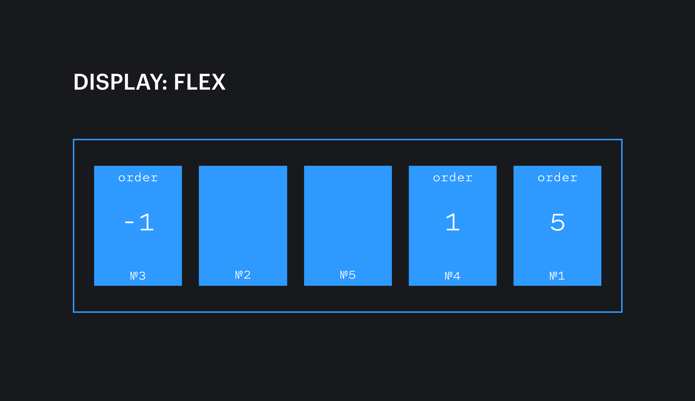

## Кратко

При помощи свойства `order` можно менять порядок отображения флекс-элементов внутри флекс-контейнера.

## Пример

В этом примере элемент с классом `.item` встанет последним, даже если в разметке будет первым.

```css
.container {
  display: flex;
}

.item {
  order: 3;
}
```

## Как понять

По умолчанию элементы отображаются в том порядке, в котором они расположены в разметке, а значение свойства `order` равно 0. Но это свойство позволяет переставлять их местами.

## Как пишется

Значение задаётся в виде целого отрицательного или положительного числа. Элементы встают по возрастающей.



## Подсказки

💡 Свойство меняет только визуальный порядок. Стоит помнить об этом. Скринридеры по-прежнему будут читать элементы по порядку расположения в разметке.

<aside>

📝 Полный список свойств флексбоксов можно посмотреть в [гайде по flexbox](/css/flexbox-guide/).

</aside>
