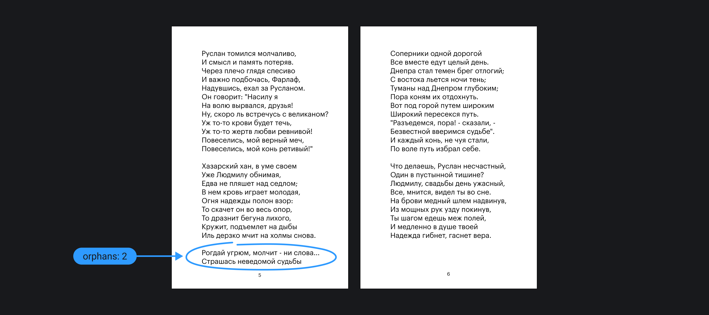

## Кратко

Свойство `orphans` указывает, минимальное количество строк абзаца, которые должны остаться на странице при печати. Если не хватает места.

Работает только внутри директивы [`@media`](/css/media/) со значением `print`. Отправьте страницу на печать, чтобы посмотреть, что получится.

## Пример

```css
@media print {
  p {
    orphans: 2;
  }
}
```

## Как пишется

В качестве значения можно передать целое положительное число, которое обозначает минимальное количество строк абзаца, которое должно остаться на предыдущей странице при печати. Не работает при отрицательном значении.

## Как понять

Свойство `orphans` тесно связано со свойством [`widows`](/css/widows/) и обозначает строки, которые остаются на предыдущей странице для печати.


Поэма А.С. Пушкина «Руслан и Людмила». Синим выделены оставшиеся одни «сироты».

Свойство `orphans` [наследуемое](/css/inheritance/) и вместо положительного числа можно передать значение `inherit`, при этом в свойство нельзя передавать отрицательные значения. Они работать не будут.

## На что обратить внимание

Обратите внимание, свойство `widows` имеет преимущество перед `orphans`. Браузер выполнит это свойство, а затем постарается выполнить то, что указано в `orphans`.

По умолчанию в браузерах, кроме Mozilla Firefox `orphans: 2`. В Firefox свойство не поддерживается.
