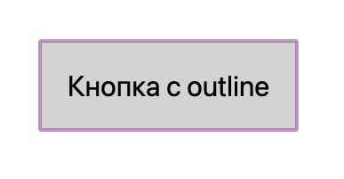

## Кратко

Что-то вроде [`border`](/css/border/) на стероидах. Не влияет на размеры элемента, можно отодвинуть от границ на любое расстояние.

Присутствует в стандартных стилях браузера для акцента на сфокусированных интерактивных элементах. Типа размеры не меняются, вёрстка страницы не ломается, но пользователь наглядно видит, какой элемент в фокусе. Ситуация win-win!



Естественно, можно задавать это свойство любому элементу и без всяких фокусов 😏

## Пример

Добавим элементу обводку, которая будет отодвинута от края на 10 пикселей. Для этого мы используем дополнительное свойство `outline-offset`. Оно идёт рука об руку с `outline`.

```css
.block {
  /* Чтобы видеть границы элемента */
  border: 1px solid black;

  /* Сплошная обводка шириной 5 пикселей зелёного цвета */
  outline: 5px solid green;
  /* От края элемента до края обводки 10 пикселей */
  outline-offset: 10px;
}
```

<iframe title="outline" src="demos/outline/" height="210"></iframe>

## Как пишется

`outline` на самом деле _шорткат_ — короткое свойство для записи сразу нескольких значений. Внутри себя оно содержит свойства `outline-width`, `outline-style` и `outline-color`.

Разберём доступные значения для каждого из свойств, а потом соберём всё в одну коробку:

### `outline-width`

- Ключевые слова `thin`, `medium`, `thick` — задают тонкую, среднюю или толстую ширину. Значения в пикселях на усмотрение браузера, но обычно соответствует 1, 3 и 6 пикселям соответственно.
- Конкретный размер — размер в любых единицах измерения, доступных в вебе. Например, `10px` или `0.2em`.

### `outline-style`

- `none` — обводка не отображается, даже если задано значение для `outline-width`.
- `dotted` — обводка будет состоять из точек. Круглых точек, вроде такого •••••
- `dashed` — обводка будет в виде пунктирной линии.
- `solid` — значение по умолчанию, если не задано иное. Сплошная линия.
- `double` — двойная ~~сплошная~~ линия.

Дальше создателей спецификации понесло в творчество и они придумали несколько *фигурных* обводок. *Освещение* таких рамок идёт сверху под прямым углом. И на это никак не повлиять:

- `groove` — обводка будет отображаться так, будто рамка объёмная, с вдавленной серединой и подсвечена. Цвет обводки (если он отличен от чёрного) станет двухцветным.
- `ridge` — обводка отобразится объёмной, её центр будет *приподнят*. Противоположно `groove`.
- `inset` — объёмная рамка, края направлены внутрь элемента.
- `outset` — объёмная рамка, края направлены наружу элемента, противоположно `inset`.

Проще всего понять на примерах:

<iframe title="Разные виды обводок" src="demos/every/" height="550"></iframe>

### `outline-color`

- любое доступное значение цвета в вебе, включая ключевые слова `transparent`, `currentColor`
- `invert` — ключевое слово, устанавливающее противоположный цвету фона элемента цвет обводки. Удобно для достижения максимальной контрастности.

Собираем все значения в шорткат.

Указано одно обязательное значение для `outline-style`:

```css
.selector {
  outline: solid;
}
```

`outline-color` | `outline-style`:

```css
.selector {
    outline: #f66 dashed;
}
```

`outline-style` | `outline-width`:

```css
.selector {
  outline: inset thick;
}
```

`outline-color` | `outline-style` | `outline-width`:

```css
.selector {
  outline: green solid 3px;
}
```

Как можно понять из примера выше, для свойства `outline` можно задать только одно значение, указывающее на стиль обводки. Без него обводка не будет отображаться. Если задано только одно значение, то цвет будет совпадать с цветом текста (подражание ключевому слову `currentColor`), а размер будет соответствовать ключевому слову `medium` (что, в свою очередь, равно 3 пикселям).

Заодно посмотрим на доступные значения для `outline-offset`:

- Может принимать в качестве значения любое указание размера в любых единицах измерения. Можно задать отрицательное значение и тогда обводка будет сдвинута внутрь. Тогда стоит учитывать ширину самой обводки, поскольку свойство `outline-offset` указывает расстояние от края элемента до внутреннего края обводки.

## Подсказки

💡 ~~В отличие от [`border`](/css/border/) обводка всегда квадратная (прямоугольная), её углы нельзя _скруглить_.~~ На сентябрь 2021 года обводка подстраивается под форму обводимого элемента! 🥳 Во всех актуальных версиях браузеров, кроме Safari 😤

💡 Обводка без зазрения совести накладывается на рядом стоящие элементы, не замечая их.

💡 Если задать обводку для многострочного текста, то каждая строка будет обведена своим прямоугольником. Лучше уж задать обводку для родителя.
