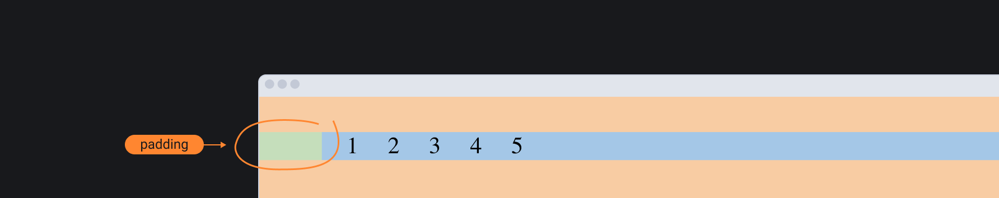

## Кратко

Свойство `padding` — или внутренний отступ — позволяет _оттолкнуть_ контент от границ родительского элемента.

Само свойство `padding` это шорткат, позволяющий задать отступы сразу со всех четырёх сторон.

Можно управлять отступами по отдельности при помощи свойств `padding-top`, `padding-left`, `padding-right`, `padding-bottom`.

## Пример

```html
<div class="parent">
  <p class="content">Сублимация, как бы это ни казалось парадоксальным, ...</p>
</div>
```

```css
.parent {
  /* Фон родительского элемента */
  background-color: #2E9AFF;
}
```

<iframe title="Текст без padding" src="demos/no-padding/" height="245"></iframe>

Текстовый контент, вложенный в блок с классом `.parent`, занимает всю площадь родителя и плотно прилегает к краям.

Попробуем добавить внутренний отступ — `padding`.

```css
.parent {
  background-color: #2E9AFF;
  /* Отступ по 55 пикселей сверху и снизу и 40 пикселей по бокам */
  padding: 55px 40px;
}
```

<iframe title="Текст с padding" src="demos/w-padding/" height="365"></iframe>

Почему в данном случае не следует задавать [`margin`](/css/margin/) или `padding` для элемента с классом `.content` чтобы оттолкнуть его от краёв родителя? Потому что нужно стараться верстать максимально гибко с расчётом на изменения в дальнейшем.

Если задать отступы для блока `.parent`, то даже в случае изменения контента всегда останется отступ между краями блока и вложенным контентом.

А если задать отступ для элемента `.content`, а завтра его заменят на `.content-2`, то отступ пропадёт, и вёрстка потеряет свой исходный вид.

## Как понять

Внутренние отступы являются частью [блочной модели](/css/box-model/), а значит участвуют в расчёте конечного размера элемента.

## Как пишется

Пишем свойство `padding` и через двоеточие после пробела указываем значение.

Значения можно указывать в любых относительных или абсолютных [единицах измерения](/css/numeric-types/), доступных в вебе: `px`, `em`, `rem`, `%`, `vh`, `vw` и так далее. Также можно использовать функцию [`calc()`](/css/calc/).

В качестве значения можно указать одно, два, три или четыре числа. Браузер будет читать это значение по-разному в зависимости от количества указанных значений.

- `padding: 10px 15px 20px 30px` — читается по часовой стрелке начиная с верхней границы. Сверху 10 пикселей —> справа 15 пикселей —> снизу 20 пикселей —> слева 30 пикселей. Все вычисления в вебе начинаются от верхнего левого угла. Запомни этот порядок. Он часто нужен при чтении кода.
- `padding: 15px` — со всех четырёх сторон будет одинаковый отступ в 15 пикселей.
- `padding: 15px 20px` — парные противоположные отступы. Первое значение для верхнего и нижнего отступов: сверху и снизу по 15 пикселей. Второе значение для боковых отступов: справа и слева по 20 пикселей.
- `padding: 10px 5px 25px` — первое значение для верхнего отступ (сверху 10 пикселей), второе значение для боковых отступов (справа и слева по 5 пикселей), последнее значение для нижнего отступа (снизу 25 пикселей).

## Подсказки

💡 Свойство не наследуется.

💡 Значение по умолчанию — `0`.

💡 Внутренний отступ не может быть отрицательным.

💡 Отступы можно анимировать при помощи свойства `transition` 🥳

💡 У вертикальных отступов нет проблемы схлопывания как у [`margin`](/css/margin/).

💡 У списков есть левый отступ по умолчанию. Не забывай его сбрасывать, если используешь списки только для группировки объектов.



💡 В инструментах разработчика в Chrome `padding` подсвечивается зелёным цветов. В Firefox при инспектировании элемента внутренний отступ обозначается светло-сиреневым цветом.
