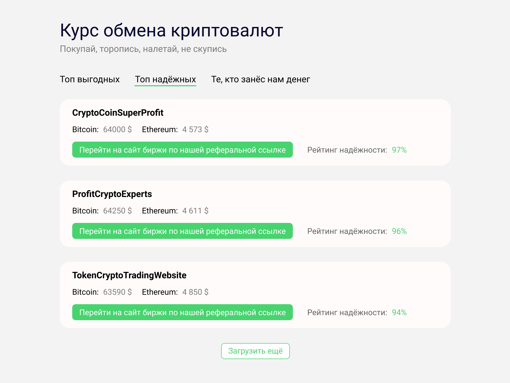
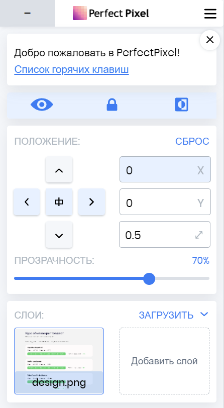
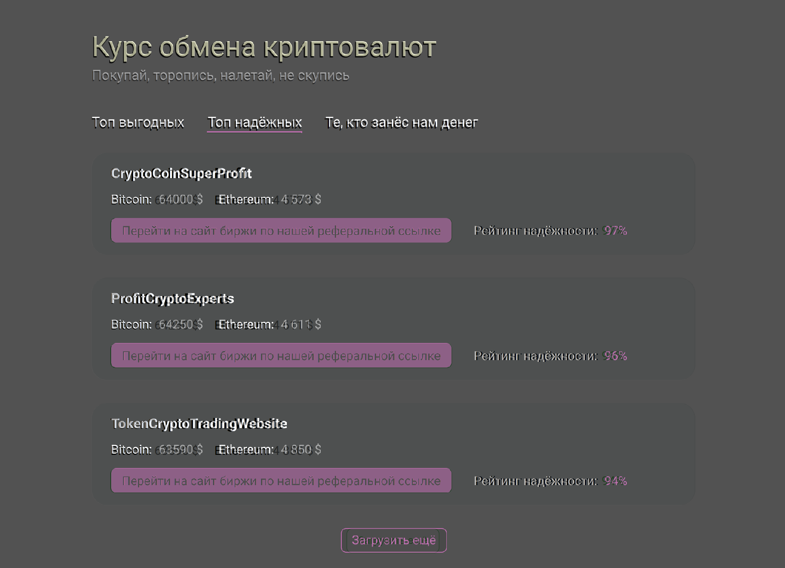
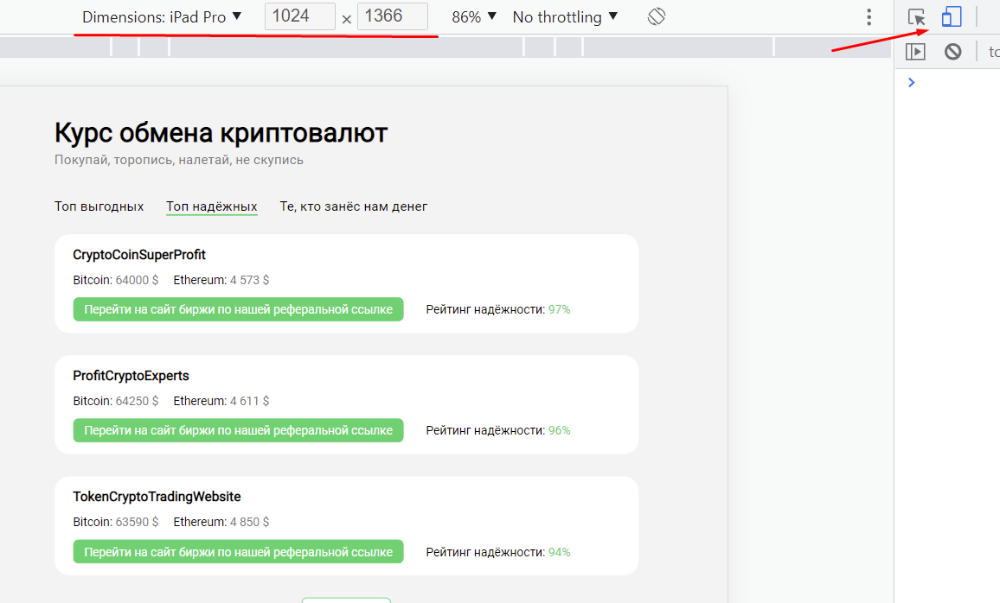

## Кратко

Pixel Perfect — это подход в вёрстке, когда итоговый результат максимально точно, пиксель в пиксель, совпадает с дизайнерским макетом. Для этого макет сайта сохраняется как обычная картинка, после чего эта картинка накладывается поверх свёрстанного сайта при помощи специальных инструментов, например, браузерных расширений. После наложения становится очевидной разница, если она есть, между тем, как нарисовал дизайнер, и тем, что получилось в итоге.

## Пример

Допустим, дизайнеры подготовили нам такой макет:



Мы его сверстали, получилось вот так:

<iframe title="Результат вёрстки" src="demos/incorrect/" height="400"></iframe>

Видите ли вы отличия с первого взгляда?

Есть несколько способов, как можно найти визуальные отличия.

**Сравнение скриншота и макета.** Можно сделать скриншот сайта и загрузить в графический редактор, после чего сравнить скриншот и исходный макет в режиме наложения. Это удобно для дизайнеров, когда нужно быстро проверить совпадение, а под рукой как раз есть открытый графический редактор. Но весьма неудобно для разработчика, потому что после каждого минимального изменения придётся делать новый скриншот и заменять им старый.

**Добавление картинки макета на страницу.** Можно сохранить макет картинкой, добавить её в документ с помощью тега [``](/html/img/) и [разместить](/css/position/#fixed) в центре страницы. После чего можно изменить прозрачность картинки с помощью [`opacity`](/css/opacity/), и отличия сразу будут видны. Это удобно при правке вёрстки, так как при изменении стилей сразу видно, насколько новая вёрстка совпадает с макетом. Этого можно добиться таким образом:

```html
<body>
  <!-- Контент страницы -->
  
</body>
```

```css
.pixel-perfect-image {
  position: fixed;
  top: 0;
  left: 50%;
  transform: translateX(-50%);
  opacity: 0.5;
}
```

**Браузерные расширения.** У предыдущего способа есть важный недостаток — нужно на каждую страницу сначала добавить картинку, затем написать для неё стили, а в конце не забыть её удалить. Браузерные расширения, такие как [PerfectPixel](https://www.welldonecode.com/perfectpixel/), берут эту рутину на себя. PerfectPixel доступен для установки в Chrome, Opera, Edge, Firefox (там доступна только платная версия), и ведётся разработка версии для Safari.

## Расширения помогают найти неточности

[Откроем демо](demos/incorrect/) из примера выше и сравним его с макетом. Вызвать интерфейс расширения можно, нажав на иконку расширения в списке расширений рядом с адресной строкой браузера. Откроется окно с таким интерфейсом:



За что отвечает каждая кнопка, можно посмотреть на официальном сайте расширения. Чаще всего нужны следующие функции:

1. Показать или скрыть накладываемый макет.
1. Инвертировать цвета макета.
1. Закрепить макет, чтобы он оставался на месте при прокрутке страницы.
1. Настроить положение макета относительно страницы.

Наложим макет на вёрстку и инвертируем цвета. Получим такой результат:



Сразу видны отличия:

- Съехали заголовки на карточках и цена биткоина и эфира.
- Съехало значение рейтинга надёжности.
- Кнопка «Загрузить ещё» имеет другой размер.

### Нужно ли учитывать все отличия?

Если внимательно присмотреться, то _единственный_ элемент, который расположен точно в нужном месте — это список карточек. Всё остальное хотя бы на 1 пиксель, но различается с макетом. Насколько это критично в рамках подхода Pixel Perfect?

Во-первых, небольшое смещение текста допустимо. Процесс рендеринга шрифта в графических редакторах и в браузерах отличается. Из-за этого заголовки карточек визуально отличаются, хотя и в макете, и в вёрстке у них одинаковые параметры.

Во-вторых, критичны только серьёзные расхождения. Основной целью Pixel Perfect подхода является, как бы это парадоксально ни звучало, не идеальная, а _приемлемая_ точность. Не нужно добиваться полного совпадения, нужно добиться результата, при котором расхождения незаметны для пользователя. Сейчас у большинства людей стоят мониторы размером 1920 × 1080 пикселей. Если заголовок займёт, допустим, не 187, а 189 пикселей в ширину, большинство людей этого не заметит. Обращайте внимание на отступы между блоками, выравнивание, размеры иконок и так далее.

## Исправляем недостатки

Исправим критичные расхождения. Для наглядности применим к заголовкам [`letter-spacing`](/css/letter-spacing/). Это не критично, но для наглядности будет полезно.

Результат:

<iframe title="Исправленная вёрстка" src="demos/correct/" height="400"></iframe>

При сравнении с макетом видно, что вёрстка совпадает с ним практически идеально:


## Работа с адаптивными макетами

Современный сайт должен адаптироваться под разные разрешения экранов. Обычно это мобильные экраны, планшеты, ноутбуки и десктопы. В таком случае дизайнер делает по одному макету на каждое необходимое разрешение. Используйте инструменты разработчика, чтобы проверить вёрстку на разных разрешениях. Их можно открыть несколькими способами:

- <kbd>Control Command I</kbd> — на macOS;
- <kbd>F12</kbd> — на Windows;
- <kbd>Control Shift I</kbd> — на Linux.

Включаем панель инструментов устройства (device toolbar) и выбираем нужный размер экрана. Можно задать размер вручную или выбрать один из предустановленных шаблонов.



После чего делаем всё так же, как раньше. Открываем расширение и добавляем картинку макета для соответствующего разрешения, после чего ищем отличия в вёрстке.

## Всегда ли нужен Pixel Perfect

Требования к вёрстке зависят от задачи и от того, кто её поставил. Если заказчик требует вёрстки по Pixel Perfect — придётся соблюдать это требование. Если же заказчик не требует идеальной вёрстки (или он не знает, что такое бывает), то можно придерживаться следующего алгоритма.

### Когда использовать Pixel Perfect

Если мы делаем презентационный вау-проект, то положение каждого элемента должно быть выверено до пикселя.

Если мы вносим изменения в сложную систему с кучей элементов, то поехавшую вёрстку можно даже не заметить, а вот при использовании Pixel Perfect изменения сразу бросятся в глаза.

Если все участники процесса понимают, для чего нужен Pixel Perfect и чего с его помощью мы пытаемся добиться, то впереди будет лишь продуктивная работа. Но иногда бывает, что у дизайнера дрогнула рука, и один элемент в списке случайно подвинулся на 1 пиксель. Затем макет прошёл цепочку согласований, и любая правка в нём — это недели бюрократических процессов. И тогда сплошь и рядом появляется ужасный код вида:

```css
.list-item:nth-child(4) {
  margin-left: 1px;
}
```

Всё потому, что вёрстка по Pixel Perfect — один из критериев приёмки работы заказчиком. И гораздо быстрее встроить ряд таких «костылей», чем поправить макет и запустить ещё один раунд голосования. Таких ситуаций стоит по возможности избегать, потому что подобный код лишь делает сайт тяжелее и медленнее, необходимо выстраивать более гибкие бизнес-процессы.

### Когда идеальной вёрсткой можно пренебречь

Если скорость разработки сильно важна. Например, мы делаем стартап, и если завтра не выйдем на рынок, то это сделают конкуренты. В таком случае _какая-нибудь_ вёрстка, но сделанная быстро, гораздо лучше идеальной, на полировку которой ушли драгоценные часы.

Если точность вёрстки не важна вообще. Например, мы делаем прототип продукта, который потом будет ещё десять раз переделываться, или панель администрирования, которой будут пользоваться технические специалисты, а не пользователи. Безусловно, это не значит, что мы можем в таком случае верстать как угодно, но и идеала добиваться не стоит.

Если точная вёрстка в принципе недостижима. Например, у графических редакторов, таких как «Фотошоп», рендеринг шрифтов может отличаться от браузерного. И тогда мы не сможем _адекватно_ добиться, чтобы текст в браузере выглядел в точности так, как в «Фотошопе» — придётся играть с [`letter-spacing`](/css/letter-spacing/), разделять текст на лишние блоки и заниматься прочей уличной магией. Таких манипуляций стоит избегать.

### Взгляд со стороны заказчика

Подход Pixel Perfect — самый простой способ для заказчика проверить качество вёрстки. Зачастую заказчик не обладает опытом веб-разработки и не сможет отличить плохой HTML- и CSS-код от хорошего. Но он сможет сравнить макет и результат, и если они совпадают — значит, верстальщик сделал свою работу хорошо.

Вам же, как верстальщику, это даёт конкурентное преимущество — говоря «Я верстаю по Pixel Perfect», вы сообщаете заказчику «Я сделаю именно то, что вам нужно, и вы сможете это очень легко проверить».

### Если вы новичок

Когда вы только начинаете путь в веб-разработке и вёрстке, использование подхода Pixel Perfect крайне желательно. Это поможет вам развить очень важные качества:

- Глазомер. После получения определённого опыта вы сможете буквально с одного взгляда замечать неточности в вёрстке.
- Чувство визуального ритма. Дизайнеры выбирают отступы между элементами, размеры шрифтов и иконок и т. д., основываясь на определённых критериях визуального ритма, которые помогают сделать сайт более приятным для глаза. Если вы будете постоянно следовать макетам дизайнеров, чувство визуального ритма разовьётся и у вас.
- Внимательность и дотошность. Один из основных критериев хорошего программиста или верстальщика — способность внимательно и сфокусированно выполнять свою работу, не допуская неточностей.

## Итог

1. Используйте подход Pixel Perfect, чтобы найти отличия получившейся вёрстки от исходного макета.
1. Не страдайте излишним перфекционизмом — обращайте внимание только на значимые отличия.
1. Обговорите требования к точности перед началом работы. При необходимости объясните коллегам, почему абсолютное совпадение макета и вёрстки не всегда достижимо, и что в этом нет ничего сильно страшного.
