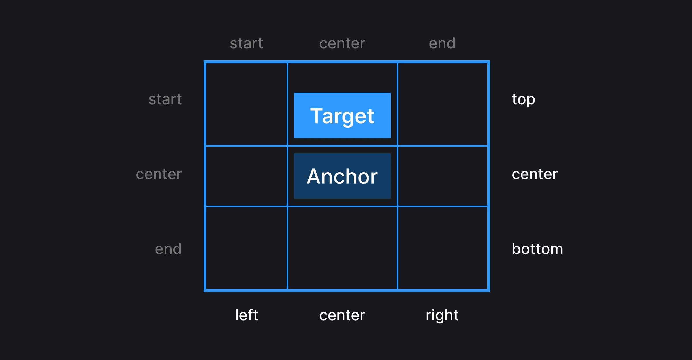

## Кратко

Свойство `position-area` предоставляет удобную концепцию на основе сетки для позиционирования относительного якорного элемента.

## Пример

```css
.target {
  position-area: top;
}
```

## Как понять

Обычно нам нужно разместить таргет элемент относительно якоря в "стандартных" позициях: сверху по центру, сверху слева и т.д.

Для этого можно использовать функцию [`anchor()`](/css/anchor-function/).

Например, вот так можем расположить элемент сверху слева относительно якоря:

```css
.target {
  // располагаем элемент сверху слева относительно якоря
  bottom: anchor(top);
  left: anchor(right);
}
```

<iframe title="Размещаем элемент сверху слева без position-area" src="demos/top-left-without-position-area/" height="440"></iframe>

Если нам нужно расположить элемент по центру одной из осей, можем использовать связку из функции [`anchor()`](/css/anchor-function/) и значения `anchor-center` для свойств [`justify-self`](/css/justify-self/), [`align-self`](/css/align-self/):

```css
.target {
  // располагаем элемент сверху по центру относительно якоря
  bottom: anchor(top);
  justify-self: anchor-center;
}
```

<iframe title="Размещаем элемент сверху по центру без position-area" src="demos/top-center-without-position-area/" height="440"></iframe>

В обоих случаях нам потребовалось использовать два свойства, чтобы расположить элемент в нужном месте. Не очень удобно. Чтобы решить эту проблему было создано свойство `position-area`. С помощью него можно расположить таргет элемент относительно якоря используя концепцию сетки.



Если визуально отобразить границы вьюпорта синим бордером, а затем провести воображаемые линии сверху, снизу, справа и слева от якорного элемента, получим сетку размера 3x3. Чтобы расположить элемент в определенной ячейке, нужно к ней обратиться с помощью ключевых слов top, bottom, right, left, center или их логических эквивалентов (start, center, end).

## Как пишется

Свойство `position-anchor` принимает в себя значение из двух ключевых слов: одно для расположения по горизонтальной оси, второе по вертикальной.

Например, запись

```css
.target {
  position-area: top center;
}
```

<iframe title="Располагаем элемент сверху по центру" src="demos/position-area-top-center/" height="680"></iframe>

расположит элемент сверху по центру.

Если нужно чтобы элемент мог занимать площадь двух ячеек нужно использовать `span` значение. Например, `span-left`.

```css
.target {
  position-area: top span-left;
}
```

<iframe title="Располагаем элемент сверху и тянем на две ячейки" src="demos/position-area-top-span-left/" height="680"></iframe>

А если хочется растянуть элемент на все три ячейки – в этом поможет значение `span-all`.

```css
.target {
  position-area: top span-all;
}
```

<iframe title="Располагаем элемент сверху и тянем на три ячейки" src="demos/position-area-top-span-all/" height="680"></iframe>

При этом `span-all` можно опустить, так как оно применяется по умолчанию.

```css
.target {
  position-area: top;
}
```

<iframe title="Располагаем элемент сверху и тянем на три ячейки" src="demos/position-area-top/" height="680"></iframe>

Важно помнить, что элемент растянется на все три ячейки, только если у него будет достаточно для этого ширины. Значение `span-all` само по себе не увеличит ширину таргет элемента.

Лучше понять, какое значение прописать для свойства, чтобы расположить его в нужной месте поможет интерективная демка ниже. В ней можно кликать на любую из ячеек, чтобы выбрать одну ячейку. Также зажать и тянуть, чтобы выбрать несколько ячеек.

<iframe title="Интерактивная демка, показывающася работу position-area" src="demos/position-area-interactive/" height="700"></iframe>
