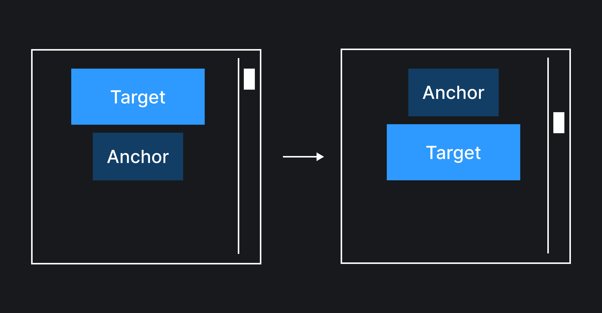
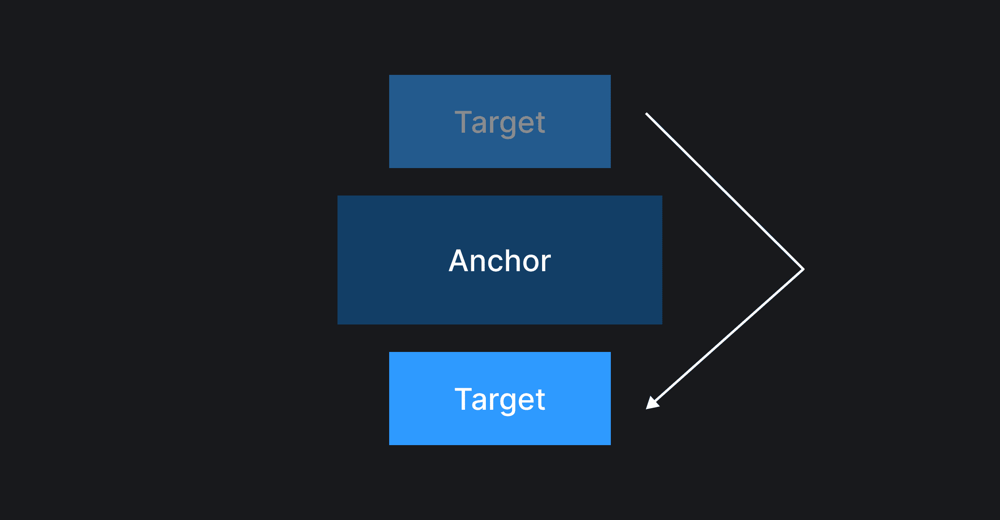
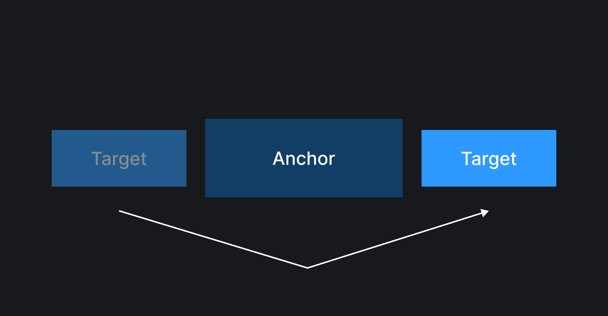
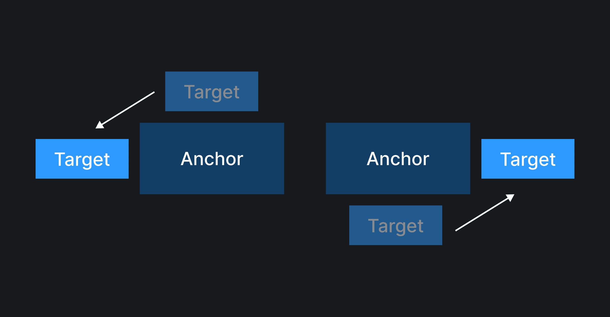

## Кратко

Свойство `position-try-fallbacks` перечисляет альтернативные варианты расположения таргет элемента.

## Пример

```css
.target {
  position-try-fallbacks: flip-block;
}
```

## Как пишется

Есть несколько вариантов значений и подходов для работы с `position-try-fallbacks`:

- `none` — список альтернативных расположений остается пустым. Значение по умолчанию;
- `<try-tactic>` – применяет заранее определенные стратегии альтернативного расположения элемента. Существует три стратегии:
  - `flip-block` – элемент будет менять свое расположение в блочном направлении;
  - `flip-inline` – элемент будет менять свое расположение в строчном направлении;
  - `flip-start` – элемент будет менять ось расположения: если он находился в начале одной оси, то он переместится в начало противоположной оси; если элемент находился в конце одной оси, то он переместится в конец противоположной оси;
- `<position-area>` – альтернативное расположение, заданное с помощью значения для свойства [`position-area`](/css/position-area/);
- `<position-try-option>` – имя альтернативного расположения, заданного с помощью директивы [`@position-try`](/css/position-try-rule).

Все вышеперечисленные варианты значений (кроме `none`) можно комбинировать между собой и указывать несколько вариантов через запятую.

```css
.target {
  position-try-fallbacks: flip-block, bottom span-right, flip-inline, --left;
}
```

## Как понять

Допустим, с помощью свойства [`position-area`](/css/position-area/) мы расположили таргет элемент сверху по центру относительно якоря.

<iframe title="Показываем отсутствие адаптивности расположения" src="demos/without-fallback/" height="400"></iframe>

В большинстве случаев этого будет достаточно, чтобы вёрстка выглядела хорошо, однако, не всегда. Например, если начать перемещать якорный элемент к верху экрана, то в какой-то момент таргет элемент скроется за пределами вьюпорта. А хотелось бы, чтобы он мог адаптироваться и переместиться вниз, как на картинке ниже.



Как раз в этом нам и может помочь свойство `position-try-fallbacks`. Оно предоставляет список альтернативных вариантов расположения таргет элемента, которые браузер может попробовать применить, если таргет элемент перестал помещаться целиком в своем начальном положении.

### `<try-tactic>`

Рассмотрим на примерах работу `<try-tactic>` значений.

Начнём с `flip-block`.

```css
.target {
  position-area: top center;
  position-try-fallbacks: flip-block;
}
```

Попробуйте переместить якорный элемент сверху вниз, потом снизу вверх.

<iframe title="Показываем работу значения flip-block" src="demos/flip-block/" height="400"></iframe>

При использовании `flip-block` значения таргет элемент будет менять свое местоположение в блочном направлении (то есть по вертикали для системы письменности справа налево).



Далее идёт `flip-inline`.

```css
.target {
  position-area: right center;
  position-try-fallbacks: flip-inline;
}
```

<iframe title="Показываем работу значения flip-inline" src="demos/flip-inline/" height="400"></iframe>

При использовании `flip-inline` значения таргет элемент будет менять своё местоположение в строчном направлении (то есть по горизонтали для системы письменности справа налево).



Последняя стратегия называется `flip-start`.

```css
.target {
  position-area: top center;
  position-try-fallbacks: flip-start;
}
```

<iframe title="Показываем работу значения flip-start" src="demos/flip-start-1/" height="400"></iframe>

```css
.target {
  position-area: bottom center;
  position-try-fallbacks: flip-start;
}
```

<iframe title="Показываем работу значения flip-start" src="demos/flip-start-2/" height="400"></iframe>

При использовании `flip-start` значения таргет элемент будет менять ось расположения: если он находился в начале одной оси, то он переместится в начало противоположной оси; если элемент находился в конце одной оси, то он переместится в конец противоположной оси.



### `<position-area>`

Если `<try-tactic>` подход не устраивает, можно явно указать значения [`position-area`](/css-position-area) в качестве альтернативных вариантов расположения.

```css
.target {
  position-area: top span-left;
  position-try-fallbacks: bottom span-right;
}
```

<iframe title="Показываем работу значения типа position-area" src="demos/position-area/" height="400"></iframe>
