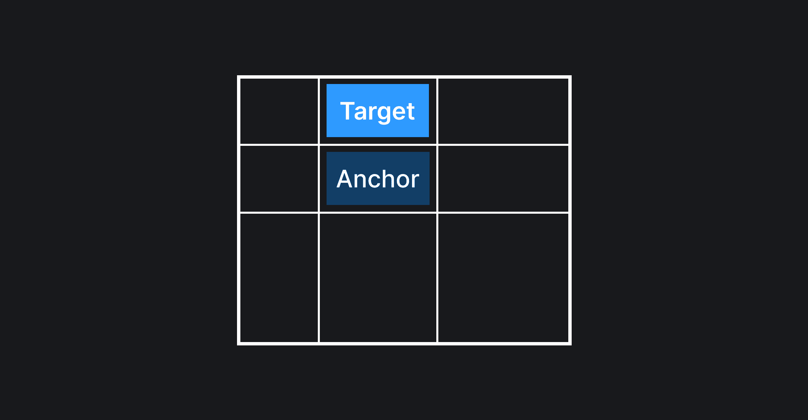
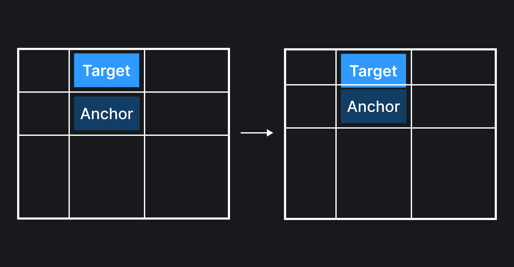
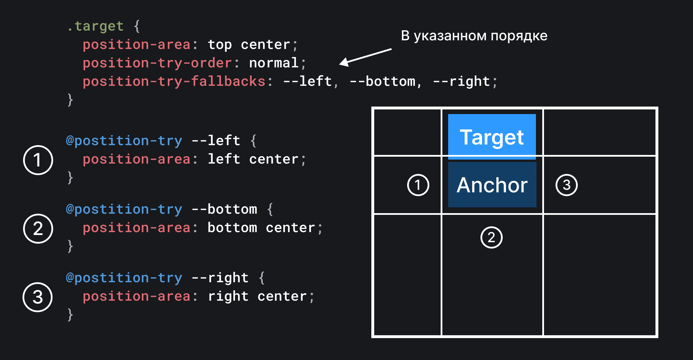
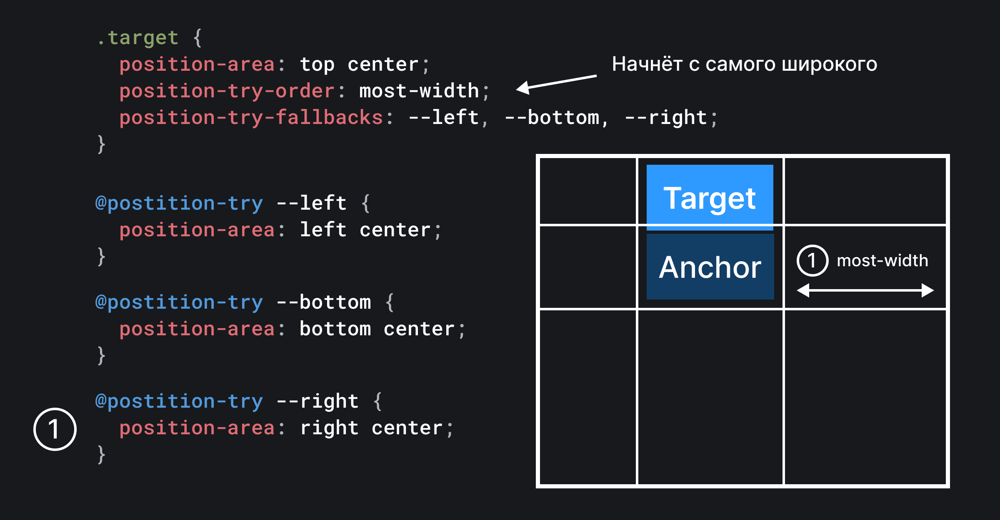
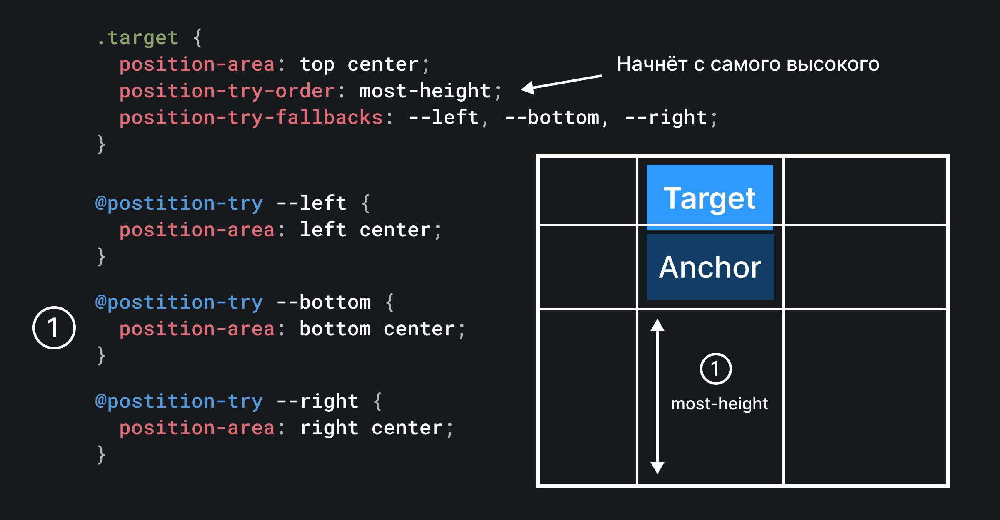

## Кратко

Свойство `position-try-order` определяет порядок применения возможных вариантов расположения таргет элемента.

## Пример

```css
.target {
  position-try-order: normal;
}
```

## Как понять

Представим, что мы c помощью свойства [`position-area`](/css/position-area/) разместили таргет элемент сверху по центру относительно якоря, а также задали несколько альтернативных вариантов расположения с помощью свойства [`position-try-fallbacks`](/css/position-try-fallbacks/).

```css
.target {
  position-area: top center;
  position-try-fallbacks: --left, --bottom, --right;
}

@position-try --left {
  position-area: left center;
}

@position-try --bottom {
  position-area: bottom center;
}

@position-try --right {
  position-area: right center;
}
```

Если с помощью белых линий визуально отобразим границы каждой из ячеек возможных для расположения, то у нас получится картинка ниже.



Кстати, не пугайтесь того, что здесь ячейки не пропорциональны друг другу. Просто якорный элемент смещён к левой стороне вьюпорта относительно центра, поэтому и пропорции ячеек тоже изменились.

Сейчас таргет элемент целиком помещается в своей дефолтной ячейке для расположения (`top center`). Но если пользователь начнёт скроллить экран, то может случиться ситуация, при которой таргет элемент перестанет помещаться в верхней центральной ячейке.



В этот момент браузер должен начать применять фолбэки для расположения. Но как он определяет, какой фолбэк применить первым?

Чтобы помочь браузеру решить эту задачу было придумано свойство `position-try-order`, с помощью которого мы можем указать порядок применения альтернативных вариантов расположения.

## Как пишется

Свойство `position-try-order` имеет несколько значений:

- `normal` – фолбэки будут пробовать примениться в том порядке, в котором они указаны внутри свойства [`position-try-fallbacks`](/css/position-try-fallbacks/). Значение по умолчанию;
- `most-width` – фолбэки начнут применяться, начиная с самого широкого (самой широкой ячейки);
- `most-height` – фолбэки начнут применяться, начиная с самого высокого (самой высокой ячейки).

Также для `most-width` и `most-height` существуют логические эквиваленты `most-block-size` и `most-inline-size`.

Рассмотрим более подробно, как это всё работает.

### `normal`

```css
.target {
  position-area: top center;
  position-try-fallbacks: --left, --bottom, --right;
  position-try-order: normal;
}

@position-try --left {
  position-area: left center;
}

@position-try --bottom {
  position-area: bottom center;
}

@position-try --right {
  position-area: right center;
}
```

Если используется значение `normal`, браузер будет пробовать применить фолбэки в том порядке, в котором они указаны внутри свойства [`position-try-fallbacks`]. В нашем случае браузер сперва попробует применить `--left`, затем `--bottom` и в конце `--right` фолбэки.



### `most-width`

```css
.target {
  position-area: top center;
  position-try-fallbacks: --left, --bottom, --right;
  position-try-order: most-width;
}

@position-try --left {
  position-area: left center;
}

@position-try --bottom {
  position-area: bottom center;
}

@position-try --right {
  position-area: right center;
}
```

Если используется значение `most-width`, браузер будет пробовать применить фолбэки, начиная с самого широкого. В нашем случае браузер сперва попробует применить `--right` фолбэк, потому что у этой ячейки самая большая ширина.



### `most-height`

```css
.target {
  position-area: top center;
  position-try-fallbacks: --left, --bottom, --right;
  position-try-order: most-height;
}

@position-try --left {
  position-area: left center;
}

@position-try --bottom {
  position-area: bottom center;
}

@position-try --right {
  position-area: right center;
}
```

Если используется значение `most-height`, браузер будет пробовать применить фолбэки, начиная с самого высокого. В нашем случае браузер сперва попробует применить `--bottom` фолбэк, потому что у этой ячейки самая большая высота.



### Интерактивная демка

```css
.target {
  position-area: top center;
  position-try-fallbacks: --left, --bottom, --right;
}

@position-try --left {
  position-area: left center;
}

@position-try --bottom {
  position-area: bottom center;
}

@position-try --right {
  position-area: right center;
}
```

Закрепим разобранные примеры с помощью интерактивной демки. Попробуйте перетащить якорный элемент к верху вьюпорта – в зависимости от выбранного значения `position-try-order` он будет пытаться переместиться влево, вниз или вправо.

<iframe title="Показываем работу свойства position-try-order" src="demos/position-try-order/" height="450"></iframe>
