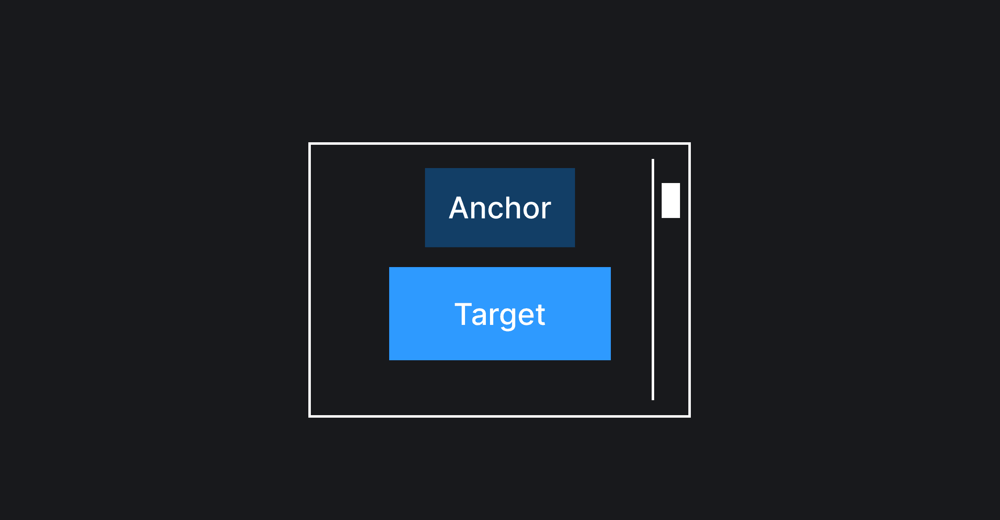
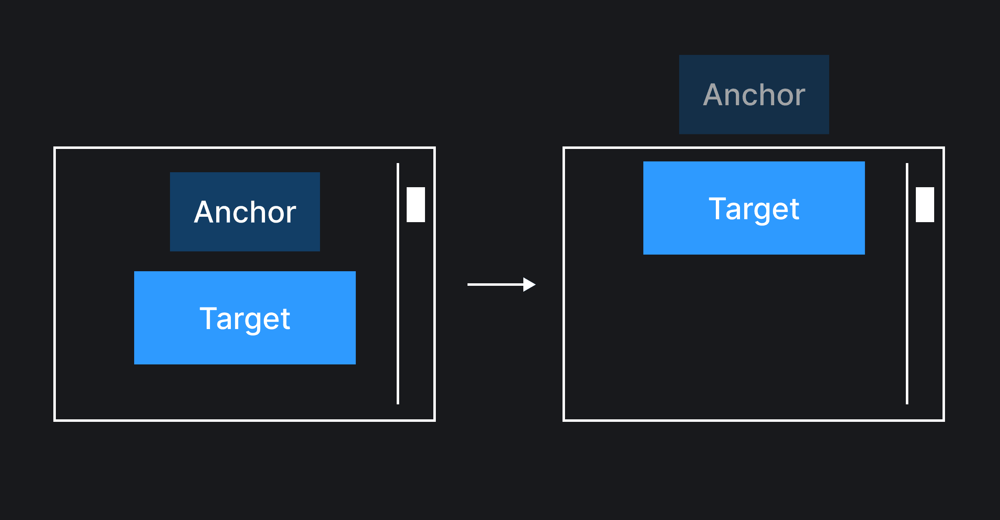
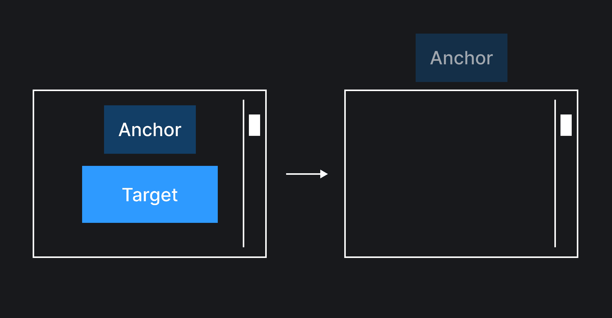

## Кратко

Свойство `position-visibility` определяет в каких случаях таргет элемент должен быть виден.

## Пример

```css
.target {
  position-visibility: anchors-visible;
}
```

## Как пишется

Свойство `position-visibility` принимает несколько значений:

- `always` – таргет элемент будет виден всегда, пока полностью или частично помещается на экран, видимость таргета не зависит от видимости якоря;
- `no-overflow` – таргет элемент будет скрываться, если происходит `overflow` – таргет элемент не помещается целиком ни в одну из позиций: ни в [начальную](/css/position-area/), ни в [фолбэчную](/css/position-try-fallbacks/);
- `anchors-visible` – таргет элемент будет виден, пока виден якорный элемент. Если якорь скрылся, таргет тоже перестанет быть видимым. Является значением по умолчанию.

Также в спецификации есть ещё четвёртое значение `anchors-valid`, но оно пока не реализовано ни в одном из браузеров.

## Как понять

Допустим, что на странице есть таргет элемент, привязанный к якорю, как на картинке ниже.



Затем, представим, что пользователь проскроллил страницу вниз таким образом, что якорный элемент целиком скрылся за пределами вьюпорта, а таргет элемент остался в границах экрана.



В данной ситуации иногда может быть не очень очевидно, почему какой-то элемент болается на экране, так как не видно элемента, к которому он привязан. И круто было бы уметь в такой ситуации скрывать еще и таргет элемент.



Реализовать подобное поведение может свойство `position-visibility`, с помощью которого можно указать, в какие моменты таргет элемент должен быть скрыт или виден.

Рассмотрим на примерах работу каждого из значений.

### `always`

```css
.target {
  position-visibility: always;
}
```

Таргет элемент будет оставаться видимым независимо от видимости якорного элемента. Попробуйте проскроллить вверх-вниз демку ниже – таргет элемент будет отображаться до тех пор, пока сам хоть сколько влезает во вьюпорт, при этом не важно – виден или скрыт якорный элемент.

<iframe title="Показываем работу значения always" src="demos/position-visibility-always/" height="400"></iframe>

### `no-overflow`

Допустим, таргет элемент имеет дефолтную [позицию](/css/position-area/) равную `top center` и в качестве [фолбэка](/css/position-try-fallbacks/) применяется стратегия `flip-block`.

```css
.target {
  position-area: top center;
  position-try: flip-block;
}
```

<iframe title="Показываем работу значения no-overflow" src="demos/position-visibility-no-overflow/" height="500"></iframe>

Если попробуем проскроллить демку выше, то таргет элемент будет менять свое положение сверху-вниз и обратно при приближении к одной из границ вьюпорта. Все работает должным образом, так как таргет элемент целиком помещается, как в верхнюю ячейку, так и в нижнюю.

Если же кликнуть на чекбокс `height: 300px;`, то высота таргет элемента увеличится и он перестанет сразу же менять свою позицию при пересечении границ вьюпорта, так как в фолбэк-позицию он тоже целиком не помещается. Если продолжить скроллить, то в момент, когда в фолбэк-позиции наберется достаточно места для размещения таргета целиком, то тогда и только тогда, он сменит своё местоположение. В остальные моменты времени будет происходить `overflow`.

Если же требуется, чтобы в момент `overflow` таргет элемент скрывался, то нужно выставить `position-visibility: no-overflow;`. Теперь таргет элемент будет отображаться только тогда, когда он целиком может поместиться в одной из указанных позиций (дефолтной или фолбэчной). Попробуйте кликнуть в демке на второй чекбокс, чтобы убедиться в этом.

### `anchors-visible`

Иногда нужно, что таргет элемент отображался на экране, только если якорный элемент тоже виден. Если якорь скрылся, то таргет тоже должен скрыться. Подобная механика пригодится, если нужно сверстать боковые сноски с пояснением, что значит какой-то из терминов в тексте. Например, как в демке ниже: якорь является термином, а таргет элемент сноской с определением.

<iframe title="Показываем работу значения anchors-visible" src="demos/position-visibility-anchors-visible/" height="480"></iframe>

Без применения значения `anchors-visible` таргет элемент продолжает оставаться видимым, даже если якорь скрылся по мере пролистывания текста. И становится не очень понятным, почему какой-то элемент движется вместе со скроллом текста, так как не видно якорь, к которому он привязан.

Если применить `position-visibility: anchors-visible;`, то таргет элемент начинает скрываться вместе с якорем, и вновь становиться видимым в момент появления якорного элемента.
