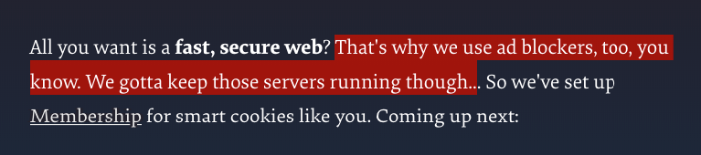
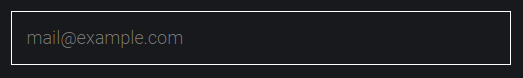

## Кратко

Псевдоэлементы — это элементы, которых не существует в HTML-разметке. Они создаются и позиционируются исключительно при помощи CSS. Чаще всего используются для создания различных декоративных элементов (которые не несут содержательного смысла).

Также псевдоэлементы приходят на помощь, когда нужно наложить поверх картинки так называемый оверлей (перекрывающий слой). На этом польза от псевдоэлементов не заканчивается.

## Пример

Самый частый сценарий использования псевдоэлемента — наложение оверлея, полупрозрачной заливки поверх картинки. Чаще всего это требуется на первом экране, но этим способом можно наложить оверлей на любое изображение на сайте.

```html
<header class="header">
  <h1 class="header__title">Good evening, Clarice.</h1>
</header>
```

```css
.header {
  background: #999999
    url("background.svg")
    no-repeat center / cover;
}

.header__title {
  color: #ffffff;
  font-size: 82px;
  text-transform: uppercase;
  text-align: center;
}
```

<iframe title="Наложение фона" src="demos/header/" height="400"></iframe>

Чтобы цвет картинки был не таким ярким и текст лучше читался, наложим поверх всего `header` полупрозрачную заливку чёрного цвета.

Добавляем позиционирование родителю и указываем порядок наложения:

```css
.header {
  position: relative;
  z-index: 0;
}
```

`content` — обязательное свойство псевдоэлементов `::before` и `::after`. Позиционируем псевдоэлемент относительно родителя и растягиваем на всю ширину и высоту. После чего задаём полупрозрачный чёрный фон и убираем под текст при помощи `z-index`:

```css
.header::before {
  content: "";
  position: absolute;
  top: 0;
  left: 0;
  width: 100%;
  height: 100%;
  background-color: rgba(0 0 0 / 0.7);
  z-index: -1;
}
```

<iframe title="Наложение фона с заливкой" src="demos/header-veil/" height="400"></iframe>

Не трогая HTML-разметку, мы добавили ещё один элемент в декоративных целях. Разметка осталась чистой. Псевдоэлементом легко управлять, добавлять или удалять его по необходимости, даже если нет доступа к HTML.

## Как понять

Определение приставки «псевдо» в словаре: «...Приставка, означающая ложность, ненастоящесть следующего за ней».

Из этого определения можно понять, что псевдоэлементы не существуют на самом деле. Это порождение CSS, которое можно изменять, удалять, добавлять, не трогая реальную HTML-разметку.

### Как пишется

Существует несколько псевдоэлементов. Рассмотрим каждый из них.

### `::before` и `::after`

Два самых часто встречающихся псевдоэлемента. Они очень похожи. Единственная разница заключается в том, что [`::before`](/css/before/) по умолчанию располагается перед содержимым элемента, для которого задаётся, а [`::after`](/css/after/) — после. Эта разница отражена в названии: слово **before** переводится с английского как «до» или «перед»; слово **after** переводится как «после».

Для обоих элементов обязательным является свойство [`content`](/css/content/) — содержимое псевдоэлемента. С его помощью можно, например, вставить какое-нибудь слово до или после текста. Без свойства `content` псевдоэлемент не отобразится.

Создадим текстовый элемент с именем пользователя.

```html
<span class="incoming">Гордон</span>
```

Поприветствуем пользователя и скажем ему комплимент:

```css
.incoming::before {
  content: "Привет, ";
}

.incoming::after {
  content: ", ты отлично выглядишь!";
}
```

<iframe title="Текст в псевдоэлементах ::before и ::after" src="demos/looking-great-gordon/" height="260"></iframe>

Как видно в примере, текст из свойства `content` псевдоэлемента `::before` встал перед именем пользователя, а из псевдоэлемента `::after` — после.

Эти псевдоэлементы по умолчанию являются строчными. Но это легко изменить при помощи стилей.

Подчеркнём декоративной линией текст.

Зададим родителю строчно-блочное отображение, чтобы линия была по ширине текста:

```css
.incoming {
  display: inline-block;
}

.incoming::before {
  content: "Привет, ";
}

.incoming::after {
  content: "";
  display: block;
  width: 100%;
  height: 2px;
  background-color: #F498AD;
}
```

<iframe title="Декоративная линия на основе псевдоэлемента" src="demos/greetings-gordon/" height="200"></iframe>

### `::first-letter`

При помощи этого псевдоэлемента можно выбрать первую букву в строке или абзаце текста. Это позволяет создать так называемую _буквицу_ — большую декоративную букву в начале текста.

```html
<p class="text">
  В траве, около высоких муравейников...
</p>
```

Увеличиваем размер первой буквы и красим её в красный цвет:

```css
.text::first-letter {
  font-size: 52px;
  color: #F498AD;
}
```

<iframe title="::first-letter, буквица" src="demos/first-letter/" height="370"></iframe>

### `::first-line`

Этот псевдоэлемент выбирает первую строку текста. Обратите внимание, что он сработает только для блочных элементов. Со строчными этот трюк не пройдёт.

Например, можно сделать «красную строку», правда, не так, как учили в школе =)

```html
<p class="text">
  В далекой и бледной глубине неба...
</p>
```

Красим первую строку в красный:

```css
.text::first-line {
  background-color: #F498AD;
}
```

<iframe title="::first-line, красная строка" src="demos/first-line/" height="325"></iframe>

### `::selection`

С помощью псевдоэлемента `::selection` можно управлять стилем текста, который пользователь выделяет при помощи мыши.



Текст на сайте [Smashing Magazine](https://www.smashingmagazine.com/) выделяется красным цветом. Использование псевдоэлемента `::selection` позволяет выдержать стиль оформления во всём, вплоть до такой мелочи, как выделение текста.

Целесообразнее всего задавать этот псевдоэлемент не какому-то отдельному блоку, а всей странице целиком.

```css
::selection {
  background-color: #F498AD;
}
```

<iframe title="::selection, выделение текста" src="demos/selection/" height="400"></iframe>

Если выделить текст в этом примере, то станет видно, что фон выделения ярко-красного цвета.

### `::placeholder`

Он позволяет стилизовать подсказку, которая выводится в поле ввода текста ([`<input>`](/html/input/)).

Текст подсказки задаётся при помощи атрибута `placeholder` у тега `<input>`.

```html
<input type="email" placeholder="test@example.com">
```



По умолчанию цвет текста подсказки серый. Но иногда по дизайну требуется другой цвет.

Используйте псевдоэлемент `::placeholder` и задайте нужные стили для подсказки. Можно изменить всё, вплоть до шрифта. При этом стили текста, который будет вводить пользователь, не будут затронуты.

```css
input::placeholder {
  color: #2E9AFF;
}
```

<iframe title="Placeholder, подсказка" src="demos/placeholder/" height="200"></iframe>

## Подсказки

💡 Обязательно проверяйте поддержку псевдоэлемента в нужных браузерах. Для этого можно использовать сайт [Can I use](https://caniuse.com/).

💡 Для свойства `content` есть несколько полезных трюков. Например, можно с помощью data-атрибута у тега (которому можно задать значение при помощи JavaScript) и значения `attr(data-атрибут)` вывести количество непрочитанных сообщений на лейбле. Или количество товаров в корзине. Такой способ будет «дешевле» в том плане, что реальная HTML-разметка не изменяется.

💡 В качестве значения свойства `content` можно вставлять юникод. Например, можно добавить символ копирайта при помощи записи `content: "&#169;"`.

💡 Можно встретить в коде написание псевдоэлементов с одним двоеточием в начале. Такой синтаксис допустим почти всегда, кроме как с псевдоэлементами `::selection` и `::placeholder`. Но в последних редакциях спецификации рекомендуется писать все псевдоэлементы с двумя двоеточиями, чтобы визуально отделить их от псевдоклассов.
