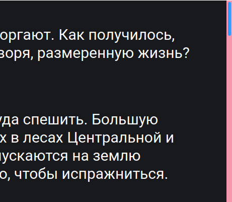
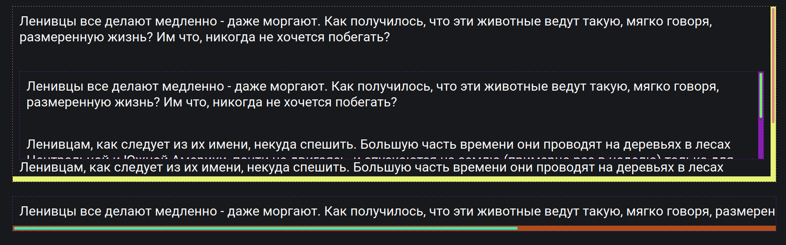

## Кратко

`scrollbar-color` позволяет изменять цвета полосы прокрутки и ползунка.

<aside>

На данный момент `scrollbar-color` очень слабо поддерживается браузерами ([Can I Use](https://caniuse.com/mdn-css_properties_scrollbar-color)). Сейчас свойство будет работать только в Firefox. К тому же, если вы используете MacOS, вам нужно в настройках ОС поставить галочку "всегда отображать скроллбар", иначе полоса прокрутки будет отображаться не совсем корректно.

Если вы используете любой другой браузер, то `scrollbar-color` не сработает. Поэтому под каждым демо мы добавим картинку того, как это выглядит в Firefox.

</aside>

## Пример

Изменим цвет ползунка и самой полосы скроллбара.

```css
html {
  scrollbar-color: #2E9AFF #F498AD;
}
```

<iframe title="Пример с несколькими разными скроллбарами" src="demos/basic/" height="400"></iframe>


Пример того, как это выглядит в Firefox

## Как пишется

Свойство принимает два цвета — первый задаёт цвет ползунка, а второй — цвет фона контейнера. Указать только один цвет не получится (даже если хотите сделать цвет фона и ползунка одинаковым) — будет синтаксическая ошибка. Можно указывать любые [корректные значения](/css/color/#kak-pishetsya) цвета.

Вот так можно задать ползунку цвет `#2E9AFF` , а фону — `#F498AD`.

```css
html {
  scrollbar-color: #2E9AFF #F498AD;
}
```

Также можно задавать разные цвета для скроллбаров в разных блоках, причём стилизуются как вертикальные, так и горизонтальные скроллбары.

<iframe title="Базовый пример" src="demos/multiple/" height="400"></iframe>


Пример того, как несколько разных скроллбаров выглядят в Firefox

Обратите внимание, что скроллбар с жёлтым фоном создаёт вертикальную и горизонтальную полосу, а с фиолетовым — только вертикальную. Это связано с тем, что для блока-контейнера (жёлтый фон) мы задали `overflow: scroll`, а для внутреннего блока — `overflow-y: scroll`. Поэтому у внутреннего блока появился фон только для вертикальной прокрутки, а для контейнера — сразу для вертикальной и горизонтальной.
