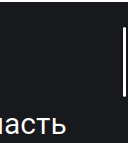
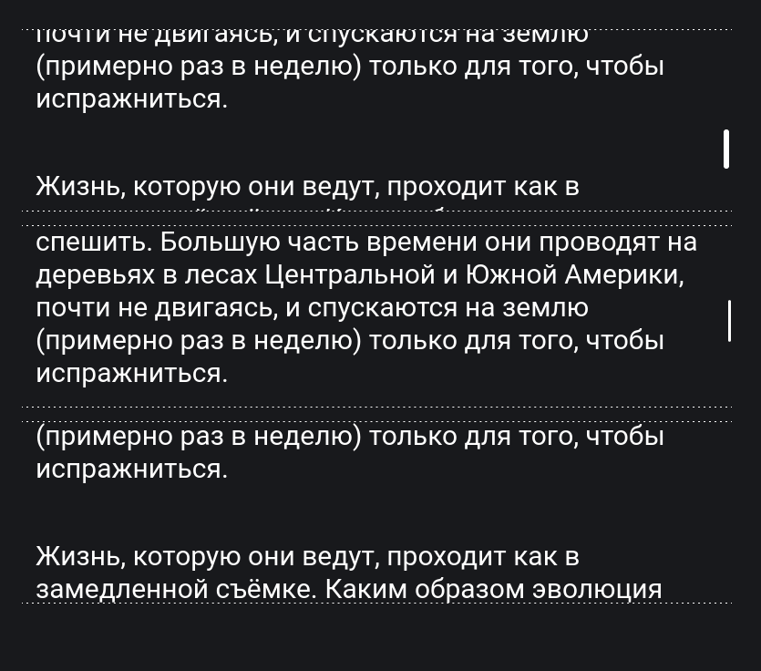

## Кратко

`scrollbar-width` позволяет изменить ширину полосы прокрутки.

<aside>

На данный момент `scrollbar-width` очень слабо поддерживается браузерами ([Can I Use](https://caniuse.com/mdn-css_properties_scrollbar-width)). Сейчас свойство будет работать только в Firefox.

Если вы используете любой другой браузер, то `scrollbar-width` не сработает. Поэтому под каждым демо мы добавим картинку того, как это выглядит в Firefox. Также во всех демо мы зададим ползунку скроллбара белый цвет при помощи [`scrollbar-color`](/css/scrollbar-color), чтобы он лучше выделялся на тёмном фоне.

</aside>

## Пример

```css
html {
  scrollbar-width: thin;
}
```

<iframe title="Тонкий скроллбар" src="demos/basic/" height="400"></iframe>


Пример того, как это выглядит в Firefox

## Как пишется

У `scrollbar-width` есть 3 возможных значения:

1. `auto` — дефолтное значение. Браузер отрисует обычный скроллбар.
1. `thin` — браузер отрисует тонкий скроллбар.
1. `none` — скроллбар не будет отрисован. При этом контент по-прежнему можно будет прокрутить.

Вот как они выглядят рядом:

<iframe title="Разные значения ширины скроллбара" src="demos/multiple/" height="400"></iframe>


Пример того, как скроллбары с разной шириной выглядят в Firefox

Значение `none` не рекомендуется использовать. Мы должны явно дать пользователю понять что контент в каком-то блоке выходит за его границы, и ему нужно пролистать, чтобы увидеть остальное. Если просто убрать скроллбар, то это только запутает пользователей. К тому же если пользователь использует только мышь, то этот контент может оказаться недоступным (вдруг у него сломалось колесо прокрутки).

В целом, с шириной полосы прокрутки нужно обращаться очень осторожно. Даже если просто сделать её тоньше, мы можем создать проблемы с доступностью — пользователям буквально сложнее попасть мышью в тонкий ползунок. А убирая ползунок совсем мы должны не допускать того, чтобы контент за пределами видимой области стал недоступен.
