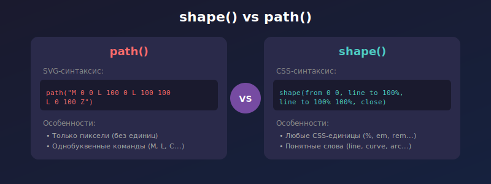
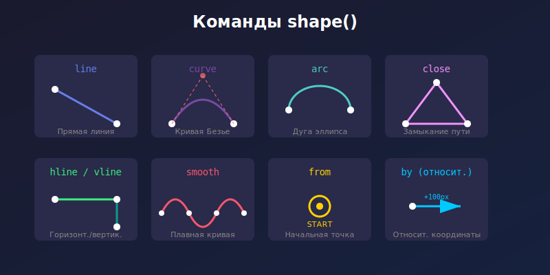

## Кратко

Функция `shape()` — это новый способ создания сложных форм в CSS. Она похожа на функцию `path()`, но использует более понятный синтаксис с командами и поддерживает CSS-единицы измерения вместо только пикселей.



## Пример

Создадим треугольник с помощью `shape()`:

```css
.triangle {
  clip-path: shape(from 50% 0, line to 100% 100%, line to 0 100%, close);
}
```

<iframe title="Базовый пример shape()" src="demos/basic/" height="320"></iframe>

## Как пишется

Функция `shape()` принимает набор команд, разделённых запятыми. Каждая команда описывает часть пути фигуры.

### Начальная точка `from`

Путь всегда начинается с команды `from`, которая задаёт начальную позицию:

```css
.element {
  clip-path: shape(from 0 0, ...);
}
```

Координаты можно указывать в любых CSS-единицах: `px`, `%`, `em`, `rem`, `vw` и других.



### Команда `line`

Рисует прямую линию от текущей точки до указанной:

```css
.element {
  clip-path: shape(from 0 0, line to 100% 0, line to 100% 100%, close);
}
```

<iframe title="Команда line" src="demos/line/" height="320"></iframe>

### Команды `hline` и `vline`

Упрощённые команды для горизонтальных и вертикальных линий:

- `hline to <x>` — горизонтальная линия до указанной координаты X
- `vline to <y>` — вертикальная линия до указанной координаты Y

```css
.element {
  clip-path: shape(
    from 0 0,
    hline to 100%,
    vline to 100%,
    hline to 0,
    close
  );
}
```

<iframe title="Команды hline и vline" src="demos/hline-vline/" height="320"></iframe>

### Команда `curve`

Создаёт кривую Безье. Поддерживаются квадратичные и кубические кривые:

```css
/* Квадратичная кривая с одной контрольной точкой */
.element {
  clip-path: shape(
    from 0 100%,
    curve to 100% 100% with 50% 0,
    close
  );
}

/* Кубическая кривая с двумя контрольными точками */
.element {
  clip-path: shape(
    from 0 50%,
    curve to 100% 50% with 25% 0 / 75% 100%,
    close
  );
}
```

<iframe title="Команда curve" src="demos/curve/" height="400"></iframe>

### Команда `arc`

Рисует дугу эллипса:

```css
.element {
  clip-path: shape(
    from 50% 0,
    arc to 50% 100% of 50% 50%,
    arc to 50% 0 of 50% 50%,
    close
  );
}
```

Параметры дуги:
- `to <x> <y>` — конечная точка дуги
- `of <rx> <ry>` — радиусы эллипса по осям X и Y
- `cw` / `ccw` — направление (по часовой / против часовой стрелки)
- `large` / `small` — большая или малая дуга

```css
.element {
  clip-path: shape(
    from 20% 50%,
    arc to 80% 50% of 30% cw large,
    close
  );
}
```

<iframe title="Команда arc" src="demos/arc/" height="400"></iframe>

### Команда `smooth`

Создаёт плавную кривую, автоматически вычисляя контрольные точки на основе предыдущей команды:

```css
.element {
  clip-path: shape(
    from 0 50%,
    curve to 33% 50% with 16% 0,
    smooth to 66% 50%,
    smooth to 100% 50%,
    close
  );
}
```

<iframe title="Команда smooth" src="demos/smooth/" height="320"></iframe>

### Команда `close`

Замыкает путь, соединяя текущую точку с начальной:

```css
.element {
  clip-path: shape(from 0 0, line to 100% 50%, line to 0 100%, close);
}
```

### Относительные координаты с `by`

Вместо абсолютных координат можно использовать относительные с ключевым словом `by`:

```css
.element {
  clip-path: shape(
    from 0 0,
    line by 100% 0,    /* Сдвиг на 100% вправо */
    line by 0 100%,    /* Сдвиг на 100% вниз */
    line by -100% 0,   /* Сдвиг на 100% влево */
    close
  );
}
```

<iframe title="Относительные координаты" src="demos/relative/" height="320"></iframe>

## Где использовать

Функция `shape()` работает со следующими свойствами:

- [`clip-path`](/css/clip-path/) — обрезка элемента по форме
- [`offset-path`](/css/offset-path/) — путь для анимации движения
- `shape-outside` — обтекание текстом

```css
/* Обрезка по форме */
.clipped {
  clip-path: shape(from 0 0, line to 100% 0, line to 50% 100%, close);
}

/* Путь для анимации */
.animated {
  offset-path: shape(from 0 0, curve to 100% 100% with 50% 0);
  animation: move 3s infinite;
}

@keyframes move {
  to {
    offset-distance: 100%;
  }
}
```

<iframe title="Анимация по пути" src="demos/animation/" height="400"></iframe>

## Сравнение с `path()`

Функция `shape()` имеет несколько преимуществ перед `path()`:

| Особенность | `path()` | `shape()` |
|-------------|----------|-----------|
| Единицы измерения | Только пиксели | Любые CSS-единицы |
| Синтаксис | SVG-команды (M, L, C...) | Понятные слова (move, line, curve...) |
| Относительные координаты | Отдельные команды (m, l, c...) | Ключевое слово `by` |
| Читаемость | Сложнее | Проще |

```css
/* path() — SVG-синтаксис */
.element {
  clip-path: path("M 0 0 L 100 0 L 100 100 L 0 100 Z");
}

/* shape() — CSS-синтаксис */
.element {
  clip-path: shape(from 0 0, line to 100px 0, line to 100px 100px, line to 0 100px, close);
}
```

## Практические примеры

### Звезда

```css
.star {
  clip-path: shape(
    from 50% 0,
    line to 61% 35%,
    line to 98% 35%,
    line to 68% 57%,
    line to 79% 91%,
    line to 50% 70%,
    line to 21% 91%,
    line to 32% 57%,
    line to 2% 35%,
    line to 39% 35%,
    close
  );
}
```

<iframe title="Звезда" src="demos/star/" height="350"></iframe>

### Сердце

```css
.heart {
  clip-path: shape(
    from 50% 20%,
    curve to 90% 45% with 50% 0 / 90% 10%,
    curve to 50% 90% with 90% 70% / 60% 90%,
    curve to 10% 45% with 40% 90% / 10% 70%,
    curve to 50% 20% with 10% 10% / 50% 0,
    close
  );
}
```

<iframe title="Сердце" src="demos/heart/" height="350"></iframe>

### Волна

```css
.wave {
  clip-path: shape(
    from 0 60%,
    curve to 25% 40% with 10% 60% / 15% 40%,
    curve to 50% 60% with 35% 40% / 40% 60%,
    curve to 75% 40% with 60% 60% / 65% 40%,
    curve to 100% 60% with 85% 40% / 90% 60%,
    line to 100% 100%,
    line to 0 100%,
    close
  );
}
```

<iframe title="Волна" src="demos/wave/" height="350"></iframe>

## Подсказки

💡 Функция `shape()` — это часть CSS Shapes Module Level 2 и пока имеет ограниченную поддержку браузерами. Проверяйте актуальную поддержку на [Can I use](https://caniuse.com/).

💡 Для сложных форм удобно сначала нарисовать их в графическом редакторе, а затем перевести координаты в команды `shape()`.

💡 Используйте относительные единицы (`%`) для создания адаптивных форм, которые масштабируются вместе с элементом.

💡 Команда `smooth` особенно полезна для создания плавных волнистых линий без ручного расчёта контрольных точек.

💡 Свойство не наследуется.

💡 Можно анимировать переходы между формами, если они имеют одинаковое количество команд.