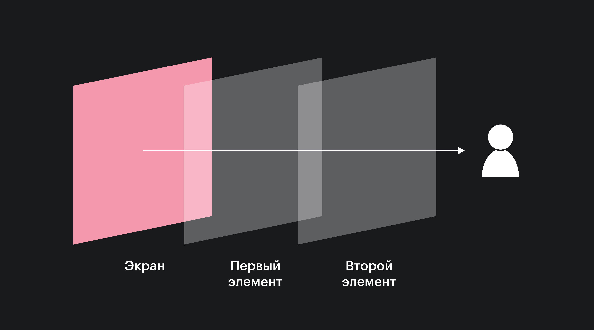

## Кратко

Контекст наложения — набор правил, на основании которых браузер решает, какой элемент на странице будет выше или ниже других. Условно, если представлять элементы как колоду карт, то правила формирования контекста наложения тасуют колоду. Это одна из основных концепций CSS.



## Всё по порядку

Браузер при отрисовке страницы идёт сверху вниз по HTML-разметке и рисует блоки один за другим в том же порядке, в котором они расположены. Мы видим и воспринимаем это как плоский лист, на котором один за другим выстраиваются элементы. Но браузер хитрый и на самом деле он располагает элементы не только по осям _x_ и _y_, но ещё и по оси _z_. По глубине, так сказать.

Вы можете резонно заметить «Монитор же плоский! Какая ещё глубина?». Ваша правда. Но браузеру важно учитывать глубину элементов, чтобы при необходимости правильно наложить их друг на друга.

В стандартной ситуации тот элемент, который находится ниже в HTML-разметке будет ближе к пользователю. Давайте посмотрим на примере. Пусть в нашей разметке будет два блока:

```html
<div class="block first"></div>
<div class="block second"></div>
```

И для наглядности мы сдвинем второй блок чуть вверх и вправо:

```css
.second {
  margin-top: -50px;
  margin-left: 50px;
}
```

<iframe title="Стандартное поведение блоков" src="demos/default/" height="350"></iframe>

В результате явно видно, что второй блок перекрывает собою первый, а значит находится выше в _стопке_ элементов по оси _z_.

## `z-index`

Но мы можем не подчиняться стандартным правилам браузера и устанавливать свой порядок наложения элементов друг на друга. Для этого понадобится свойство [`z-index`](/css/z-index/).

Перемешаем элементы в нашем примере. Для наглядности добавим третий блок:

```html
<div class="block first"></div>
<div class="block second"></div>
<div class="block third"></div>
```

И пусть последний блок и первый блоки перекрывают второй блок. Для этого достаточно добавить позиционирование и `z-index` для первого, а последний и так выше, просто по порядку следования:

```css
.first {
  position: relative;
  z-index: 1;
}
```

<iframe title="Меняем порядок блоков при помощи z-index" src="demos/z-index/" height="450"></iframe>

Для большинства стандартных случаев этих знаний достаточно. Но случаются ситуации посложнее. Пойдём глубже и поговорим про контекст наложения.

## Контекст наложения

На самом деле уже в предыдущих примерах мы с вами поработали с контекстом наложения. Просто не знали об этом 😅

**Контекст наложения** — это концепция трёхмерного расположения элементов по оси _z_ относительно пользователя, смотрящего на экран.

Самый базовый контекст наложения, существующий на любой странице формируется корневым элементом [`<html>`](/html/html/). Все элементы внутри этого контекста сортируются и располагаются с оглядкой друг на друга.

Но мы можем создавать контексты наложения не только на странице целиком, но и в каждом отдельном блоке. Тогда вложенные в него дочерние блоки будут сортироваться и располагаться уже по правилам этого нового, родительского контекста наложения.

Новый контекст наложения формируется если:

1. это корневой элемент (`<html>`),
2. элемент позиционирован абсолютно (`position: absolute`) или относительно (`position: relative`) со свойством `z-index`, значение которого не `auto`,
3. флекс-элемент со свойством `z-index`, значение которого не `auto` и чей родительский элемент имеет свойство `display: flex` или `display: inline-flex`,
4. элементу задано свойство `opacity` со значением меньше `1`,
5. элементу задано свойство `transform` со значением не `none`,
6. элементу задано свойство `mix-blend-mode` со значением не `normal`,
7. элементу задано свойство `filter` со значением не `none`,
8. элементу задано свойство `isolation` со значением `isolate`,
9. элемент с `position: fixed`,
10. элементу задано свойство `will-change` или аналогичный атрибут,
11. элементу задано свойство `-webkit-overflow-scrolling` со значением `touch`.

Остальные элементы, не создающие собственный контекст наложения, используют родительский контекст.

Обычно достаточно запомнить первые три сценария и чуть-чуть помнить про следующие два. Если браузер рисует что-то, чего вы не ожидали, можно всегда вернуться и подсмотреть остальные.

## Разные колоды карт

Стоит запомнить одну важную вещь, связанную с контекстом наложения: элементы могут сортироваться находясь на одном уровне внутри контекста наложения. Элементы внутри блока никогда не могут быть выше или ниже своего родителя.

Пусть у нас будет два блока. Внутри первого будут три дочерних блока:

```html
<div class="block parent">
  <div class="child brown"></div>
  <div class="child red"></div>
  <div class="child yellow"></div>
</div>
<div class="block no-parent"></div>
```

Пусть оба блока будут не статично спозиционированы и с `z-index: 1`, чтобы создать внутри каждого свой контекст наложения:

```css
.block {
  position: relative;
  z-index: 1;
}
```

А теперь попробуем сделать так, чтобы жёлтый блок был поверх розового:

```css
.yellow {
  position: relative;
  z-index: 9999999;
}
```

<iframe title="Жёлтый блок остаётся под розовым" src="demos/parent/" height="350"></iframe>

Результат огорчает, жёлтый блок по-прежнему под розовым. Потому что `z-index: 9999999` влияет на сортировку элементов только внутри блока `.parent` и его контекста наложения.

## Порядок наложения

Внутри каждого контекста наложения существует свой порядок отрисовки элементов и их компонентов. Ниже перечисление идёт от самого нижнего слоя, до самого верхнего:

1. Фон ([`background`](/css/background/)) и рамки элемента ([`border`](/css/border/));
2. Позиционированные элементы (включая потомков), у которых значение свойства `z-index` меньше 0;
3. Элементы без контекста наложения с `display: block`;
4. Элементы со свойством [`float`](/css/float/);
5. Элементы с `display: inline`;
6. Элементы (включая потомков) с `z-index: auto` или `z-index: 0`, а также элементы с `opacity` меньше 1;
7. Элементы (включая потомков) с `z-index` больше 0.

Согласно этому порядку, элемент с отрицательным значением `z-index` никогда не будет ниже фона или рамки родительского элемента.

Оставив только один блок с потомками из примера выше. Попробуем жёлтый спрятать под синий фон родителя или под родительскую рамку. Чуть сместим его в бок для наглядности:

```css
.yellow {
  z-index: -9999999;
  margin-left: 90px;
}
```

<iframe title="Жёлтый блок остаётся поверх фона и рамки родителя" src="demos/under-bkg/" height="250"></iframe>

Он станет ниже своих соседей, но не уйдёт под синий фон родителя и останется поверх рамки родителя.
