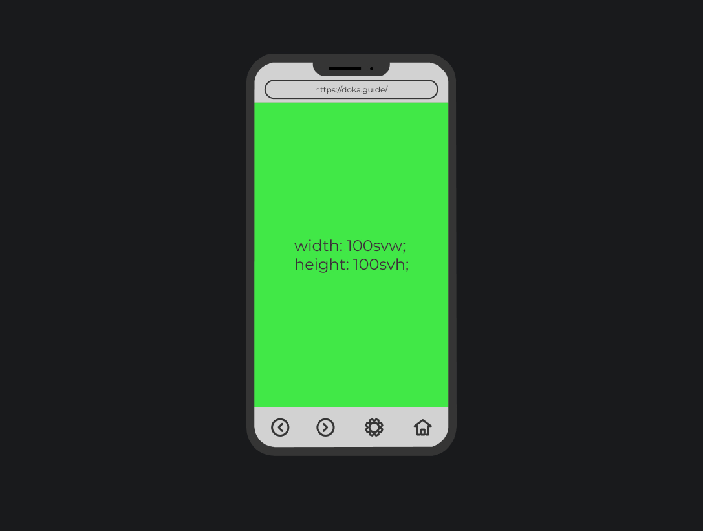
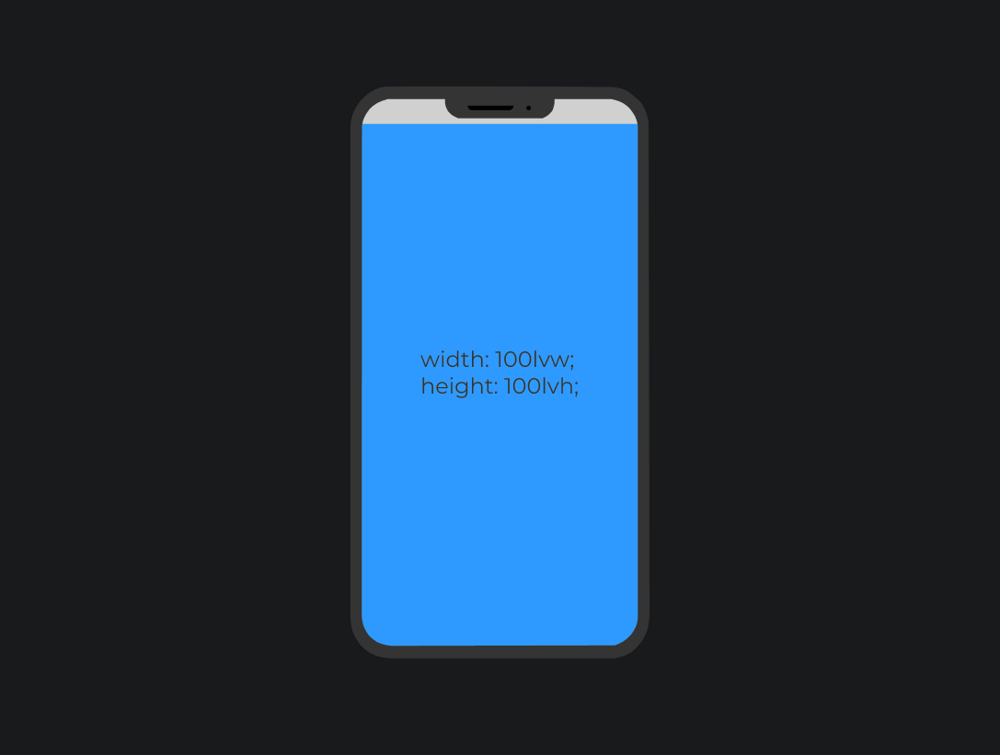
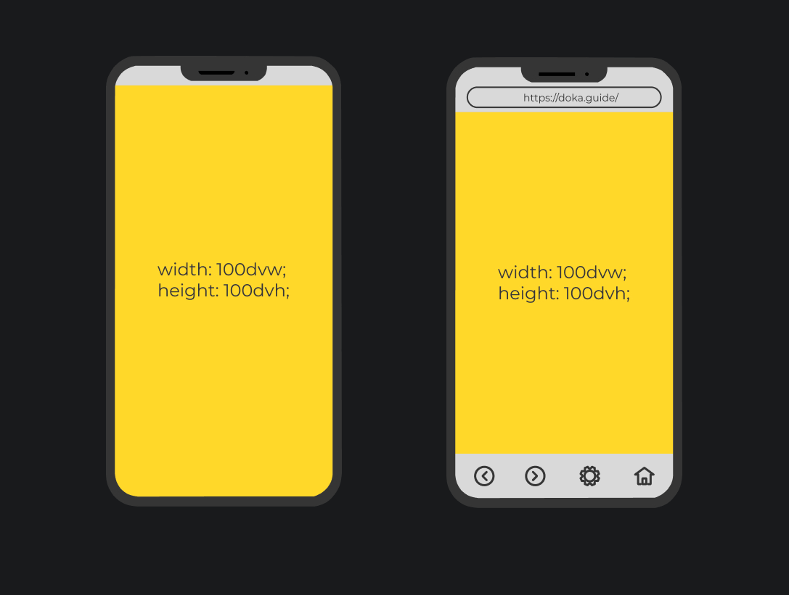

С 2013 года браузеры поддерживают единицы измерения [`vw`, `vh`, `vmin`, `vmax`](/css/vw-vh/), которые позволили задавать размер элементам относительно размеров окна браузера (viewport). Однако устройства и их экраны эволюционировали.

Одной из распространённых проблем, с которой сталкиваются разработчики сегодня это изменение размера viewport на мобильных устройствах. Было бы логичным полагать, что `100vh` или `100%` высоты экрана означали высоту, равную высоте экрана устройства, но `vh` не учитывает адресную строку и навигационную панель браузера на мобильных устройствах. Поэтому иногда высота контента оказывается слишком большой и появляется лишний скролл.

## Кратко

Это относительные единицы измерения, пришедшие на помощь знакомым `vw`, `vh`, `vmin`, `vmax`, с целью сделать процесс разработки более предсказуемым. `svw` и `svh` представляет собой наименьшую (smallest) ширину и высоту экрана с учётом элементов браузера, `lvw` и `lvh` — наибольшую (largest) ширину и высоту с учётом элементов браузера. `dvw` и `dvh` динамически (dynamic) высчитывает размер экрана при различных состояниях браузера, при открытой/закрытой адрессной строке и навигационной панели браузера.

## Пример

Ширина первого экрана будет равна 100% ширины вьюпорта, а высота — 100% высоты вьюпорта, причём размер будет динамически высчитываться при открытии/закрытии элементов бразера:

```css
.vh {
  min-height: 100vh;
}

.dvh {
  min-height: 100dvh;
}
```

<iframe title="Сравнение vh и dvh" src="demos/vh-vs-dvh/" height="500"></iframe>

## Как понять

Порой при работе с первым экраном в мобильном режиме необходимо, чтобы его размер чётко совпадал с видимой областью пользовательского устройства, в таком случае данные единицы измерения попросту незаменимы.

### `svw`

Размер указывается в процентах от **ширины** вьюпорта (**v**iewport **w**idth). `100svw` соответствует полной ширине вьюпорта cо всеми **открытыми** элементами браузера. `1svw` = 1% ширины вьюпорта.

### `svh`

Размер в процентах от **высоты** вьюпорта (**v**iewport **h**eight). `100svh`соответствует полной высоте вьюпорта cо всеми **открытыми** элементами браузера. `1svh` = 1% высоты вьюпорта.

### `svmin`

Размер в процентах от **меньшей** размерности вьюпорта cо всеми **открытыми** элементами браузера. Если высота меньше ширины (например, горизонтальная ориентация телефона), то расчёт будет вестись относительно высоты.

### `svmax`

Размер в процентах от **большей** размерности вьюпорта cо всеми **открытыми** элементами браузера. Если высота больше ширины (например, нормальная ориентация телефона), то расчёт будет вестись относительно высоты.



### `lvw`

Размер указывается в процентах от **ширины** вьюпорта (**v**iewport **w**idth). `100lvw` соответствует полной ширине вьюпорта cо всеми **закрытыми** элементами браузера. `1lvw` = 1% ширины вьюпорта.

### `lvh`

Размер в процентах от **высоты** вьюпорта (**v**iewport **h**eight). `100lvh`соответствует полной высоте вьюпорта cо всеми **закрытыми** элементами браузера. `1lvh` = 1% высоты вьюпорта.

### `lvmin`

Размер в процентах от **меньшей** размерности вьюпорта cо всеми **закрытыми** элементами браузера. Если высота меньше ширины (например, горизонтальная ориентация телефона), то расчёт будет вестись относительно высоты.

### `lvmax`

Размер в процентах от **большей** размерности вьюпорта cо всеми **закрытыми** элементами браузера. Если высота больше ширины (например, нормальная ориентация телефона), то расчёт будет вестись относительно высоты.



### `dvw`

Размер указывается в процентах от **ширины** вьюпорта (**v**iewport **w**idth). `100dvw` соответствует полной ширине вьюпорта и динамически пересчитывается при открытии/закрытии элементов браузера. `1dvw` = 1% ширины вьюпорта.

### `dvh`

Размер в процентах от **высоты** вьюпорта (**v**iewport **h**eight). `100dvh`соответствует полной высоте вьюпорта и динамически пересчитывается при открытии/закрытии элементов браузера. `1dvh` = 1% высоты вьюпорта.

### `dvmin`

Размер в процентах от **меньшей** размерности вьюпорта и динамически пересчитывается при открытии/закрытии элементов браузера. Если высота меньше ширины (например, горизонтальная ориентация телефона), то расчёт будет вестись относительно высоты.

### `dvmax`

Размер в процентах от **большей** размерности вьюпорта и динамически пересчитывается при открытии/закрытии элементов браузера. Если высота больше ширины (например, нормальная ориентация телефона), то расчёт будет вестись относительно высоты.


