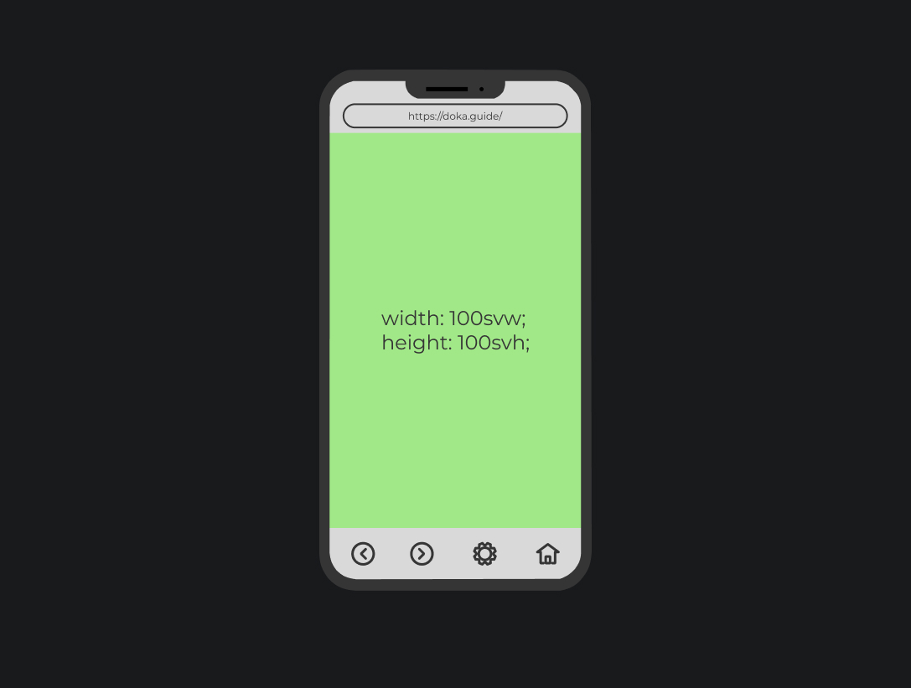
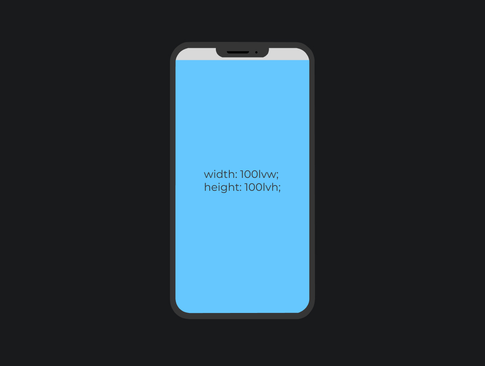
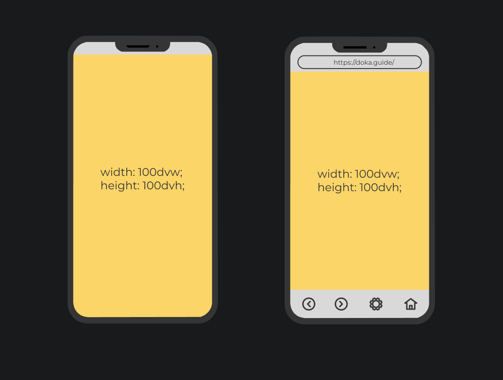

В далёком 2013 году браузеры стали поддерживать единицы измерения vw, vh, vmin, vmax, которые позволили задавать размер элементам относительно размеров окна браузера (viewport), однако устройства и их экраны эволюционировали с течением времени, поэтому вэб, должен был идти в ногу со временем. Одной из распространённых проблем, с которой сталкиваются веб разработчики сегодня это viewport, точнее его точный размер, особенно на мобильных устройствах. Было бы логичным полагать, что 100 VH или 100% высоты экрана означали высоту, равную высоте экрана устройства,  но VH не учитывает такие вещи, как адрессный бар и навигационный бар браузера на мобильных устройствах. Поэтому иногда высота контента оказывается слишком большой и появляется лишний скролл.

## Кратко

Это относительные единицы измерения, пришедшие на замену устаревшим vw, vh, vmin, vmax, с целью сделать процесс разработки более предсказуемым. svw и svh представляет собой наименьшую ширину и высоту экрана с учётом элементов браузера, lvw и lvh наибольшую ширину и высоту с учётом элементов браузера а также dvw и dvh. Последнее динамически высчитывает размер экрана при различных состояниях браузера, при открытом/закрытом адрессном баре и навигационном баре браузера.

## Пример

Ширина блока будет равна 100% ширины вьюпорта, а высота — 100% высоты вьюпорта, причём размер будет динамически высчитываться при открытии/закрытии элементов бразера:

```css
div {
  min-width: 100dvw;
  height: 100dvh;
}
```

## Как понять

Порой при работе с первым экраном в мобильном режиме, необходимо, чтобы его размер чётко совпадал с видимой областью пользователя, в таком случае данные единицы измерения попросту незаменимы.

### `svw`

Размер указывается в процентах от **ширины** вьюпорта (**v**iewport **w**idth). `100svw` соответствует полной ширине вьюпорта cо всеми **открытыми** элементами браузера. `1svw` = 1% ширины вьюпорта.

### `svh`

Размер в процентах от **высоты** вьюпорта (**v**iewport **h**eight). `100svh`соответствует полной высоте вьюпорта cо всеми **открытыми** элементами браузера. `1svh` = 1% высоты вьюпорта.

### `smin`

Размер в процентах от **меньшей** размерности вьюпорта cо всеми **открытыми** элементами браузера. Если высота меньше ширины (например, горизонтальная ориентация телефона), то расчёт будет вестись относительно высоты.

### `smax`

Размер в процентах от **большей** размерности вьюпорта cо всеми **открытыми** элементами браузера. Если высота больше ширины (например, нормальная ориентация телефона), то расчёт будет вестись относительно высоты.



### `lvw`

Размер указывается в процентах от **ширины** вьюпорта (**v**iewport **w**idth). `100lvw` соответствует полной ширине вьюпорта cо всеми **закрытыми** элементами браузера. `1lvw` = 1% ширины вьюпорта.

### `lvh`

Размер в процентах от **высоты** вьюпорта (**v**iewport **h**eight). `100lvh`соответствует полной высоте вьюпорта cо всеми **закрытыми** элементами браузера. `1lvh` = 1% высоты вьюпорта.

### `lmin`

Размер в процентах от **меньшей** размерности вьюпорта cо всеми **закрытыми** элементами браузера. Если высота меньше ширины (например, горизонтальная ориентация телефона), то расчёт будет вестись относительно высоты.

### `lmax`

Размер в процентах от **большей** размерности вьюпорта cо всеми **закрытыми** элементами браузера. Если высота больше ширины (например, нормальная ориентация телефона), то расчёт будет вестись относительно высоты.



### `dvw`

Размер указывается в процентах от **ширины** вьюпорта (**v**iewport **w**idth). `100dvw` соответствует полной ширине вьюпорта и динамически пересчитывается при открытии/закрытии элементов браузера. `1dvw` = 1% ширины вьюпорта.

### `dvh`

Размер в процентах от **высоты** вьюпорта (**v**iewport **h**eight). `100dvh`соответствует полной высоте вьюпорта и динамически пересчитывается при открытии/закрытии элементов браузера. `1dvh` = 1% высоты вьюпорта.

### `dmin`

Размер в процентах от **меньшей** размерности вьюпорта и динамически пересчитывается при открытии/закрытии элементов браузера. Если высота меньше ширины (например, горизонтальная ориентация телефона), то расчёт будет вестись относительно высоты.

### `dmax`

Размер в процентах от **большей** размерности вьюпорта и динамически пересчитывается при открытии/закрытии элементов браузера. Если высота больше ширины (например, нормальная ориентация телефона), то расчёт будет вестись относительно высоты.

