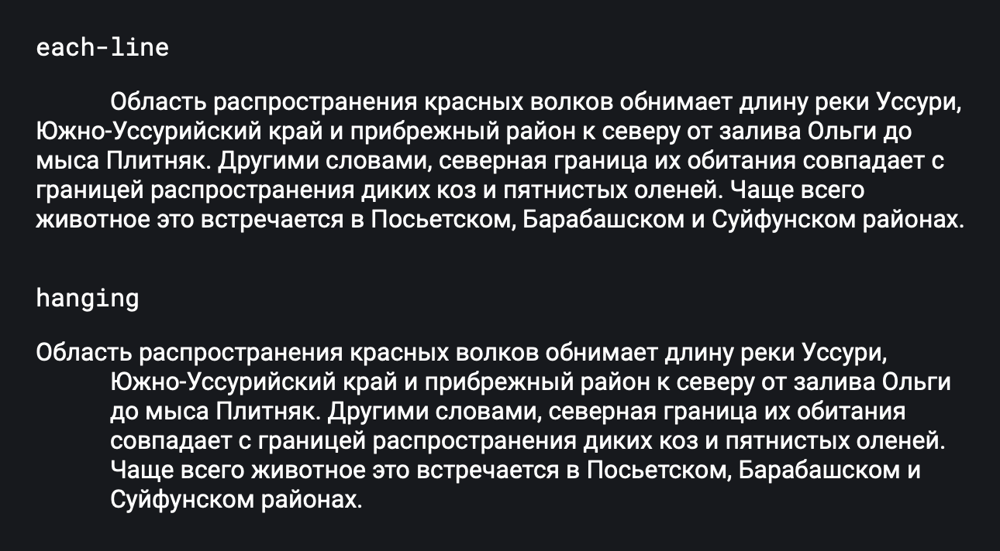

## Кратко

Свойство `text-indent` управляет отступом первой строки текста: либо вытягивает строку за пределы абзаца, либо утягивает её внутрь. Используется для выделения начала абзаца при плотном наборе без отступов между абзацами.

Строка смещается по горизонтали относительно начала строки.

## Пример

Значение в пикселях:

```css
div {
  text-indent: 20px;
}
```

Процент рассчитывается от ширины блока:

```css
div {
  text-indent: 15%;
}
```

Значения ключевых слов:

<iframe title="Варианты значений" src="demos/basic/" height="375"></iframe>

Пример корректно отображается только в Safari. Он выглядит следующим образом:



## Как пишется

### Ключевые слова

Ключевые слова являются экспериментальными и официально не предусмотрены в спецификации CSS.

- `hanging` — инвертирует отступы в строках. Добавляет отступ в каждой строке, кроме первой.
- `each-line` — добавляет отступы в каждой строке после принудительного разрыва строки (с помощью [`<br>`](/html/br/)).

### Единицы измерения

Значение свойства можно задать в любых [единицах измерения](/css/numeric-types/) включая проценты. Во втором случае размер отступа будет зависеть от ширины блока, содержащего текст. Допустимо использовать отрицательные значения, но при этом в разных браузерах возможно появление ошибок.
