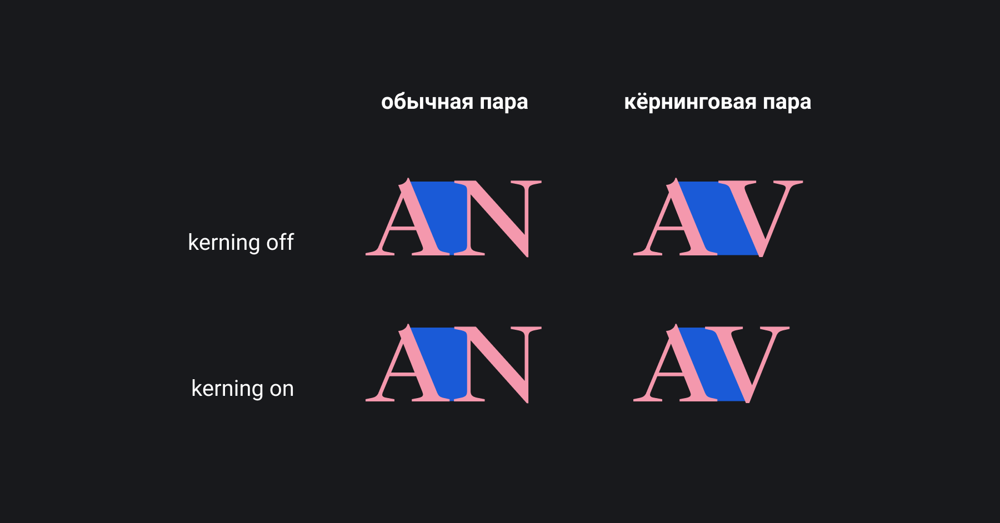
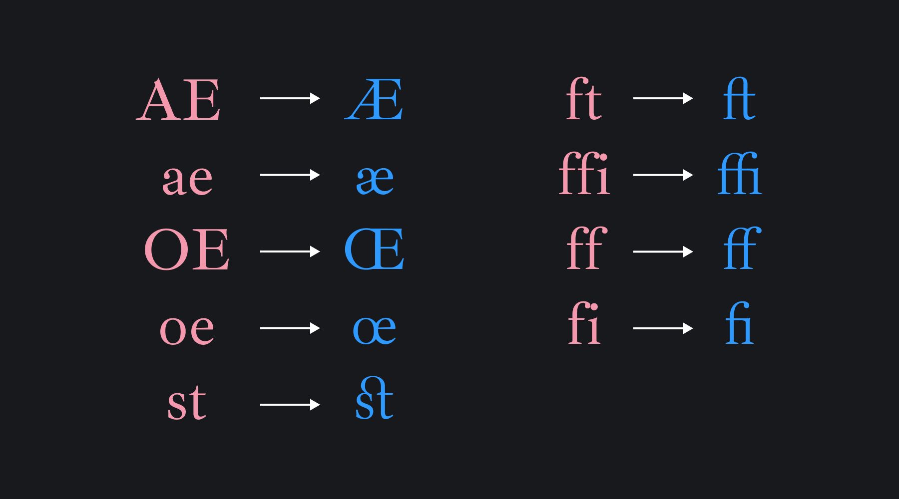

## Кратко

Свойство `text-rendering` позволяет указывать браузеру, какие оптимизации нужно производить с текстом во время рендера.

## Пример

```html
<p class="legible">I’m filling this page</p>
```

```css
.legible {
  text-rendering: optimizeLegibility;
}
```

## Как понять

Чтобы символ шрифта мог менять свой размер в любых пределах, сохраняя при этом читаемость и гладкость, он представляет собой не растровую картинку, состоящую из пикселей, а набор математических формул, описывающих кривые и прямые, из которых состоит символ. Это позволяет браузеру отрисовывать символ любого размера.

Когда браузер «рассчитал» внешний вид символа, он должен корректно отрисовать символ в пиксельной сетке экрана монитора. Процесс заполнения пикселей после расчётов для видимой отрисовки чего угодно называется **рендеринг**.

Рендеринг текста — это процесс отрисовки символов шрифта в пиксельной сетке. При этом для обеспечения более естественного вида текста браузер может выполнять дополнительные вычисления и модификации символов: изменять **кернинг** (межсимвольное расстояние), объединять пары и даже тройки символов в **лигатуры**.


Яркий пример кернинговых пар — сочетания символов **AV** или **VA**.


Яркий пример лигатур — сочетания символов **fi**, **fl**, **at**.

Не все шрифты имеют богатый набор кернинговых пар или лигатуры, поэтому употребление свойства `text-rendering` уместно не для каждого дизайна.

Рендеринг текста — сложный процесс, и браузеру приходится решать, как именно оптимизировать вывод символов: где-то скорректировать кернинг, где-то собрать символы в лигатуры, а где-то обеспечить геометрическую точность отрисовки символа. Свойство `text-rendering` указывает, что именно должен оптимизировать браузер во время рендеринга.

<iframe title="Примеры лигатуры и кернинговых пар" src="demos/ligatures-kerning/" height="550"></iframe>

В примере показаны различные шрифты для понимания терминов **лигатура** и **кернинговая пара**.

## Как пишется

Ключевые слова:

```css
.seelctor {
  text-rendering: auto; /* По умолчанию */
  text-rendering: optimizeSpeed;
  text-rendering: optimizeLegibility;
  text-rendering: geometricPrecision;
}
```

### `auto`

Значение по умолчанию. Браузер пытается самостоятельно угадать, в какой момент отрисовки важна скорость вывода символов, в какой — читаемость, а в какой — геометрическая точность.

### `optimizeSpeed`

При отрисовке текста браузер будет ставить в приоритет именно скорость отрисовки, поэтому лигатуры и кернинг будут отключены.

### `optimizeLegibility`

Используется в случае, когда важна не скорость отрисовки, а удобочитаемость текста и визуальная красота сочетаний символов. При таком значении браузер активно использует лигатуры и корректирует кернинг.

<iframe title="Разница между значениями" src="demos/ligatures/" height="360"></iframe>

### `geometricPrecision`

Основной приоритет при рендеринге текста — геометрическая точность. В некоторых шрифтах кернинг изменяется не пропорционально изменению размера шрифта. Это может приводить к не самому лучшему внешнему виду текста. При установке `text-rendering: geometricPrecision` браузер начинает вычислять кернинг, основываясь на геометрической точности в положении символов, благодаря чему в некоторых случаях внешний вид текста может существенно улучшиться.

Когда мы масштабируем текст, браузер вычисляет итоговый размер символа, опираясь на размер шрифта и текущий масштаб, после чего запрашивает шрифт вычисленного размера у операционной системы. Иногда сочетание размера и масштаба может выдать дробное итоговое значение (например, размер шрифта 12 при масштабе 110% даст в итоге 13,2), которого просто не существует в системе. Тогда браузер округляет размер до ближайшего целого (13) и запрашивает его в системе. Это приводит к ступенчатому изменению размера шрифта.

Использование значения `geometricPrecision` позволяет избежать округления и отрисовывать текст именно такого размера, как задумано. Тут мы получаем плавное масштабирование и точность отрисовки. Но при одном условии — это должно полностью поддерживаться движком рендеринга.

## Подсказки

💡 Нужно понимать, что использование кернинга и лигатур требует от браузера дополнительных вычислений может существенно замедлить рендеринг больших объёмов текста, так что использовать значение `optimizeLegibility` следует с осторожностью.
