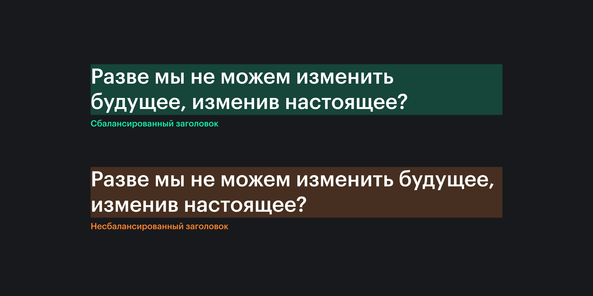

## Кратко

Свойство `text-wrap` контролирует то, как текст расположится внутри элемента. Можно применять, например, для более сбалансированного вида заголовков, которые не вмещаются в одну строку.



## Как пишется

Возможные значения:

- `nowrap` — текст не переносится по строкам. Он переполнит родительский элемент и выйдет за его пределы, а не перейдёт на новую строку.
- `balance` — текст переносится так, чтобы наилучшим образом сбалансировать количество символов в каждой строке, улучшая разборчивость и читаемость.
- `stable` — результат аналогичен `wrap`, но при редактировании текста, строки, идущие выше, остаются неподвижными, в то время как при значении по умолчанию будет перерисовываться всё содержимое. Значение поддерживается только в браузерах Safari и Firefox.
- `pretty` — результат будет таким же, как и при использовании `wrap`, за исключением того, что браузер будет использовать более медленный алгоритм, который отдает предпочтение лучшему виду, а не скорости. Предназначается для текста, где хорошая типографика предпочтительнее производительности.
Про этот алгоритм можно почитать у разработавшего его инженера [по ссылке](https://docs.google.com/document/d/1jJFD8nAUuiUX6ArFZQqQo8yTsvg8IuAq7oFrNQxPeqI/edit#heading=h.cqq9czoal00g).
Пожалуй, самое популярное преимущество этого свойства — предотвращение «сирот» («сирота» в типографике — это слово, которое переносится на новую строку, чем делает текст менее гармоничным внешне).
Свойство не поддерживается в браузерах Safari и Firefox.

Поскольку подсчёт символов и их балансировка по нескольким строкам требует больших вычислительных затрат, это значение поддерживается только для блоков текста с ограниченным количеством строк (шесть или меньше для Chromium и десять или меньше для Firefox).

## Пример

```css
div {
  text-wrap: wrap;
}
```

<iframe title="Сравнение разных значений" src="demos/basic/" height="920"></iframe>

Значение `balance` помогает сохранять текст визуально привлекательным и разборчивым, независимо от того, просматривает ли пользователь контент на большом мониторе или на маленьком экране мобильного телефона.

## Производительность

Не рекомендуется применять значение `balance` для больших блоков текста. Несмотря на то, что это значение оказывает видимый эффект только на ограниченное число строк, браузер всё равно будет пытаться рассчитать баланс для всех остальных, и это скажется на скорости рендеринга страницы. Лучше применять его для заголовков, цитат и других визуально значимых блоков текста.

Значение `pretty` не имеет таких ограничений.

## `balance` + `white-space`

`text-wrap: balance` вступает в противоречие со свойством [`white-space`](/css/white-space/), поскольку первое требует сбалансированных переносов, а второе — их отсутствия. Чтобы решить эту проблему, задайте для `white-space` значение `unset`, после чего балансировка количества символов в строке снова будет работать.

