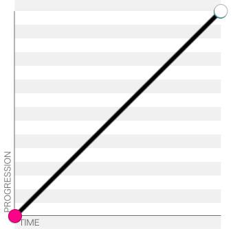

## Кратко

`transition-timing-function` определяет функцию зависимости значения свойства от времени. Другими словами, эта функция определяет скорость течения анимации.

## Пример

В примере ниже свойство [`color`](/css/color/) будет меняться линейно (равномерно) на протяжении 300 мс.

```css
.box {
  transition-property: color;
  transition-duration: .3s;
  transition-timing-function: linear;
}
```

## Как пишется

Ключевые слова в качестве значений:

```css
.selector {
  transition-timing-function: ease; /* Используется по умолчанию */
  transition-timing-function: ease-in;
  transition-timing-function: ease-out;
  transition-timing-function: ease-in-out;
  transition-timing-function: linear;
  transition-timing-function: step-start;
  transition-timing-function: step-end;
}
```

Описание функций в качестве значений:

```css
.selector {
  transition-timing-function: steps(4, jump-end);
  transition-timing-function: cubic-bezier(0.1, 0.7, 1.0, 0.1);
}
```

Дополнительные параметры функции Steps:

```css
.selector {
  transition-timing-function: steps(4, jump-start);
  transition-timing-function: steps(10, jump-end);
  transition-timing-function: steps(20, jump-none);
  transition-timing-function: steps(5, jump-both);
  transition-timing-function: steps(6, start);
  transition-timing-function: steps(8, end);
}
```

Указание нескольких функций:

```css
.selector {
  transition-timing-function: ease, step-start, cubic-bezier(0.1, 0.7, 1.0, 0.1);
}
```

## Как понять

Например, нам нужно изменить какое-то свойство от 0 до 100 за 1 секунду. В течение этой секунды значение свойства может меняться с разной скоростью. Как именно — как раз описывает наша функция.

Например, если свойство меняется равномерно всю секунду, то это линейная зависимость, которая описывается ключевым словом `linear` и выглядит так:



Если свойство меняется сначала быстро, а потом медленнее, то эта зависимость описывается ключевым словом `ease-out` и выглядит так:


### Функция `cubic-bezier`

В общем случае график функции описывается значением `cubic-bezier(p1, p2, p3, p4)`. В качестве параметров p1 и p3 обязательно должны быть числа от 0 до 1.

Каждому ключевому слову соответствует свой график функции с определёнными коэффициентами:

- `linear` — `cubic-bezier(0.0, 0.0, 1.0, 1.0)`
- `ease` — `cubic-bezier(0.25, 0.1, 0.25, 1.0)`
- `ease-in` — `cubic-bezier(0.42, 0, 1.0, 1.0)`
- `ease-out` — `cubic-bezier(0, 0, 0.58, 1.0)`
- `ease-in-out` — `cubic-bezier(0.42, 0, 0.58, 1.0)`

<iframe title="Демонстрация разных временных функций" src="demos/every/" height="410"></iframe>

### Функция `steps`

Изменять свойство можно не плавно, а скачками. Функция `steps` описывает, за сколько шагов должно произойти изменение свойства.

```css
.box {
  transition-timing-function: steps(5, jump-start);
}
```

Первый параметр указывает количество шагов, за которое будет изменено свойство. При этом каждый шаг будет отображаться равное количество времени.

Второй параметр определяет логику, по которой будет разделён промежуток на отрезки.

Например, если первый параметр равен 5, то всего будет 5 шагов. На каждом шаге отображение будет задерживаться, следуя одному из условий в зависимости от второго параметра. Второй параметр может принимать следующие значения:

`jump-start`, `jump-end`, `jump-both`, `jump-none`, `start`, `end`

- на 20%, 40%, 60%, 80% и 100% — `jump-start`. В момент старта анимации текущее значение сразу прыгнет на 20% и там задержится на $1/5$ времени.
- на 0%, 20%, 40%, 60% и 80% — `jump-end`. Текущее значение начинает задержку сразу на 0%
- или сделает 5 остановок в промежутке между 0% и 100% (16%, 33%, 50%, 66%, 84%) — `jump-both`
- или сделает 5 остановок, включая 0% и 100% (0%, 25%, 50%, 75%, 100%) — `jump-none`

Интересно, что Safari вплоть до версии 13.1 (Catalina) не поддерживал эти значения 🤷‍♂️
Начиная с версии 14 (Big Sur) в Safari все хорошо 🙂

В зависимости от используемого сейчас браузера пример ниже может изменяться:

<iframe title="Демонстрация разных значений jump" src="demos/jump/" height="520"></iframe>

Ключевые слова `step-start`, `step-end` являются синонимами для записи `steps(1, jump-start)` и `steps(1, jump-end)`. Изменение происходит скачком за один шаг.

`step-start` переходит в конечное состояние сразу при старте анимации и дожидается конца анимации.

`step-end` дожидается конца анимации и потом переходит в конечное состояние

<iframe title="Демонстрация разных значений step" src="demos/step/" height="350"></iframe>

## Подсказки

💡 Если не указано свойство `transition-timing-function`, то по умолчанию браузер будет использовать функцию `ease` и соответствующее ей описание `cubic-bezier(0.25, 0.1, 0.25, 1.0)`

💡 Задавая коэффициенты `p2` и `p4` меньше 0 или больше 1, можно добиться эффекта «пружины», что в некоторых случаях может сделать анимацию более интересной

<iframe title="Cubic-bezier" src="demos/cubic-bezier/" height="150"></iframe>
