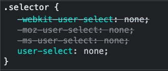

## Кратко

Вендорные префиксы — это приставки перед свойствами, селекторами, функциями или другими сущностями в CSS, позволяющие браузерам внедрять экспериментальные фичи до того, как они полностью стандартизированы и готовы для использования. Когда префикс отбрасывается — это знак, что всё готово.

## Кто такие вендоры?

Чтобы понять, что такое вендорные префиксы и зачем они нужны, надо немного разобраться с тем, как и кто разрабатывает CSS.

CSS — это одна из трёх основных мощных технологий, на которых строится веб. Его используют в своей работе тысячи разработчиков. А результат — стили сайта — видят миллионы пользователей.

Чтобы CSS во всём мире был единым, над его развитием работает так называемая [_Рабочая группа CSS_](https://www.w3.org/wiki/CSSWG) (CSS Working Group), или коротко CSSWG. Они собирают потребности разработчиков сайтов и описывают возможности CSS в новых модулях. Получившийся документ называется _спецификацией_. В ней содержится описание того, как новое свойство должно работать.

Дальше наступает этап внедрения в браузеры. Каждый браузер разрабатывает отдельная компания, отдельные команды разработки. Когда в черновиках спецификации появляется новая CSS-фича, разработчики браузера начинают её реализовывать. Поскольку в спецификации не всегда описаны конкретные технические решения (черновик на то и черновик, что может меняться), то каждая команда разработки может делать это чуть иначе и принципы работы фичи вполне могут меняться со временем. До момента, пока не стабилизируется спецификация или пока не будут написаны все тесты, фича может работать в тестовом режиме, с вендорным префиксом.

Каждый браузер — это отдельный _вендор_ (от англ. vendor — продавец) услуг просмотра сайтов, интернета. Отсюда и слово «вендорный». Буквально это означает, что существуют некие отдельные префиксы — они же приставки — которые работают в конкретном браузере — вендоре.

## Префиксы

Основные браузеры используют следующие префиксы:

- `-webkit-` — Safari, Chrome, Opera 15+ и другие браузеры на основе движка WebKit или Blink.
- `-moz-` — Firefox и браузеры на движке Gecko.
- `-o-` — Opera 12 и раньше, на движке Presto.
- `-ms-` — Internet Explorer и старый Microsoft Edge 12–18.

## Где нужны префиксы?

В CSS существует много разных сущностей: селекторы и псевдоэлементы, свойства и их значения, функции, директивы. В процессе внедрения любой новой фичи используются вендорные префиксы.

### Директивы

Самый частый случай, когда вам может пригодится вендорный префикс для директивы — [`@keyframes`](/css/keyframes/):

```css
@-webkit-keyframes animation {
  0% { left: 0; }
  100% { left: 100%; }
}

@keyframes animation {
  0% { left: 0; }
  100% { left: 100%; }
}
```

Написать директивы `@-webkit-keyframes` и `@keyframes` через запятую, чтобы не дублировать их содержимое, не получится.

### Псевдоклассы

В последнее время в CSS появляется много новых очень мощных псевдоклассов. Например, стилизовать плейсхолдер в поле ввода можно при помощи такого кода:

```css
input::-webkit-input-placeholder {
  color: #BADA55;
}

input:-moz-placeholder {
  color: #BADA55;
}

input::-moz-placeholder {
  color: #BADA55;
}

input:-ms-input-placeholder {
  color: #BADA55;
}

input::-ms-input-placeholder {
  color: #BADA55;
}

input::placeholder {
  color: #BADA55;
}
```

Как и в случае с директивами, префиксы в псевдоэлементах тоже приводят к дублированию кода: если перечислить всё через запятую, браузеры вас не поймут.

### Значения свойств

Бывает и так, что свойство старое, а вот значение для него новое, экспериментальное. В данный момент таким новым значением является функция [`image-set()`](/css/image-set/) для свойства [`background-image`](/css/background-image/):

```css
div {
  background-image: url("image.png");
  background-image: -webkit-image-set(url("image.png") 1x, url("image-2x.png") 2x);
  background-image: image-set("image.png" 1x, "image-2x.png" 2x);
}
```

Сначала браузер прочитает свойство `background-image` со значением `url()`, которое он точно понимает. Потом увидит такое же свойство с другим значением, и если он его поймёт, то забудет первое свойство и применит второе. Это называется _фолбэк_.

Но браузер на этом не остановится и пойдёт дальше: если он поддерживает значение без префикса, то он предпочтёт его — ведь оно последнее. Поэтому порядок следования свойств с префиксами в значениях тоже важен: сначала идут значения с префиксами, потом — без, чтобы браузеры выбрали последний, максимально современный вариант.

### Селекторы

Случается так, что в процессе внедрения фича меняется. Изначально планировалось, что функция выбора нескольких селекторов будет называться `:any()`, потом `:match()`, а в итоге пришли к [`:is()`](/css/is/). Чтобы селектор сработал везде, даже в старых браузерах, где функция называлась иначе, нужна будет такая запись:

```css
:-moz-any(header, footer) a:hover {
  color: red;
}

:-webkit-any(header, footer) a:hover {
  color: red;
}

:matches(header, footer) a:hover {
  color: red;
}

:is(header, footer) a:hover {
  color: red;
}
```

В примере выше мы задаём красный цвет для ссылок при наведении курсора при условии, что эти ссылки находятся внутри [`<header>`](/html/header/) или [`<footer>`](/html/footer/).

## Как всё запомнить?

Скорее всего, вы сейчас думаете, а как же запомнить, где какие префиксы нужно писать, и для каких свойств они действительно нужны, а какие поддерживаются и без них.

Самый простой способ проверить поддержку свойства — найти его на сайте [Can I use](https://caniuse.com). Там, в том числе, написано, какие префиксы для каких браузеров нужны.

Но чаще всего разработчики не пишут префиксы руками, а используют инструменты автоматизации. Самым популярным из них на сегодня является [Автопрефиксер](https://github.com/postcss/autoprefixer). Вы можете [попробовать его онлайн](https://autoprefixer.github.io/ru/): вставляете ваш CSS, указываете, какие браузеры должны поддерживаться, и получаете код с проставленными префиксами там, где это нужно.

## Порядок важен

Очень важно указывать сущности (свойства, селекторы, директивы и так далее) с вендорными префиксами выше, чем без префиксов:

```css
div {
  -webkit-user-select: none;
  -moz-user-select: none;
  -ms-user-select: none;
  user-select: none;
}
```

Это нужно для того, чтобы браузер использовал самую последнюю стабильную реализацию. Если браузер уже поддерживает фичу без префиксов, то применится последнее из перечисленных. А если нет, то сработает подходящая запись из кода выше.


