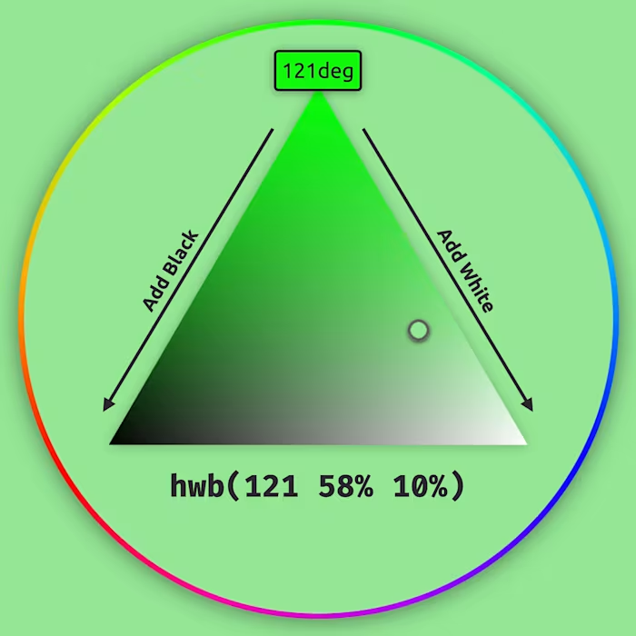
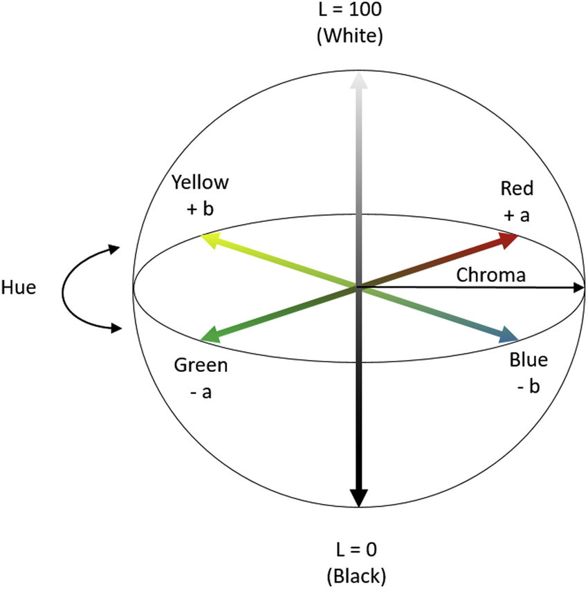
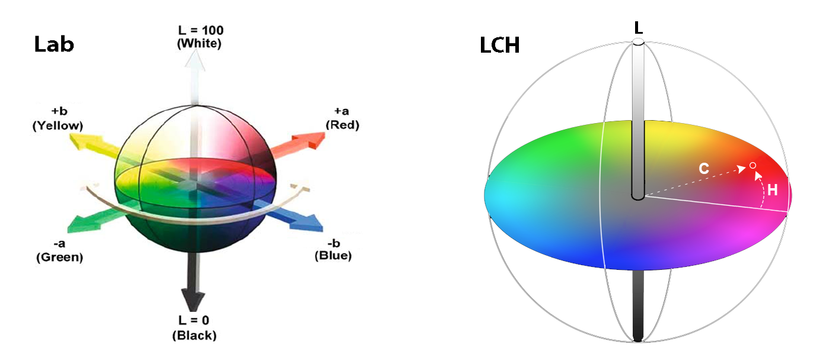
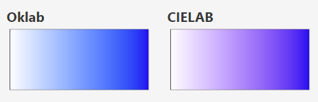

## Название цвета

Самый простой способ указания цвета в вебе — ключевые слова. Используются английские названия цветов. Самые популярные _базовые_ цвета:

- Чёрный `black`
- Белый `white`
- Красный `red`
- Зелёный `green`
- Синий `blue`

На самом деле ключевых слов для цветов очень много. Нет особого смысла их все запоминать. Всегда можно заглянуть в таблицу цветов.

<style>
  #color-table {
    width: 100%;
    color: currentColor;
  }

  #color-table td {
    width: 25%;
    text-align: center;
    color: #000;
  }

  #color-table td.light-text {
    color: white;
  }
</style>
<table id="color-table">
  <caption>Таблица с ключевыми словами для обозначения цвета в CSS</caption>
  <tr>
    <td style="background: indianred">IndianRed</td>
    <td style="background: lightcoral">LightCoral</td>
    <td style="background: salmon">Salmon</td>
    <td style="background: darksalmon">DarkSalmon</td>
  </tr>
  <tr>
    <td style="background: lightsalmon">LightSalmon</td>
    <td style="background: crimson" class="light-text">Crimson</td>
    <td style="background: red">Red</td>
    <td style="background: firebrick" class="light-text">FireBrick</td>
  </tr>
  <tr>
    <td style="background: darkred" class="light-text">DarkRed</td>
    <td style="background: pink">Pink</td>
    <td style="background: lightpink">LightPink</td>
    <td style="background: hotpink">HotPink</td>
  </tr>
  <tr>
    <td style="background: deeppink">DeepPink</td>
    <td style="background: mediumvioletred" class="light-text">MediumVioletRed</td>
    <td style="background: palevioletred">PaleVioletRed</td>
    <td style="background: coral">Coral</td>
  </tr>
  <tr>
    <td style="background: tomato">Tomato</td>
    <td style="background: orangered">OrangeRed</td>
    <td style="background: darkorange">DarkOrange</td>
    <td style="background: orange">Orange</td>
  </tr>
  <tr>
    <td style="background: gold">Gold</td>
    <td style="background: yellow">Yellow</td>
    <td style="background: lightyellow">LightYellow</td>
    <td style="background: lemonchiffon">LemonChiffon</td>
  </tr>
  <tr>
    <td style="background: lightgoldenrodyellow">LightGoldenrodYellow</td>
    <td style="background: papayawhip">PapayaWhip</td>
    <td style="background: moccasin">Moccasin</td>
    <td style="background: peachpuff">PeachPuff</td>
  </tr>
  <tr>
    <td style="background: palegoldenrod">PaleGoldenrod</td>
    <td style="background: khaki">Khaki</td>
    <td style="background: darkkhaki">DarkKhaki</td>
    <td style="background: lavender">Lavender</td>
  </tr>
  <tr>
    <td style="background: thistle">Thistle</td>
    <td style="background: plum">Plum</td>
    <td style="background: violet">Violet</td>
    <td style="background: orchid">Orchid</td>
  </tr>
  <tr>
    <td style="background: fuchsia">Fuchsia</td>
    <td style="background: magenta">Magenta</td>
    <td style="background: mediumorchid">MediumOrchid</td>
    <td style="background: mediumpurple">MediumPurple</td>
  </tr>
  <tr>
    <td style="background: rebeccapurple" class="light-text">RebeccaPurple</td>
    <td style="background: blueviolet" class="light-text">BlueViolet</td>
    <td style="background: darkviolet" class="light-text">DarkViolet</td>
    <td style="background: darkorchid" class="light-text">DarkOrchid</td>
  </tr>
  <tr>
    <td style="background: darkmagenta" class="light-text">DarkMagenta</td>
    <td style="background: purple" class="light-text">Purple</td>
    <td style="background: indigo" class="light-text">Indigo</td>
    <td style="background: slateblue" class="light-text">SlateBlue</td>
  </tr>
  <tr>
    <td style="background: darkslateblue" class="light-text">DarkSlateBlue</td>
    <td style="background: mediumslateblue">MediumSlateBlue</td>
    <td style="background: greenyellow">GreenYellow</td>
    <td style="background: chartreuse">Chartreuse</td>
  </tr>
  <tr>
    <td style="background: lawngreen">LawnGreen</td>
    <td style="background: lime">Lime</td>
    <td style="background: limegreen">LimeGreen</td>
    <td style="background: palegreen">PaleGreen</td>
  </tr>
  <tr>
    <td style="background: lightgreen">LightGreen</td>
    <td style="background: mediumspringgreen">MediumSpringGreen</td>
    <td style="background: springgreen">SpringGreen</td>
    <td style="background: mediumseagreen">MediumSeaGreen</td>
  </tr>
  <tr>
    <td style="background: seagreen">SeaGreen</td>
    <td style="background: forestgreen">ForestGreen</td>
    <td style="background: green" class="light-text">Green</td>
    <td style="background: darkgreen" class="light-text">DarkGreen</td>
  </tr>
  <tr>
    <td style="background: yellowgreen">YellowGreen</td>
    <td style="background: olivedrab">OliveDrab</td>
    <td style="background: olive">Olive</td>
    <td style="background: darkolivegreen" class="light-text">DarkOliveGreen</td>
  </tr>
  <tr>
    <td style="background: mediumaquamarine">MediumAquamarine</td>
    <td style="background: darkseagreen">DarkSeaGreen</td>
    <td style="background: lightseagreen">LightSeaGreen</td>
    <td style="background: darkcyan">DarkCyan</td>
  </tr>
  <tr>
    <td style="background: teal" class="light-text">Teal</td>
    <td style="background: aqua">Aqua</td>
    <td style="background: cyan">Cyan</td>
    <td style="background: lightcyan">LightCyan</td>
  </tr>
  <tr>
    <td style="background: paleturquoise">PaleTurquoise</td>
    <td style="background: aquamarine">Aquamarine</td>
    <td style="background: turquoise">Turquoise</td>
    <td style="background: mediumturquoise">MediumTurquoise</td>
  </tr>
  <tr>
    <td style="background: darkturquoise">DarkTurquoise</td>
    <td style="background: cadetblue">CadetBlue</td>
    <td style="background: steelblue">SteelBlue</td>
    <td style="background: lightsteelblue">LightSteelBlue</td>
  </tr>
  <tr>
    <td style="background: powderblue">PowderBlue</td>
    <td style="background: lightblue">LightBlue</td>
    <td style="background: skyblue">SkyBlue</td>
    <td style="background: lightskyblue">LightSkyBlue</td>
  </tr>
  <tr>
    <td style="background: deepskyblue">DeepSkyBlue</td>
    <td style="background: dodgerblue">DodgerBlue</td>
    <td style="background: cornflowerblue">CornflowerBlue</td>
    <td style="background: mediumslateblue">MediumSlateBlue</td>
  </tr>
  <tr>
    <td style="background: royalblue" class="light-text">RoyalBlue</td>
    <td style="background: blue" class="light-text">Blue</td>
    <td style="background: mediumblue" class="light-text">MediumBlue</td>
    <td style="background: darkblue" class="light-text">DarkBlue</td>
  </tr>
  <tr>
    <td style="background: navy" class="light-text">Navy</td>
    <td style="background: midnightblue" class="light-text">MidnightBlue</td>
    <td style="background: cornsilk">Cornsilk</td>
    <td style="background: blanchedalmond">BlanchedAlmond</td>
  </tr>
  <tr>
    <td style="background: bisque">Bisque</td>
    <td style="background: navajowhite">NavajoWhite</td>
    <td style="background: wheat">Wheat</td>
    <td style="background: burlywood">BurlyWood</td>
  </tr>
  <tr>
    <td style="background: tan">Tan</td>
    <td style="background: rosybrown">RosyBrown</td>
    <td style="background: sandybrown">SandyBrown</td>
    <td style="background: goldenrod">Goldenrod</td>
  </tr>
  <tr>
    <td style="background: darkgoldenrod">DarkGoldenrod</td>
    <td style="background: peru">Peru</td>
    <td style="background: chocolate">Chocolate</td>
    <td style="background: saddlebrown" class="light-text">SaddleBrown</td>
  </tr>
  <tr>
    <td style="background: sienna" class="light-text">Sienna</td>
    <td style="background: brown" class="light-text">Brown</td>
    <td style="background: maroon" class="light-text">Maroon</td>
    <td style="background: white">White</td>
  </tr>
  <tr>
    <td style="background: snow">Snow</td>
    <td style="background: honeydew">HoneyDew</td>
    <td style="background: mintcream">MintCream</td>
    <td style="background: azure">Azure</td>
  </tr>
  <tr>
    <td style="background: aliceblue">AliceBlue</td>
    <td style="background: ghostwhite">GhostWhite</td>
    <td style="background: whitesmoke">WhiteSmoke</td>
    <td style="background: seashell">SeaShell</td>
  </tr>
  <tr>
    <td style="background: beige">Beige</td>
    <td style="background: oldlace">OldLace</td>
    <td style="background: floralwhite">FloralWhite</td>
    <td style="background: ivory">Ivory</td>
  </tr>
  <tr>
    <td style="background: antiquewhite">AntiqueWhite</td>
    <td style="background: linen">Linen</td>
    <td style="background: lavenderblush">LavenderBlush</td>
    <td style="background: mistyrose">MistyRose</td>
  </tr>
  <tr>
    <td style="background: gainsboro">Gainsboro</td>
    <td style="background: lightgray">LightGray</td>
    <td style="background: silver">Silver</td>
    <td style="background: darkgray">DarkGray</td>
  </tr>
  <tr>
    <td style="background: gray">Gray</td>
    <td style="background: dimgray" class="light-text">DimGray</td>
    <td style="background: lightslategray">LightSlateGray</td>
    <td style="background: slategray">SlateGray</td>
  </tr>
  <tr>
    <td style="background: darkslategray" class="light-text">DarkSlateGray</td>
    <td style="background: black" class="light-text">Black</td>
  </tr>
</table>

### Как пишется

```css
.selector {
  color: black;
  background-color: AntiqueWhite;
}
```

Ключевые слова регистронезависимые — вы можете писать их как угодно и браузер всё равно вас поймёт.

## RGB / RGBA


RGB  — базовая цветовая модель, в которой красный, зелёный и синий основные цвета света суммируются различными способами для воспроизведения широкого спектра цветов. Название модели происходит от инициалов трёх дополнительных основных цветов: красного, зелёного и синего. В вебе состоит из трёх обязательных компонентов:

- R — интенсивность красного (от 0 или 0% до 255 или 100%)
- G — интенсивность зелёного (от 0 или 0% до 255 или 100%)
- B — интенсивность синего (от 0 или 0% до 255 или 100%)
- α — альфа канал (от 0 или 0% до 1 или 100%)

<aside>
📌 В RGB-модели цвета складываются по принципу света, а не красок: если соединить красный и зелёный, получится жёлтый. Это называется аддитивным смешением — каждый канал добавляет яркость, и чем больше активных каналов, тем светлее итог. Когда задействованы все три — красный, зелёный и синий — мы получаем белый.
</aside>

### Синтаксис

Имеет два типа синтаксиса:

- С указанием всех параметров вручную, они называются абсолютными:
```css
.rgb {
  color: rgb(r g b[ / α]);

  color: rgb(255 255 255);
  color: rgb(255 255 255 / 50%);
}
```

- Или наследования от цветов в других форматах, они называются относительными:
```css
.rgb {
  color: rgb(from <color> r g b[ / α]);

  color: rgb(from green r g b / 0.5);
  color: rgb(from hwb(120deg 10% 20%) r g calc(b + 200));
}
```

Также при относительном синтаксисе можно не наследовать какие-либо параметры цвета:
```css
.rgb {
  color: rgb(from hsl(0 100% 50%) r g 48);
/* не наследует синий (b) */
}
```
Так же все типы синтаксиса имеют вторую форму в виде `rgba()`. Отличие от обычного `rgb()` в том, что альфа канал обязателен.

```css
.rgba {
/* Абсолютные значения */
  color: rgba(r g b α);

  color: rgba(255 255 255 / 50%);

/* Относительные значения */
  color: rgba(from <color> r g b α);

  color: rgba(from green r g b 0.5);
  color: rgba(from hwb(120deg 10% 20%) r g calc(b + 200) a);

/* Относительное значение без наследования некоторого параметра (b) */
  color: rgba(from hsl(0 100% 50%) r g 48 a);
}
```

<iframe title="Песочница для подбора RGB-цвета" src="demos/rgb/" height="300"></iframe>

[**Поддержка на CanIUse**](https://caniuse.com/mdn-css_types_color_rgb)

## HEX


HEX — цветовая модель, основанная на RGB использующая шестнадцатеричный код для отображения цветов. Состоит из трёх компонентов:

- R — интенсивность красного (от 0 до 255, записывается в 16-теричном виде от 00 до FF)
- G — интенсивность зелёного (от 0 до 255, записывается в 16-теричном виде от 00 до FF)
- B — интенсивность синего (от 0 до 255, записывается в 16-теричном виде от 00 до FF)
- α — альфа канал (от 0 или 0% до 1 или 100%)

<aside>
📌 Каждая пара символов в HEX-коде — это значение одного из каналов RGB, но в шестнадцатеричной системе. Чем больше значение, тем ярче цвет. Чтобы уложиться в две цифры, после 9 используют буквы: A = 10, F = 15. Например, `#FF0000` — максимальный красный, `#999999` — средне-серый, а `#000000` — чёрный.
</aside>

### Синтаксис

Синтаксис HEX цвета может быть разделён на 4 способа записи цвета:
```css

.hex {
/* Трёхзначный способ записать цвет */
  color: #RGB;
  color: #F09;

/* Четырёхзначный способ записать цвет */
  color: #RGBA;
  color: #f09a;

/* Шетизначный способ записать цвет */
  color: #RRGGBB;
  color: #ff0099;

/* Восьмизначный способ записать цвет */
  color: #RRGGBBAA;
  color: #FF0099AA;
}
```

<iframe title="Песочница для подбора HEX-цвета" src="demos/hex/" height="300"></iframe>

[**Поддержка на CanIUse**](https://caniuse.com/css-rrggbbaa)

## HSL


HSL — цветовая модель, основанная на RGB, но описывает цвета оттенков, насыщенностью и светлотой. Состоит из трёх компонентов:

- H — оттенок (в градусах от 0 до 360)
- S — насыщенность (от 0% до 100%)
- L — светлота (от 0% до 100%)
- α — альфа канал (от 0 или 0% до 1 или 100%)

### Синтаксис

Такой же как и у RGB:

```css
.hsl {
/* Абсолютные значения */
  color: hsl(h s l[ / α]);

  color: hsl(120deg 75% 25%);
  color: hsl(120deg 75% 25% / 60%);

/* Относительные значения */
  color: hsl(from <color> h s l[ / α]);

  color: hsl(from green h s l / 0.5);
  color: hsl(from rgb(200 0 0) calc(h + 30) s calc(l + 30));

/* Относительное значение без наследования некоторого параметра (l) */
  color: hsl(from rgb(255 0 0) h s 50);
}

```

<iframe title="Песочница для подбора HSL-цвета" src="demos/hsl/" height="300"></iframe>

[**Поддержка на CanIUse**](https://caniuse.com/mdn-css_types_color_hsl)

## HWB



HWB — цветовая модель, разработанная как альтернатива HSL. Она позволяет описывать цвет через оттенок, количество белого и количество чёрного. Состоит из трёх компонентов:

- H — оттенок (в градусах от 0 до 360)
- W — количество белого (от 0% до 100%)
- B — количество чёрного (от 0% до 100%)
- α — альфа канал (от 0 или 0% до 1 или 100%)

### Синатксис

Такой же как и у HSL:

```css
.hwb {
/* Абсолютные значения */
  color: hwb(h w b[ / α]);

  color: hwb(120deg 75% 25%);
  color: hwb(120deg 75% 25% / 0.6);

/* Относительные значения */
  color: hwb(from <color> h w b[ / α]);

  color: hwb(from green h w b / 0.5);
  color: hwb(from rgb(200 0 0) calc(h + 30) w calc(b + 30));

/* Относительное значение без наследования некоторого параметра (l) */
  color: hwb(from rgb(255 0 0) h w 50);
}

```

<iframe title="Песочница для подбора HWB-цвета" src="demos/hwb/" height="300"></iframe>

[**Поддержка на CanIUse**](https://caniuse.com/mdn-css_types_color_hwb)

## LAB



LAB — цветовая модель, разработанная Международной комиссией по освещению (CIE), основана на прямоугольной (декартовой) системе координат. Состоит из трёх компонентов:

- L — светлота (от 0 до 100)
- A — от зелёного (-125 или -100%) до красного (125 или 100%)
- B — от синего (-125 или -100%) до жёлтого (125 или 100%)
- α — альфа канал (от 0 или 0% до 1 или 100%)

### Синтаксис

Цветовая модель LAB имеет две возможности задать цвет:

- С указанием всех параметров вручную, они называются абсолютными:
```css
.lab {
  color: lab(l a b[ / α]);

  color: lab(29% 39 20);
  color: lab(52% 40 59);
  color: lab(52% 40 59 / .5);
}

```

- Или наследования от цветов в других форматах, они называются относительными:
```css
.lab {
  color: lab(from <color> l a b[ / α]);

  color: lab(from green l a b / 0.5);
  color: lab(from hsl(180 100% 50%) calc(l - 10) a b);
}

```

Также при относительном синтаксисе можно не наследовать какие-либо параметры цвета:
```css
.lab {
  color: lab(from hsl(0 100% 50%) l -100 b);
}
```

<iframe title="Песочница для подбора LAB-цвета" src="demos/lab/" height="300"></iframe>

[**Поддержка на CanIUse**](https://caniuse.com/css-lch-lab)

## LCH



LCH — вариация LAB, в полярной системе координат. Так же состоит из трёх компонентов:

- L — светлота (от 0 или 0% до 100 или 100%)
- C — насыщенность (от 0 или 0% до 150 и выше или 100%.)
- H — тон, в градусах (от 0 до 360)
- α — альфа канал (от 0 или 0% до 1 или 100%)

### Синтаксис

Синтаксис почти такой же как и у LAB:
```css
.lch {
/* Абсолютные значения */
  color: lch(l c h[ / α]);

  color: lch(29% 39 20);
  color: lch(52% 40 59);
  color: lch(52% 40 59 / .5);

/* Относительные значения */
  color: lch(from <color> l c h[ / α]);

  color: lch(from green l c h / 0.5);
  color: lch(from hsl(180 100% 50%) calc(l - 10) c h);

/* Относительное значение без наследования некоторого параметра (c) */
  color: lch(from hsl(0 100% 50%) l -100 h);
}

```

<iframe title="Песочница для подбора LCH-цвета" src="demos/lch/" height="300"></iframe>

[**Поддержка на CanIUse**](https://caniuse.com/css-lch-lab)

## OKLAB



OKLAB — новая цветовая модель, улучшенная версия LAB, созданная для цифровых дисплеев. Обеспечивает более равномерное восприятие цвета и лучше подходит для UI. Состоит из трёх компонентов:

- L — светлота (от 0 или 0% до 1 или 100%)
- A — от зелёного (-0.4 и меньше или -100% ) до красного (0.4 и выше или 100%)
- B — от синего (-0.4 и меньше или -100% ) до жёлтого (0.4 и выше или 100%)
- α — альфа канал (от 0 или 0% до 100 или 100%)

### Синтаксис

Такой же как и у LAB:
```css
.oklab {
/* Абсолютные значения */
  color: oklab(l a b[ / α]);

  color: oklab(29% 39 20);
  color: oklab(52% 40 59);
  color: oklab(52% 40 59 / .5);

/* Относительные значения */
  color: oklab(from <color> l a b[ / α]);

  color: oklab(from green l a b / 0.5);
  color: oklab(from hsl(180 100% 50%) calc(l - 10) a b);

/* Относительное значение без наследования некоторого параметра (a) */
  color: oklab(from hsl(0 100% 50%) l -100 b);
}
```

<iframe title="Песочница для подбора OKLAB-цвета" src="demos/oklab/" height="300"></iframe>

[**Поддержка на CanIUse**](https://caniuse.com/mdn-css_types_color_oklab)

## OKLCH


Вариация OKLAB основанная на полярной системе координат. Состоит из трёх компонентов:

- L — светлота (от 0 или 0% до 1 или 100%)
- C — насыщенность (от -0.4 и ниже или 0% до +0.4 и выше или 100%)
- H — тон, в градусах (от 0 до 360)
- α — альфа канал (от 0 или 0% до 100 или 100%)

### Синтаксис

Такой же как и у LAB и LCH:

```css
.oklch {
/* Абсолютные значения */
  color: oklch(l c h[ / α]);

  color: oklch(29% 39 20);
  color: oklch(52% 40 59);
  color: oklch(52% 40 59 / .5);

/* Относительные значения */
  color: oklch(from <color> l c h[ / α]);

  color: oklch(from green l c h / 0.5);
  color: oklch(from hsl(180 100% 50%) calc(l - 10) c h);

/* Относительное значение без наследования некоторого параметра (c) */
  color: oklch(from hsl(0 100% 50%) l -100 h);
}
```

<iframe title="Песочница для подбора OKLCH-цвета" src="demos/oklch/" height="300"></iframe>

[**Поддержка на CanIUse**](https://caniuse.com/mdn-css_types_color_oklch)

## Ключевые слова

### `transparent`

Ключевое слово `transparent` задаёт прозрачный цвет текста. Технически это равносильно записи любого цвета с нулевой прозрачностью `rgb(0 0 0 / 0)`, но бывают случаи, когда просто прозрачность и прозрачность цвета могут работать иначе, например, в градиентах.

### `currentColor`

За ключевым словом [`currentColor`](/css/currentcolor/) скрывается цвет, указанный в свойстве `color` элемента. Очень удобно указывать это слово в качестве значения других свойств, чтобы многократно не указывать один и тот же цвет.

Рассмотрим пример. Пусть цвет рамки элемента будет совпадать с цветом текста:

```css
.element {
  color: #6e4aff;
  border: 1px solid currentColor;
}
```

Если мы захотим менять цвет текста и рамки по наведению курсора, то нам достаточно будет изменить значение одного свойства, а цвет рамки подстроится за счёт [`currentColor`](/css/currentcolor/):

```css
.element:hover {
  color: #09ff00;
}
```
