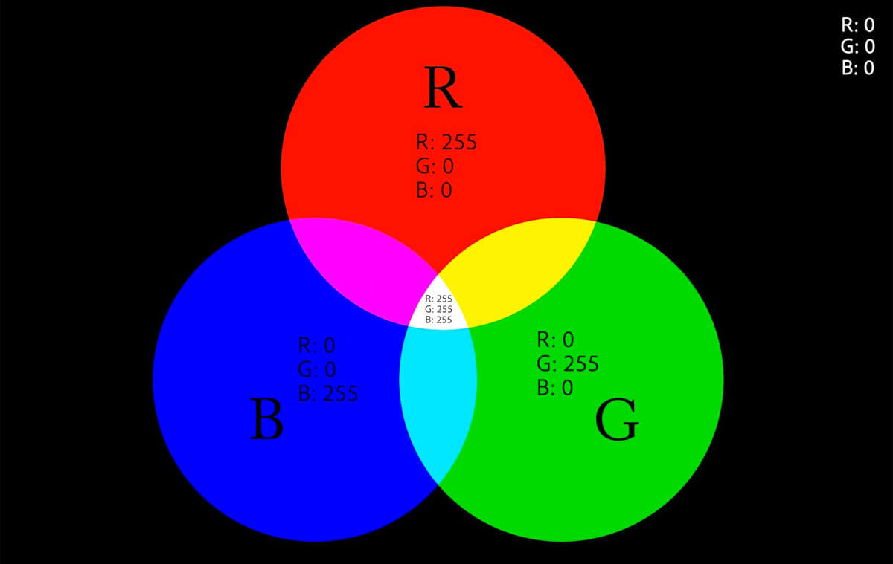
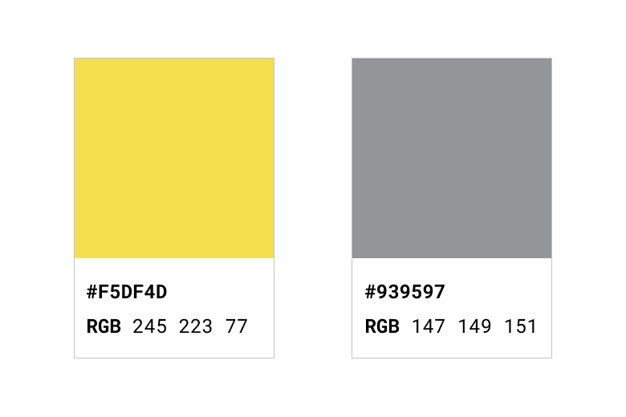
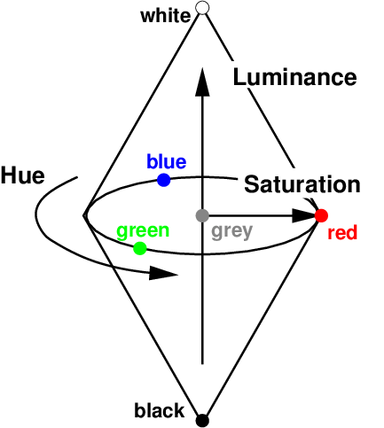

## Название цвета

Самый простой способ указания цвета в вебе — ключевые слова. Используются английские названия цветов. Самые популярные _базовые_ цвета:

- Чёрный `black`
- Белый `white`
- Красный `red`
- Зелёный `green`
- Синий `blue`

На самом деле ключевых слов для цветов очень много. Нет особого смысла их все запоминать. Всегда можно заглянуть в таблицу цветов.

<style>
  #color-table {
    width: 100%;
    color: #000000;
  }

  #color-table td {
    width: 25%;
    text-align: center;
  }

  .light-text {
    color: white;
  }
</style>
<table id="color-table">
<caption>Таблица с ключевыми словами для обозначения цвета в CSS</caption>
<tr>
  <td style="background: indianred">IndianRed</td>
  <td style="background: lightcoral">LightCoral</td>
  <td style="background: salmon">Salmon</td>
  <td style="background: darksalmon">DarkSalmon</td>
</tr>
<tr>
  <td style="background: lightsalmon">LightSalmon</td>
  <td style="background: crimson" class="light-text">Crimson</td>
  <td style="background: red">Red</td>
  <td style="background: firebrick" class="light-text">FireBrick</td>
</tr>
<tr>
  <td style="background: darkred" class="light-text">DarkRed</td>
  <td style="background: pink">Pink</td>
  <td style="background: lightpink">LightPink</td>
  <td style="background: hotpink">HotPink</td>
</tr>
<tr>
  <td style="background: deeppink">DeepPink</td>
  <td style="background: mediumvioletred" class="light-text">MediumVioletRed</td>
  <td style="background: palevioletred">PaleVioletRed</td>
  <td style="background: coral">Coral</td>
</tr>
<tr>
  <td style="background: tomato">Tomato</td>
  <td style="background: orangered">OrangeRed</td>
  <td style="background: darkorange">DarkOrange</td>
  <td style="background: orange">Orange</td>
</tr>
<tr>
  <td style="background: gold">Gold</td>
  <td style="background: yellow">Yellow</td>
  <td style="background: lightyellow">LightYellow</td>
  <td style="background: lemonchiffon">LemonChiffon</td>
</tr>
<tr>
  <td style="background: lightgoldenrodyellow">LightGoldenrodYellow</td>
  <td style="background: papayawhip">PapayaWhip</td>
  <td style="background: moccasin">Moccasin</td>
  <td style="background: peachpuff">PeachPuff</td>
</tr>
<tr>
  <td style="background: palegoldenrod">PaleGoldenrod</td>
  <td style="background: khaki">Khaki</td>
  <td style="background: darkkhaki">DarkKhaki</td>
  <td style="background: lavender">Lavender</td>
</tr>
<tr>
  <td style="background: thistle">Thistle</td>
  <td style="background: plum">Plum</td>
  <td style="background: violet">Violet</td>
  <td style="background: orchid">Orchid</td>
</tr>
<tr>
  <td style="background: fuchsia">Fuchsia</td>
  <td style="background: magenta">Magenta</td>
  <td style="background: mediumorchid">MediumOrchid</td>
  <td style="background: mediumpurple">MediumPurple</td>
</tr>
<tr>
  <td style="background: rebeccapurple" class="light-text">RebeccaPurple</td>
  <td style="background: blueviolet" class="light-text">BlueViolet</td>
  <td style="background: darkviolet" class="light-text">DarkViolet</td>
  <td style="background: darkorchid" class="light-text">DarkOrchid</td>
</tr>
<tr>
  <td style="background: darkmagenta" class="light-text">DarkMagenta</td>
  <td style="background: purple" class="light-text">Purple</td>
  <td style="background: indigo" class="light-text">Indigo</td>
  <td style="background: slateblue" class="light-text">SlateBlue</td>
</tr>
<tr>
  <td style="background: darkslateblue" class="light-text">DarkSlateBlue</td>
  <td style="background: mediumslateblue">MediumSlateBlue</td>
  <td style="background: greenyellow">GreenYellow</td>
  <td style="background: chartreuse">Chartreuse</td>
</tr>
<tr>
  <td style="background: lawngreen">LawnGreen</td>
  <td style="background: lime">Lime</td>
  <td style="background: limegreen">LimeGreen</td>
  <td style="background: palegreen">PaleGreen</td>
</tr>
<tr>
  <td style="background: lightgreen">LightGreen</td>
  <td style="background: mediumspringgreen">MediumSpringGreen</td>
  <td style="background: springgreen">SpringGreen</td>
  <td style="background: mediumseagreen">MediumSeaGreen</td>
</tr>
<tr>
  <td style="background: seagreen">SeaGreen</td>
  <td style="background: forestgreen">ForestGreen</td>
  <td style="background: green" class="light-text">Green</td>
  <td style="background: darkgreen" class="light-text">DarkGreen</td>
</tr>
<tr>
  <td style="background: yellowgreen">YellowGreen</td>
  <td style="background: olivedrab">OliveDrab</td>
  <td style="background: olive">Olive</td>
  <td style="background: darkolivegreen" class="light-text">DarkOliveGreen</td>
</tr>
<tr>
  <td style="background: mediumaquamarine">MediumAquamarine</td>
  <td style="background: darkseagreen">DarkSeaGreen</td>
  <td style="background: lightseagreen">LightSeaGreen</td>
  <td style="background: darkcyan">DarkCyan</td>
</tr>
<tr>
  <td style="background: teal" class="light-text">Teal</td>
  <td style="background: aqua">Aqua</td>
  <td style="background: cyan">Cyan</td>
  <td style="background: lightcyan">LightCyan</td>
</tr>
<tr>
  <td style="background: paleturquoise">PaleTurquoise</td>
  <td style="background: aquamarine">Aquamarine</td>
  <td style="background: turquoise">Turquoise</td>
  <td style="background: mediumturquoise">MediumTurquoise</td>
</tr>
<tr>
  <td style="background: darkturquoise">DarkTurquoise</td>
  <td style="background: cadetblue">CadetBlue</td>
  <td style="background: steelblue">SteelBlue</td>
  <td style="background: lightsteelblue">LightSteelBlue</td>
</tr>
<tr>
  <td style="background: powderblue">PowderBlue</td>
  <td style="background: lightblue">LightBlue</td>
  <td style="background: skyblue">SkyBlue</td>
  <td style="background: lightskyblue">LightSkyBlue</td>
</tr>
<tr>
  <td style="background: deepskyblue">DeepSkyBlue</td>
  <td style="background: dodgerblue">DodgerBlue</td>
  <td style="background: cornflowerblue">CornflowerBlue</td>
  <td style="background: mediumslateblue">MediumSlateBlue</td>
</tr>
<tr>
  <td style="background: royalblue" class="light-text">RoyalBlue</td>
  <td style="background: blue" class="light-text">Blue</td>
  <td style="background: mediumblue" class="light-text">MediumBlue</td>
  <td style="background: darkblue" class="light-text">DarkBlue</td>
</tr>
<tr>
  <td style="background: navy" class="light-text">Navy</td>
  <td style="background: midnightblue" class="light-text">MidnightBlue</td>
  <td style="background: cornsilk">Cornsilk</td>
  <td style="background: blanchedalmond">BlanchedAlmond</td>
</tr>
<tr>
  <td style="background: bisque">Bisque</td>
  <td style="background: navajowhite">NavajoWhite</td>
  <td style="background: wheat">Wheat</td>
  <td style="background: burlywood">BurlyWood</td>
</tr>
<tr>
  <td style="background: tan">Tan</td>
  <td style="background: rosybrown">RosyBrown</td>
  <td style="background: sandybrown">SandyBrown</td>
  <td style="background: goldenrod">Goldenrod</td>
</tr>
<tr>
  <td style="background: darkgoldenrod">DarkGoldenrod</td>
  <td style="background: peru">Peru</td>
  <td style="background: chocolate">Chocolate</td>
  <td style="background: saddlebrown" class="light-text">SaddleBrown</td>
</tr>
<tr>
  <td style="background: sienna" class="light-text">Sienna</td>
  <td style="background: brown" class="light-text">Brown</td>
  <td style="background: maroon" class="light-text">Maroon</td>
  <td style="background: white">White</td>
</tr>
<tr>
  <td style="background: snow">Snow</td>
  <td style="background: honeydew">HoneyDew</td>
  <td style="background: mintcream">MintCream</td>
  <td style="background: azure">Azure</td>
</tr>
<tr>
  <td style="background: aliceblue">AliceBlue</td>
  <td style="background: ghostwhite">GhostWhite</td>
  <td style="background: whitesmoke">WhiteSmoke</td>
  <td style="background: seashell">SeaShell</td>
</tr>
<tr>
  <td style="background: beige">Beige</td>
  <td style="background: oldlace">OldLace</td>
  <td style="background: floralwhite">FloralWhite</td>
  <td style="background: ivory">Ivory</td>
</tr>
<tr>
  <td style="background: antiquewhite">AntiqueWhite</td>
  <td style="background: linen">Linen</td>
  <td style="background: lavenderblush">LavenderBlush</td>
  <td style="background: mistyrose">MistyRose</td>
</tr>
<tr>
  <td style="background: gainsboro">Gainsboro</td>
  <td style="background: lightgray">LightGray</td>
  <td style="background: silver">Silver</td>
  <td style="background: darkgray">DarkGray</td>
</tr>
<tr>
  <td style="background: gray">Gray</td>
  <td style="background: dimgray" class="light-text">DimGray</td>
  <td style="background: lightslategray">LightSlateGray</td>
  <td style="background: slategray">SlateGray</td>
</tr>
<tr>
  <td style="background: darkslategray" class="light-text">DarkSlateGray</td>
  <td style="background: black" class="light-text">Black</td>
</tr>
</table>

### Как пишется

```css
.selector {
  color: black;
  background-color: AntiqueWhite;
}
```

Ключевые слова регистронезависимые — вы можете писать их как угодно и браузер всё равно вас поймёт.

## RGB



Для задания цвета используется функция `rgb()`, например, `rgb(0 63 255)` для синего. Каждое из трёх значений отвечает за отдельный канал RGB и может быть записано числом от 0 до 255 или в процентах. Для добавления прозрачности, после записи каналов нужно поставить слэш и записать нужное значение от 0 до 1 или в процентах, например `rgb(0 63 255 / 0.5)` для полупрозрачного синего.

Раньше синтаксис RGB отличался от современного и вы всё ещё можете встретить его в коде или выбрать для лучшей кроссбраузерности, [см. Can I use](https://caniuse.com/mdn-css_types_color_rgb_alpha_parameter). Для разделения каналов внутри функции нужно было использовать запятые `rgb(0, 63, 255)`, а для добавления прозрачности — специальную функцию `rgba()`, которая принимала последним параметром прозрачность цвета, например `rgba(255, 0, 0, 0.5)`.

## HEX



Шестнадцатеричный код цвета в цветовой модели RGB, который начинается с `#`, например, `#ff0000`. Сплошные цвета записываются в формате `#RRGGBB` или в сокращённом `#RGB` (если символы каждой группы одинаковые). Например `#009900` или `#090`. Если нужно указать прозрачность, она добавляется в конце в HEX-формате `#RRGGBBAA` или `#RGBA`, например `#00990055` или `#0905`.

Раньше нельзя было задать цвет в нотации `#RGBA` и приходилось использовать функцию `rgba()`, но сегодня у этого способа [неплохая кроссбраузерность](https://caniuse.com/css-rrggbbaa). Проблема одна: мало кто сходу сможет рассчитать 50% в шестнадцатеричном формате, поэтому для указания прозрачности цвета чаще всего используют функцию `rgb()`, где прозрачность можно задать в дробях или процентах.

Разные способы записи HEX-цветов в качестве значений:

```css
.selector {
  color: #FFF;
  border-color: #00000080;
  background-color: #ff00ff;
}
```

## HSL



Цветовая модель HSL описывает те же цвета, что и RGB, но иначе: H — Hue (оттенок), S — Saturation (насыщенность), L — Lightness (светлота). Например, `hsl(120 100% 50%)` для зелёного. Первое значение оттенка задаётся в градусах и его можно записать просто как `120` (как чаще всего и делают) или с указанием единицы `120deg`, второе и третье значение указываются в процентах. Прозрачность добавляется так же, как в `rgb`, с помощью слэша со значением, например `hsl(120 100% 50% / 0.5)` полупрозрачный зелёный.

Синтаксис `hsl()` отличался от современного точно так же, как `rgb()`: нужны были запятые и специальная функция `hsla()` для задания прозрачности цвета. Используйте старый синтаксис для лучшей совместимости и не удивляйтесь, если встретите его в коде.

## Ключевые слова

### `transparent`

Ключевое слово `transparent` задаёт прозрачный цвет текста. Технически это равносильно записи любого цвета с нулевой прозрачностью `rgb(0 0 0 / 0)`, но бывают случаи, когда просто прозрачность и прозрачность цвета могут работать иначе, например, в градиентах.

### `currentColor`

За ключевым словом [`currentColor`](/css/currentcolor/) скрывается цвет, указанный в свойстве `color` элемента. Очень удобно указывать это слово в качестве значения других свойств, чтобы многократно не указывать один и тот же цвет.

Рассмотрим пример. Пусть цвет рамки элемента будет совпадать с цветом текста:

```css
.element {
  color: #6e4aff;
  border: 1px solid currentColor;
}
```

Если мы захотим менять цвет текста и рамки по наведению курсора, то нам достаточно будет изменить значение одного свойства, а цвет рамки подстроится за счёт [`currentColor`](/css/currentcolor/):

```css
.element:hover {
  color: #09ff00;
}
```
