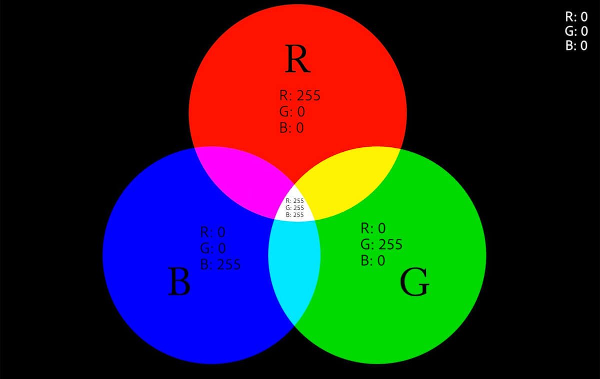
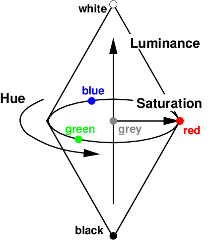
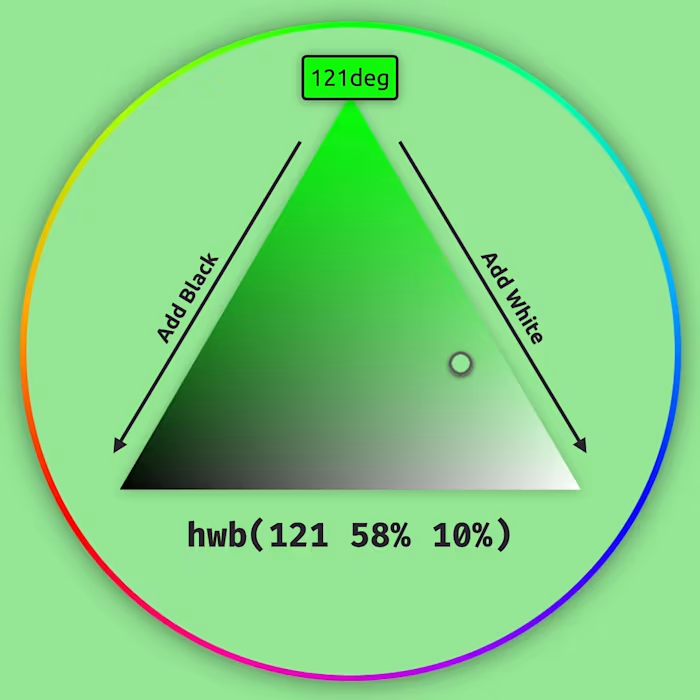
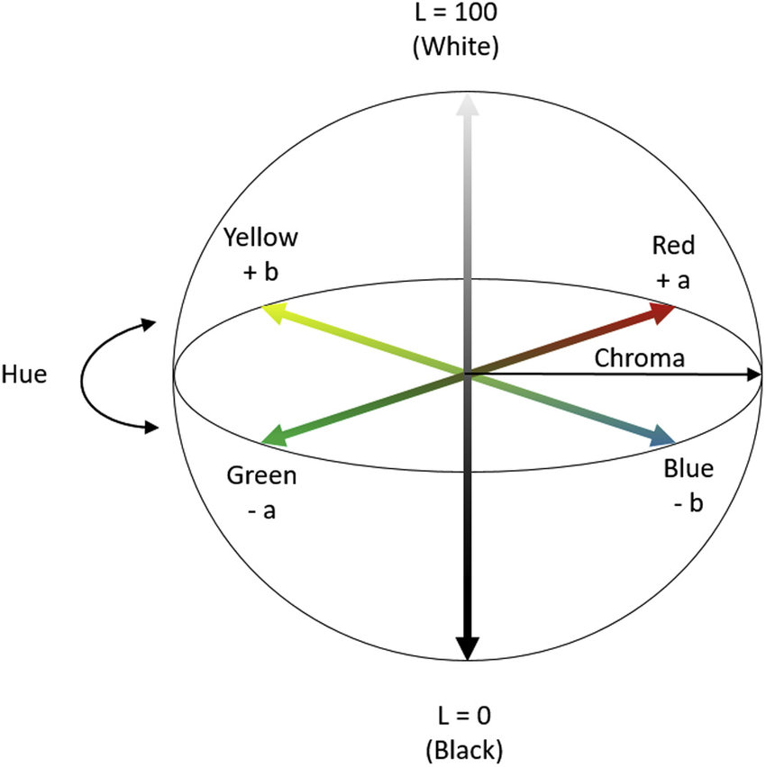
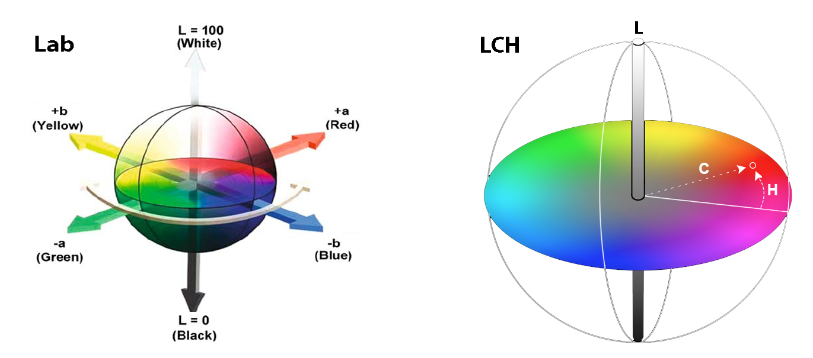
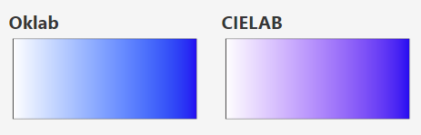

CSS поддерживает множество форматов цвета, от ключевых слов до современных пространств, где яркость ведёт себя предсказуемо для глаза.

## Названия цветов

Написать название цвета по-английски это самый простой способ. CSS знает 140+ ключевых слов:

```css
.selector {
  color: black;
  background-color: AntiqueWhite;
}
```

Ключевые слова регистронезависимые, браузер одинаково поймёт `Red`, `red` и `RED`.

Палитра встроенных имён:

<style>
  #color-table {
    width: 100%;
    color: currentColor;
  }

  #color-table td {
    width: 25%;
    text-align: center;
    color: #000;
  }

  #color-table td.light-text {
    color: white;
  }
</style>
<table id="color-table">
  <caption>Таблица с ключевыми словами для обозначения цвета в CSS</caption>
  <tr>
    <td style="background: indianred">IndianRed</td>
    <td style="background: lightcoral">LightCoral</td>
    <td style="background: salmon">Salmon</td>
    <td style="background: darksalmon">DarkSalmon</td>
  </tr>
  <tr>
    <td style="background: lightsalmon">LightSalmon</td>
    <td style="background: crimson" class="light-text">Crimson</td>
    <td style="background: red">Red</td>
    <td style="background: firebrick" class="light-text">FireBrick</td>
  </tr>
  <tr>
    <td style="background: darkred" class="light-text">DarkRed</td>
    <td style="background: pink">Pink</td>
    <td style="background: lightpink">LightPink</td>
    <td style="background: hotpink">HotPink</td>
  </tr>
  <tr>
    <td style="background: deeppink">DeepPink</td>
    <td style="background: mediumvioletred" class="light-text">MediumVioletRed</td>
    <td style="background: palevioletred">PaleVioletRed</td>
    <td style="background: coral">Coral</td>
  </tr>
  <tr>
    <td style="background: tomato">Tomato</td>
    <td style="background: orangered">OrangeRed</td>
    <td style="background: darkorange">DarkOrange</td>
    <td style="background: orange">Orange</td>
  </tr>
  <tr>
    <td style="background: gold">Gold</td>
    <td style="background: yellow">Yellow</td>
    <td style="background: lightyellow">LightYellow</td>
    <td style="background: lemonchiffon">LemonChiffon</td>
  </tr>
  <tr>
    <td style="background: lightgoldenrodyellow">LightGoldenrodYellow</td>
    <td style="background: papayawhip">PapayaWhip</td>
    <td style="background: moccasin">Moccasin</td>
    <td style="background: peachpuff">PeachPuff</td>
  </tr>
  <tr>
    <td style="background: palegoldenrod">PaleGoldenrod</td>
    <td style="background: khaki">Khaki</td>
    <td style="background: darkkhaki">DarkKhaki</td>
    <td style="background: lavender">Lavender</td>
  </tr>
  <tr>
    <td style="background: thistle">Thistle</td>
    <td style="background: plum">Plum</td>
    <td style="background: violet">Violet</td>
    <td style="background: orchid">Orchid</td>
  </tr>
  <tr>
    <td style="background: fuchsia">Fuchsia</td>
    <td style="background: magenta">Magenta</td>
    <td style="background: mediumorchid">MediumOrchid</td>
    <td style="background: mediumpurple">MediumPurple</td>
  </tr>
  <tr>
    <td style="background: rebeccapurple" class="light-text">RebeccaPurple</td>
    <td style="background: blueviolet" class="light-text">BlueViolet</td>
    <td style="background: darkviolet" class="light-text">DarkViolet</td>
    <td style="background: darkorchid" class="light-text">DarkOrchid</td>
  </tr>
  <tr>
    <td style="background: darkmagenta" class="light-text">DarkMagenta</td>
    <td style="background: purple" class="light-text">Purple</td>
    <td style="background: indigo" class="light-text">Indigo</td>
    <td style="background: slateblue" class="light-text">SlateBlue</td>
  </tr>
  <tr>
    <td style="background: darkslateblue" class="light-text">DarkSlateBlue</td>
    <td style="background: mediumslateblue">MediumSlateBlue</td>
    <td style="background: greenyellow">GreenYellow</td>
    <td style="background: chartreuse">Chartreuse</td>
  </tr>
  <tr>
    <td style="background: lawngreen">LawnGreen</td>
    <td style="background: lime">Lime</td>
    <td style="background: limegreen">LimeGreen</td>
    <td style="background: palegreen">PaleGreen</td>
  </tr>
  <tr>
    <td style="background: lightgreen">LightGreen</td>
    <td style="background: mediumspringgreen">MediumSpringGreen</td>
    <td style="background: springgreen">SpringGreen</td>
    <td style="background: mediumseagreen">MediumSeaGreen</td>
  </tr>
  <tr>
    <td style="background: seagreen">SeaGreen</td>
    <td style="background: forestgreen">ForestGreen</td>
    <td style="background: green" class="light-text">Green</td>
    <td style="background: darkgreen" class="light-text">DarkGreen</td>
  </tr>
  <tr>
    <td style="background: yellowgreen">YellowGreen</td>
    <td style="background: olivedrab">OliveDrab</td>
    <td style="background: olive">Olive</td>
    <td style="background: darkolivegreen" class="light-text">DarkOliveGreen</td>
  </tr>
  <tr>
    <td style="background: mediumaquamarine">MediumAquamarine</td>
    <td style="background: darkseagreen">DarkSeaGreen</td>
    <td style="background: lightseagreen">LightSeaGreen</td>
    <td style="background: darkcyan">DarkCyan</td>
  </tr>
  <tr>
    <td style="background: teal" class="light-text">Teal</td>
    <td style="background: aqua">Aqua</td>
    <td style="background: cyan">Cyan</td>
    <td style="background: lightcyan">LightCyan</td>
  </tr>
  <tr>
    <td style="background: paleturquoise">PaleTurquoise</td>
    <td style="background: aquamarine">Aquamarine</td>
    <td style="background: turquoise">Turquoise</td>
    <td style="background: mediumturquoise">MediumTurquoise</td>
  </tr>
  <tr>
    <td style="background: darkturquoise">DarkTurquoise</td>
    <td style="background: cadetblue">CadetBlue</td>
    <td style="background: steelblue">SteelBlue</td>
    <td style="background: lightsteelblue">LightSteelBlue</td>
  </tr>
  <tr>
    <td style="background: powderblue">PowderBlue</td>
    <td style="background: lightblue">LightBlue</td>
    <td style="background: skyblue">SkyBlue</td>
    <td style="background: lightskyblue">LightSkyBlue</td>
  </tr>
  <tr>
    <td style="background: deepskyblue">DeepSkyBlue</td>
    <td style="background: dodgerblue">DodgerBlue</td>
    <td style="background: cornflowerblue">CornflowerBlue</td>
    <td style="background: mediumslateblue">MediumSlateBlue</td>
  </tr>
  <tr>
    <td style="background: royalblue" class="light-text">RoyalBlue</td>
    <td style="background: blue" class="light-text">Blue</td>
    <td style="background: mediumblue" class="light-text">MediumBlue</td>
    <td style="background: darkblue" class="light-text">DarkBlue</td>
  </tr>
  <tr>
    <td style="background: navy" class="light-text">Navy</td>
    <td style="background: midnightblue" class="light-text">MidnightBlue</td>
    <td style="background: cornsilk">Cornsilk</td>
    <td style="background: blanchedalmond">BlanchedAlmond</td>
  </tr>
  <tr>
    <td style="background: bisque">Bisque</td>
    <td style="background: navajowhite">NavajoWhite</td>
    <td style="background: wheat">Wheat</td>
    <td style="background: burlywood">BurlyWood</td>
  </tr>
  <tr>
    <td style="background: tan">Tan</td>
    <td style="background: rosybrown">RosyBrown</td>
    <td style="background: sandybrown">SandyBrown</td>
    <td style="background: goldenrod">Goldenrod</td>
  </tr>
  <tr>
    <td style="background: darkgoldenrod">DarkGoldenrod</td>
    <td style="background: peru">Peru</td>
    <td style="background: chocolate">Chocolate</td>
    <td style="background: saddlebrown" class="light-text">SaddleBrown</td>
  </tr>
  <tr>
    <td style="background: sienna" class="light-text">Sienna</td>
    <td style="background: brown" class="light-text">Brown</td>
    <td style="background: maroon" class="light-text">Maroon</td>
    <td style="background: white">White</td>
  </tr>
  <tr>
    <td style="background: snow">Snow</td>
    <td style="background: honeydew">HoneyDew</td>
    <td style="background: mintcream">MintCream</td>
    <td style="background: azure">Azure</td>
  </tr>
  <tr>
    <td style="background: aliceblue">AliceBlue</td>
    <td style="background: ghostwhite">GhostWhite</td>
    <td style="background: whitesmoke">WhiteSmoke</td>
    <td style="background: seashell">SeaShell</td>
  </tr>
  <tr>
    <td style="background: beige">Beige</td>
    <td style="background: oldlace">OldLace</td>
    <td style="background: floralwhite">FloralWhite</td>
    <td style="background: ivory">Ivory</td>
  </tr>
  <tr>
    <td style="background: antiquewhite">AntiqueWhite</td>
    <td style="background: linen">Linen</td>
    <td style="background: lavenderblush">LavenderBlush</td>
    <td style="background: mistyrose">MistyRose</td>
  </tr>
  <tr>
    <td style="background: gainsboro">Gainsboro</td>
    <td style="background: lightgray">LightGray</td>
    <td style="background: silver">Silver</td>
    <td style="background: darkgray">DarkGray</td>
  </tr>
  <tr>
    <td style="background: gray">Gray</td>
    <td style="background: dimgray" class="light-text">DimGray</td>
    <td style="background: lightslategray">LightSlateGray</td>
    <td style="background: slategray">SlateGray</td>
  </tr>
  <tr>
    <td style="background: darkslategray" class="light-text">DarkSlateGray</td>
    <td style="background: black" class="light-text">Black</td>
  </tr>
</table>

## RGB, RGBA



RGB — базовая цветовая модель, в которой основные цвета света, красный, зелёный и синий, суммируются различными способами для воспроизведения широкого спектра цветов. Название модели происходит от инициалов трёх основных цветов: красного, зелёного и синего. В вебе модель состоит из трёх обязательных компонентов:

- R — интенсивность красного (от 0 или 0% до 255 или 100%).
- G — интенсивность зелёного (от 0 или 0% до 255 или 100%).
- B — интенсивность синего (от 0 или 0% до 255 или 100%).
- α — альфа-канал (от 0 или 0% до 1 или 100%).

<aside>

📌 В RGB-модели цвета складываются по принципу света, а не красок: если соединить красный и зелёный, получится жёлтый. Это называется аддитивным смешением: каждый канал добавляет яркость. Чем больше активных каналов, тем светлее итог. Когда задействованы все три — красный, зелёный и синий — мы получаем белый.

</aside>

### Синтаксис RGB и RGBA

В RGB и RGBA есть два типа синтаксиса.

Первый синтаксис называется абсолютным. Параметры в нём указываются вручную:

```css
.rgb {
  /* color: rgb(r g b[ / α]) */
  color: rgb(255 255 255);
  color: rgb(255 255 255 / 0.5);
}
```

Относительный синтаксис предполагает наследование от цветов в других форматах:

```css
.rgb {
  /* color: rgb(from <color> r g b[ / α]) */
  color: rgb(from green r g b / 0.5);
  color: rgb(from hwb(120deg 10% 20%) r g calc(b + 200));
}
```

При относительном синтаксисе можно вообще не наследовать параметры цвета:

```css
.rgb {
  /* Не наследует синий (b) */
  color: rgb(from hsl(0 100% 50%) r g 48);
}
```

Все типы синтаксиса имеют вторую форму в виде `rgba()`. Отличие от обычного `rgb()` в том, что альфа канал обязателен.

```css
.rgba {
  /* Абсолютные значения — color: rgba(r g b α) */
  color: rgba(255 255 255 / 0.5);

  /* Относительные значения — color: rgba(from <color> r g b α) */
  color: rgba(from green r g b 0.5);
  color: rgba(from hwb(120deg 10% 20%) r g calc(b + 200) a);

  /* Относительное значение без наследования параметра (b) */
  color: rgba(from hsl(0 100% 50%) r g 48 a);
}
```

<iframe title="Песочница для подбора RGB-цвета" src="demos/rgb/" height="300"></iframe>

[Посмотреть поддержку RGB на CanIUse](https://caniuse.com/mdn-css_types_color_rgb).

В старом коде встречается синтаксис с запятыми. Он работает, но считается устаревшим. Вместо `rgba()` для прозрачности теперь просто добавляют слэш в `rgb()`:

```css
/* старый синтаксис */
color: rgba(255, 0, 0, 0.5);

/* современный */
color: rgb(255 0 0 / 0.5);
```

## HEX

HEX — цветовая модель, основанная на RGB. Она использует шестнадцатеричный код для отображения цветов. Состоит из трёх компонентов:

- R — интенсивность красного (от 0 до 255, записывается в 16-теричном виде от 00 до FF).
- G — интенсивность зелёного (от 0 до 255, записывается в 16-теричном виде от 00 до FF).
- B — интенсивность синего (от 0 до 255, записывается в 16-теричном виде от 00 до FF).
- α — альфа-канал (от 0 или 0% до 1 или 100%).

<aside>

📌 Каждая пара символов в HEX-коде — это значение одного из каналов RGB, но в шестнадцатеричной системе. Чем больше значение, тем ярче цвет. Чтобы уложиться в две цифры, после 9 используют буквы: A = 10, F = 15. Например, `#FF0000` — максимальный красный, `#999999` — средне-серый, а `#000000` — чёрный.

</aside>

### Синтаксис HEX

Есть четыре способа записи HEX-цвета: трёхзначный, четырёхзначный, шестизначный и восьмизначный.

Короткие формы HEX — это сокращённая запись полной формы.
Каждый символ в сокращённой записи дублируется браузером при разборе цвета.

То есть парсер CSS сначала "разворачивает" значение, а затем уже работает с полной RGB(A)-формой:
- `#RGB` → `#RRGGBB`
- `#RGBA` → `#RRGGBBAA`

Например:
- `#F09`  → `#FF0099`
- `#F09A` → `#FF0099AA`

```css
.hex {
  /* Трёхзначный способ */
  color: #RGB;
  color: #F09;

  /* Четырёхзначный способт */
  color: #RGBA;
  color: #f09a;

  /* Шестизначный способ */
  color: #RRGGBB;
  color: #ff0099;

  /* Восьмизначный способ  */
  color: #RRGGBBAA;
  color: #FF0099AA;
}
```

<iframe title="Песочница для подбора HEX-цвета" src="demos/hex/" height="300"></iframe>

[Посмотреть поддержку HEX на CanIUse](https://caniuse.com/css-rrggbbaa).

## HSL



HSL — цветовая модель, которая тоже основана на RGB. Она описывает цвета оттенков через их насыщенность и светлоту. Состоит из трёх компонентов:

- H — оттенок (в градусах от 0 до 360).
- S — насыщенность (от 0% до 100%).
- L — светлота (от 0% до 100%).
- α — альфа-канал (от 0 или 0% до 1 или 100%).

### Синтаксис HSL

Синтаксис HSL такой же как и у RGB:

```css
.hsl {
  /* Абсолютные значения — color: hsl(h s l[ / α]) */
  color: hsl(120deg 75% 25%);
  color: hsl(120deg 75% 25% / 60%);

  /* Относительные значения — color: hsl(from <color> h s l[ / α]) */
  color: hsl(from green h s l / 0.5);
  color: hsl(from rgb(200 0 0) calc(h + 30) s calc(l + 30));

  /* Относительное значение без наследования параметра (l) */
  color: hsl(from rgb(255 0 0) h s 50);
}
```

<iframe title="Песочница для подбора HSL-цвета" src="demos/hsl/" height="300"></iframe>

[Посмотреть поддержку HSL на CanIUse](https://caniuse.com/mdn-css_types_color_hsl).

## HWB



HWB — цветовая модель, разработанная как альтернатива HSL. Она позволяет описывать цвет через оттенок, количество белого и количество чёрного. Состоит из трёх компонентов:

- H — оттенок (в градусах от 0 до 360).
- W — количество белого (от 0% до 100%).
- B — количество чёрного (от 0% до 100%).
- α — альфа-канал (от 0 или 0% до 1 или 100%).

### Синтаксис HWB

Синтаксис HWB такой же как у HSL:

```css
.hwb {
  /* Абсолютные значения — color: hwb(h w b[ / α]) */
  color: hwb(120deg 75% 25%);
  color: hwb(120deg 75% 25% / 0.6);

  /* Относительные значения — color: hwb(from <color> h w b[ / α]) */
  color: hwb(from green h w b / 0.5);
  color: hwb(from rgb(200 0 0) calc(h + 30) w calc(b + 30));

  /* Относительное значение без наследования параметра (l) */
  color: hwb(from rgb(255 0 0) h w 50);
}
```

<iframe title="Песочница для подбора HWB-цвета" src="demos/hwb/" height="300"></iframe>

[Поддержка HWB на CanIUse](https://caniuse.com/mdn-css_types_color_hwb).

## LAB



LAB — цветовая модель, разработанная Международной комиссией по освещению (CIE). Основана на прямоугольной (декартовой) системе координат. Состоит из трёх компонентов:

- L — светлота (от 0 до 100).
- A — от зелёного (-125 или -100%) до красного (125 или 100%).
- B — от синего (-125 или -100%) до жёлтого (125 или 100%).
- α — альфа-канал (от 0 или 0% до 1 или 100%).

### Синтаксис LAB

В модели LAB есть два способа задать цвет.

Первый способ абсолютный, в нём все параметры указывают вручную:

```css
.lab {
  /* color: lab(l a b[ / α]) */
  color: lab(29% 39 20);
  color: lab(52% 40 59);
  color: lab(52% 40 59 / .5);
}
```

Второй способ относительный. В нём цвета наследуются от цветов в других форматах:

```css
.lab {
  /* color: lab(from <color> l a b[ / α]) */
  color: lab(from green l a b / 0.5);
  color: lab(from hsl(180 100% 50%) calc(l - 10) a b);
}
```

В относительном синтаксисе можно не наследовать параметры цвета:

```css
.lab {
  color: lab(from hsl(0 100% 50%) l -100 b);
}
```

<iframe title="Песочница для подбора LAB-цвета" src="demos/lab/" height="300"></iframe>

[Поддержка LAB на CanIUse](https://caniuse.com/css-lch-lab).

## LCH



LCH — вариация LAB в полярной системе координат. Состоит из трёх компонентов:

- L — светлота (от 0 или 0% до 100 или 100%).
- C — насыщенность (от 0 или 0% до 150 и выше или 100%).
- H — тон в градусах (от 0 до 360).
- α — альфа-канал (от 0 или 0% до 1 или 100%).

### Синтаксис LCH

У LCH почти такой же синтаксис, как у LAB:

```css
.lch {
  /* Абсолютные значения — color: lch(l c h[ / α]) */
  color: lch(29% 39 20);
  color: lch(52% 40 59);
  color: lch(52% 40 59 / .5);

  /* Относительные значения color — lch(from <color> l c h[ / α]) */
  color: lch(from green l c h / 0.5);
  color: lch(from hsl(180 100% 50%) calc(l - 10) c h);

  /* Относительное значение без наследования параметра (c) */
  color: lch(from hsl(0 100% 50%) l -100 h);
}
```

<iframe title="Песочница для подбора LCH-цвета" src="demos/lch/" height="300"></iframe>

[Поддержка LCH на CanIUse](https://caniuse.com/css-lch-lab).

## OKLAB



OKLAB — новая цветовая модель, улучшенная версия LAB. Создана для цифровых дисплеев. Обеспечивает более равномерное восприятие цвета и лучше подходит для пользовательских интерфейсов. Состоит из трёх компонентов:

- L — светлота (от 0 или 0% до 1 или 100%).
- A — от зелёного (-0.4 и меньше или -100% ) до красного (0.4 и выше или 100%).
- B — от синего (-0.4 и меньше или -100% ) до жёлтого (0.4 и выше или 100%).
- α — альфа-канал (от 0 или 0% до 100 или 100%).

### Синтаксис OKLAB

Синтаксис OKLAB такой же как и у LAB:

```css
.oklab {
  /* Абсолютные значения — color: oklab(l a b[ / α]) */
  color: oklab(29% 39 20);
  color: oklab(52% 40 59);
  color: oklab(52% 40 59 / .5);

  /* Относительные значения — color: oklab(from <color> l a b[ / α]) */
  color: oklab(from green l a b / 0.5);
  color: oklab(from hsl(180 100% 50%) calc(l - 10) a b);

  /* Относительное значение без наследования параметра (a) */
  color: oklab(from hsl(0 100% 50%) l -100 b);
}
```

<iframe title="Песочница для подбора OKLAB-цвета" src="demos/oklab/" height="300"></iframe>

Посмотреть [поддержку OKLAB на CanIUse](https://caniuse.com/mdn-css_types_color_oklab).

## OKLCH


Вариация OKLAB, основанная на полярной системе координат. Состоит из трёх компонентов:

- L — светлота (от 0 или 0% до 1 или 100%).
- C — насыщенность (от -0.4 и ниже или 0% до +0.4 и выше или 100%).
- H — тон в градусах (от 0 до 360).
- α — альфа-канал (от 0 или 0% до 100 или 100%).

### Синтаксис OKLCH

В OKLCH используется тот же синтаксис, что в LAB и LCH:

```css
.oklch {
  /* Абсолютные значения — color: oklch(l c h[ / α]) */
  color: oklch(29% 39 20);
  color: oklch(52% 40 59);
  color: oklch(52% 40 59 / .5);

  /* Относительные значения — color: oklch(from <color> l c h[ / α]) */
  color: oklch(from green l c h / 0.5);
  color: oklch(from hsl(180 100% 50%) calc(l - 10) c h);

  /* Относительное значение без наследования параметра (c) */
  color: oklch(from hsl(0 100% 50%) l -100 h);
}
```

<iframe title="Песочница для подбора OKLCH-цвета" src="demos/oklch/" height="300"></iframe>

[Посмотреть поддержку OKLCH на CanIUse](https://caniuse.com/mdn-css_types_color_oklch).

## Ключевые слова

### `transparent`

Ключевое слово `transparent` задаёт полностью прозрачный цвет. Технически оно эквивалентно записи `rgb(0 0 0 / 0)` - чёрного цвета с нулевой непрозрачностью. Оно ведёт себя точно так же, как любой другой цвет с альфа-каналом, равным нулю, и может использоваться в любых CSS-свойствах, включая [`background`](/css/background/), [`border`](/css/border/) и `*-gradient`.

```css
/* Может появиться серый/чёрный в середине */
background: linear-gradient(red, transparent);

/* Чистый переход без артефактов */
background: linear-gradient(red, oklch(from red l c h / 0));
```

### `currentColor`

[`currentColor`](/css/currentcolor/) — текущий цвет текста элемента. Удобен, когда нужно синхронизировать несколько свойств с одним источником:

```css
.element {
  color: #6e4aff;
  border: 1px solid currentColor;  /* рамка того же цвета, что текст */
  fill: currentColor;              /* для SVG-иконок */
}

/* При hover достаточно изменить одно свойство */
.element:hover {
  color: #09ff00;
}
```

### `light-dark()`

Функция [`light-dark()`](/css/light-dark/) принимает два цвета — для светлой и тёмной темы — и выбирает нужный в зависимости от `color-scheme`. Поддерживается с мая 2024.

```css
html {
  /* Обязательно — разрешает переключение тем */
  color-scheme: light dark;
}

.element {
  /* Белый в светлой теме, тёмно-серый в тёмной */
  background: light-dark(#ffffff, #1a1a1a);

  /* Тёмный текст в светлой теме, светлый в тёмной */
  color: light-dark(#111111, #eeeeee);
}
```

Без `color-scheme: light dark` на `html` или `:root` функция не работает.
