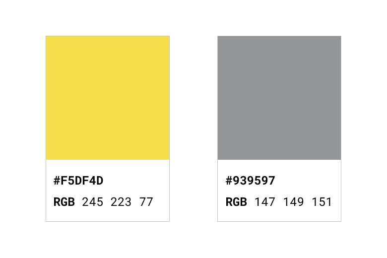
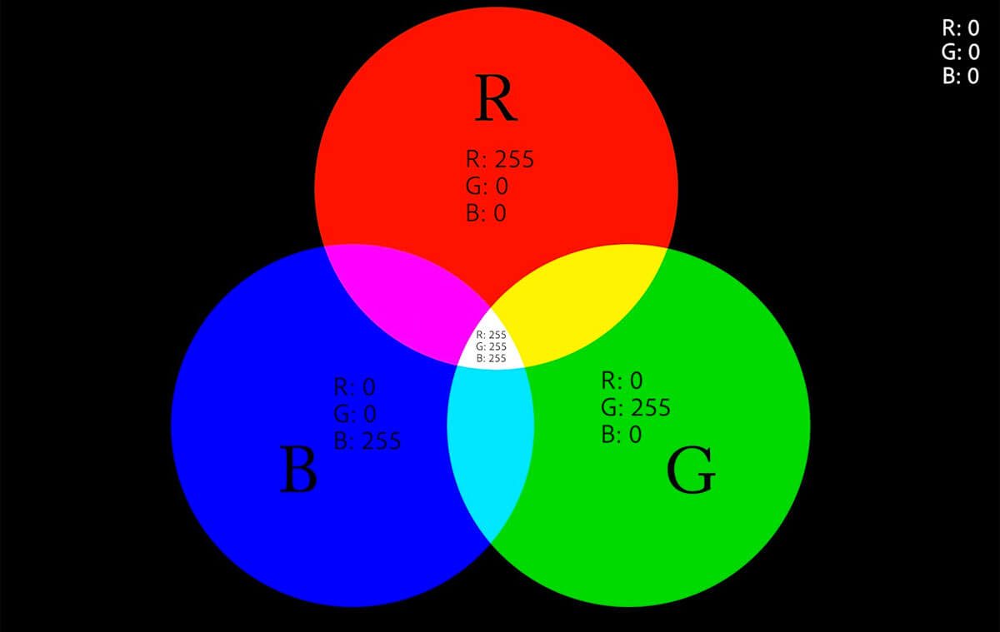

CSS поддерживает множество форматов цвета, от ключевых слов до современных пространств, где яркость ведёт себя предсказуемо для глаза.

## Названия цветов

Написать название цвета по-английски это самый простой способ. CSS знает 140+ ключевых слов:

```css
.selector {
  color: black;
  background-color: AntiqueWhite;
}
```

Ключевые слова регистронезависимые, браузер одинаково поймёт `Red`, `red` и `RED`.

Палитра встроенных имён:

<style>
  #color-table {
    width: 100%;
    color: currentColor;
  }

  #color-table td {
    width: 25%;
    text-align: center;
    color: #000;
  }

  #color-table td.light-text {
    color: white;
  }
</style>
<table id="color-table">
<caption>Таблица с ключевыми словами для обозначения цвета в CSS</caption>
<tr>
  <td style="background: indianred">IndianRed</td>
  <td style="background: lightcoral">LightCoral</td>
  <td style="background: salmon">Salmon</td>
  <td style="background: darksalmon">DarkSalmon</td>
</tr>
<tr>
  <td style="background: lightsalmon">LightSalmon</td>
  <td style="background: crimson" class="light-text">Crimson</td>
  <td style="background: red">Red</td>
  <td style="background: firebrick" class="light-text">FireBrick</td>
</tr>
<tr>
  <td style="background: darkred" class="light-text">DarkRed</td>
  <td style="background: pink">Pink</td>
  <td style="background: lightpink">LightPink</td>
  <td style="background: hotpink">HotPink</td>
</tr>
<tr>
  <td style="background: deeppink">DeepPink</td>
  <td style="background: mediumvioletred" class="light-text">MediumVioletRed</td>
  <td style="background: palevioletred">PaleVioletRed</td>
  <td style="background: coral">Coral</td>
</tr>
<tr>
  <td style="background: tomato">Tomato</td>
  <td style="background: orangered">OrangeRed</td>
  <td style="background: darkorange">DarkOrange</td>
  <td style="background: orange">Orange</td>
</tr>
<tr>
  <td style="background: gold">Gold</td>
  <td style="background: yellow">Yellow</td>
  <td style="background: lightyellow">LightYellow</td>
  <td style="background: lemonchiffon">LemonChiffon</td>
</tr>
<tr>
  <td style="background: lightgoldenrodyellow">LightGoldenrodYellow</td>
  <td style="background: papayawhip">PapayaWhip</td>
  <td style="background: moccasin">Moccasin</td>
  <td style="background: peachpuff">PeachPuff</td>
</tr>
<tr>
  <td style="background: palegoldenrod">PaleGoldenrod</td>
  <td style="background: khaki">Khaki</td>
  <td style="background: darkkhaki">DarkKhaki</td>
  <td style="background: lavender">Lavender</td>
</tr>
<tr>
  <td style="background: thistle">Thistle</td>
  <td style="background: plum">Plum</td>
  <td style="background: violet">Violet</td>
  <td style="background: orchid">Orchid</td>
</tr>
<tr>
  <td style="background: fuchsia">Fuchsia</td>
  <td style="background: magenta">Magenta</td>
  <td style="background: mediumorchid">MediumOrchid</td>
  <td style="background: mediumpurple">MediumPurple</td>
</tr>
<tr>
  <td style="background: rebeccapurple" class="light-text">RebeccaPurple</td>
  <td style="background: blueviolet" class="light-text">BlueViolet</td>
  <td style="background: darkviolet" class="light-text">DarkViolet</td>
  <td style="background: darkorchid" class="light-text">DarkOrchid</td>
</tr>
<tr>
  <td style="background: darkmagenta" class="light-text">DarkMagenta</td>
  <td style="background: purple" class="light-text">Purple</td>
  <td style="background: indigo" class="light-text">Indigo</td>
  <td style="background: slateblue" class="light-text">SlateBlue</td>
</tr>
<tr>
  <td style="background: darkslateblue" class="light-text">DarkSlateBlue</td>
  <td style="background: mediumslateblue">MediumSlateBlue</td>
  <td style="background: greenyellow">GreenYellow</td>
  <td style="background: chartreuse">Chartreuse</td>
</tr>
<tr>
  <td style="background: lawngreen">LawnGreen</td>
  <td style="background: lime">Lime</td>
  <td style="background: limegreen">LimeGreen</td>
  <td style="background: palegreen">PaleGreen</td>
</tr>
<tr>
  <td style="background: lightgreen">LightGreen</td>
  <td style="background: mediumspringgreen">MediumSpringGreen</td>
  <td style="background: springgreen">SpringGreen</td>
  <td style="background: mediumseagreen">MediumSeaGreen</td>
</tr>
<tr>
  <td style="background: seagreen">SeaGreen</td>
  <td style="background: forestgreen">ForestGreen</td>
  <td style="background: green" class="light-text">Green</td>
  <td style="background: darkgreen" class="light-text">DarkGreen</td>
</tr>
<tr>
  <td style="background: yellowgreen">YellowGreen</td>
  <td style="background: olivedrab">OliveDrab</td>
  <td style="background: olive">Olive</td>
  <td style="background: darkolivegreen" class="light-text">DarkOliveGreen</td>
</tr>
<tr>
  <td style="background: mediumaquamarine">MediumAquamarine</td>
  <td style="background: darkseagreen">DarkSeaGreen</td>
  <td style="background: lightseagreen">LightSeaGreen</td>
  <td style="background: darkcyan">DarkCyan</td>
</tr>
<tr>
  <td style="background: teal" class="light-text">Teal</td>
  <td style="background: aqua">Aqua</td>
  <td style="background: cyan">Cyan</td>
  <td style="background: lightcyan">LightCyan</td>
</tr>
<tr>
  <td style="background: paleturquoise">PaleTurquoise</td>
  <td style="background: aquamarine">Aquamarine</td>
  <td style="background: turquoise">Turquoise</td>
  <td style="background: mediumturquoise">MediumTurquoise</td>
</tr>
<tr>
  <td style="background: darkturquoise">DarkTurquoise</td>
  <td style="background: cadetblue">CadetBlue</td>
  <td style="background: steelblue">SteelBlue</td>
  <td style="background: lightsteelblue">LightSteelBlue</td>
</tr>
<tr>
  <td style="background: powderblue">PowderBlue</td>
  <td style="background: lightblue">LightBlue</td>
  <td style="background: skyblue">SkyBlue</td>
  <td style="background: lightskyblue">LightSkyBlue</td>
</tr>
<tr>
  <td style="background: deepskyblue">DeepSkyBlue</td>
  <td style="background: dodgerblue">DodgerBlue</td>
  <td style="background: cornflowerblue">CornflowerBlue</td>
  <td style="background: mediumslateblue">MediumSlateBlue</td>
</tr>
<tr>
  <td style="background: royalblue" class="light-text">RoyalBlue</td>
  <td style="background: blue" class="light-text">Blue</td>
  <td style="background: mediumblue" class="light-text">MediumBlue</td>
  <td style="background: darkblue" class="light-text">DarkBlue</td>
</tr>
<tr>
  <td style="background: navy" class="light-text">Navy</td>
  <td style="background: midnightblue" class="light-text">MidnightBlue</td>
  <td style="background: cornsilk">Cornsilk</td>
  <td style="background: blanchedalmond">BlanchedAlmond</td>
</tr>
<tr>
  <td style="background: bisque">Bisque</td>
  <td style="background: navajowhite">NavajoWhite</td>
  <td style="background: wheat">Wheat</td>
  <td style="background: burlywood">BurlyWood</td>
</tr>
<tr>
  <td style="background: tan">Tan</td>
  <td style="background: rosybrown">RosyBrown</td>
  <td style="background: sandybrown">SandyBrown</td>
  <td style="background: goldenrod">Goldenrod</td>
</tr>
<tr>
  <td style="background: darkgoldenrod">DarkGoldenrod</td>
  <td style="background: peru">Peru</td>
  <td style="background: chocolate">Chocolate</td>
  <td style="background: saddlebrown" class="light-text">SaddleBrown</td>
</tr>
<tr>
  <td style="background: sienna" class="light-text">Sienna</td>
  <td style="background: brown" class="light-text">Brown</td>
  <td style="background: maroon" class="light-text">Maroon</td>
  <td style="background: white">White</td>
</tr>
<tr>
  <td style="background: snow">Snow</td>
  <td style="background: honeydew">HoneyDew</td>
  <td style="background: mintcream">MintCream</td>
  <td style="background: azure">Azure</td>
</tr>
<tr>
  <td style="background: aliceblue">AliceBlue</td>
  <td style="background: ghostwhite">GhostWhite</td>
  <td style="background: whitesmoke">WhiteSmoke</td>
  <td style="background: seashell">SeaShell</td>
</tr>
<tr>
  <td style="background: beige">Beige</td>
  <td style="background: oldlace">OldLace</td>
  <td style="background: floralwhite">FloralWhite</td>
  <td style="background: ivory">Ivory</td>
</tr>
<tr>
  <td style="background: antiquewhite">AntiqueWhite</td>
  <td style="background: linen">Linen</td>
  <td style="background: lavenderblush">LavenderBlush</td>
  <td style="background: mistyrose">MistyRose</td>
</tr>
<tr>
  <td style="background: gainsboro">Gainsboro</td>
  <td style="background: lightgray">LightGray</td>
  <td style="background: silver">Silver</td>
  <td style="background: darkgray">DarkGray</td>
</tr>
<tr>
  <td style="background: gray">Gray</td>
  <td style="background: dimgray" class="light-text">DimGray</td>
  <td style="background: lightslategray">LightSlateGray</td>
  <td style="background: slategray">SlateGray</td>
</tr>
<tr>
  <td style="background: darkslategray" class="light-text">DarkSlateGray</td>
  <td style="background: black" class="light-text">Black</td>
</tr>
</table>

## HEX

Шестнадцатеричная запись — самый распространённый формат в вебе. Начинается с `#` и кодирует красный, зелёный и синий каналы парами шестнадцатеричных символов:

```css
.selector {
  color: #ff0000;           /* чистый красный */
  background-color: #FFF;   /* сокращённая запись белого */
  border-color: #00990055;  /* зелёный с 33% прозрачностью */
}
```

Форматы записи:

- `#RRGGBB` — полный вариант, например `#ff6347` (tomato)
- `#RGB` — сокращённый, если каждая пара одинакова: `#f00` = `#ff0000`
- `#RRGGBBAA` — с прозрачностью, AA от `00` (полностью прозрачный) до `ff` (непрозрачный)
- `#RGBA` — сокращённый с прозрачностью: `#f008` = `rgb(255 0 0 / 50%)`



Прозрачность в HEX неудобно считать в голове — 50% это `80`, 25% это `40`. Поэтому для полупрозрачных цветов проще использовать другие форматы.

## RGB



Функция `rgb()` принимает три значения каналов (красный, зелёный, синий) от 0 до 255 или в процентах. Прозрачность добавляется четвёртым параметром через слэш:

```css
.element {
  color: rgb(255 0 0);             /* красный */
  color: rgb(0 63 255);            /* синий */
  color: rgb(0 63 255 / 0.5);      /* полупрозрачный синий */
  color: rgb(0 63 255 / 50%);      /* то же самое в процентах */
}
```

В старом коде встречается синтаксис с запятыми. Он работает, но считается устаревшим. Вместо `rgba()` для прозрачности теперь просто добавляют слэш в `rgb()`:

```css
/* старый синтаксис */
color: rgba(255, 0, 0, 0.5);

/* современный */
color: rgb(255 0 0 / 0.5);
```

## HSL

HSL описывает цвет через три параметра, более понятные человеку:

- **H** (Hue) — оттенок, угол на цветовом колесе от 0 до 360°
- **S** (Saturation) — насыщенность в процентах, 0% = серый
- **L** (Lightness) — светлота в процентах, 0% = чёрный, 100% = белый


```css
.element {
  color: hsl(120 100% 50%);          /* яркий зелёный */
  color: hsl(120 100% 50% / 0.5);    /* полупрозрачный */
  color: hsl(0.5turn 100% 50%);      /* то же, что 180deg */
}
```

Оттенок можно задавать в `deg`, `turn`, `grad`, `rad`. Чаще всего просто пишут число, браузер считает его градусами.

HSL удобен для ручного подбора цветов и создания тематических палитр через CSS-переменные:

```css
:root {
  --hue: 220;
  --accent: hsl(var(--hue) 80% 55%);
  --accent-light: hsl(var(--hue) 80% 75%);
  --accent-dark:  hsl(var(--hue) 80% 35%);
}
```

## HWB

HWB — ещё один способ описать цвет через оттенок плюс количество белого и чёрного:

- **H** (Hue) — оттенок, 0–360°
- **W** (Whiteness) — белизна, 0–100%
- **B** (Blackness) — чернота, 0–100%

```css
.item {
  color: hwb(45 45% 20%);           /* тёплый жёлто-оранжевый */
  color: hwb(45 45% 20% / 0.6);     /* с прозрачностью */
}
```

Если W + B в сумме превышают 100%, браузер нормализует их автоматически.

Поиграть с HWB:

<iframe title="Песочница для подбора HWB-цвета" src="demos/hwb/?embed=1" height="720"></iframe>

## Цветовые пространства

Все форматы выше — RGB, HEX, HSL, HWB — работают в одном пространстве под названием **sRGB**. Это стандарт, который появился в конце 1990-х для мониторов и интернета, и он описывает лишь часть видимых человеком цветов.

Современные дисплеи, в том числе iPhone, Mac с Retina и большинство флагманских телефонов, поддерживают более широкий охват **Display P3**: он покрывает примерно на 35% больше цветов, чем sRGB. Особенно это заметно в ярких насыщенных зелёных, красных и пурпурных: на P3-экране они выглядят гораздо живее.

Второй важный вопрос — **перцептуальная равномерность**: насколько одинаковое изменение числа ощущается одинаковым на глаз. В HSL параметр L называется «светлотой», но он неточен: жёлтый и синий с одинаковым `L` выглядят по-разному ярко. Это делает создание сбалансированных палитр сложным: приходится вручную корректировать каждый цвет.

Современные форматы (oklch, oklab, lch, lab) решают обе проблемы:

1. Они перцептуально равномерны: одинаковое изменение L даёт одинаково воспринимаемую разницу в яркости.
1. Функция `color()` с пространством `display-p3` даёт доступ к широкому охвату P3-экранов.

Наглядно сравнить интерполяцию в разных пространствах и увидеть разницу в равномерности светлоты:

<iframe title="Сравнение цветовых пространств — интерполяция и перцептуальная равномерность" src="demos/color-spaces/?embed=1" height="780"></iframe>

## OKLab и OKLCh

Два формата из одного пространства, они описывают одни и те же цвета, просто разными координатами. Оба работают во всех актуальных браузерах с мая 2023.

### `oklch(L C H)`

Полярные координаты: L — светлота (0–1), C — насыщенность (chroma, от 0 и выше, обычно до ~0.37), H — оттенок (0–360°). Рекомендуемый современный формат для большинства задач: интуитивный, удобен для палитр.

```css
.element {
  color: oklch(0.7 0.2 160);          /* зелёный */
  color: oklch(0.7 0.2 160 / 0.8);    /* полупрозрачный */
  color: oklch(0 0 0);                /* чёрный */
  color: oklch(1 0 0);                /* белый */
}
```

Главное преимущество: одинаковый L при любом оттенке — это одинаково воспринимаемая яркость. Это делает oklch идеальным для создания дизайн-токенов и тематических палитр.

<iframe title="OKLCh — интерактивная песочница" src="demos/oklch/?embed=1" height="550"></iframe>

### `oklab(L a b)`

Прямоугольные координаты того же пространства: a — ось зелёный/красный, b — ось синий/жёлтый. Удобен для интерполяции: в градиентах цвета плавно переходят без «серых провалов» посередине:

```css
.gradient {
  background: linear-gradient(
      in oklab, oklch(0.65 0.25 0),
      oklch(0.65 0.25 150)
    );
}
```

```css
.element {
  color: oklab(0.7 -0.1 0.1);
  color: oklab(0.7 -0.1 0.1 / 0.5);
}
```

## Lab и LCH

Аналоги oklch/oklab на основе более старого стандарта CIE. Тоже перцептуально равномерные, но OKLab/OKLCh дают более точные результаты на практике и обычно предпочтительнее. Работают во всех актуальных браузерах с мая 2023.

```css
.element {
  color: lch(50 80 160);    /* L: 0–100, C: 0–150+, H: 0–360 */
  color: lab(50 -40 30);    /* L: 0–100, a и b: -125 до 125 */
}
```

Если уже используете oklch/oklab — lch/lab не нужны. Они нужны, когда работаете с инструментами или библиотеками, которые оперируют CIE-пространством.

## `color()` — широкий охват

Функция [`color()`](/css/color-function/) позволяет явно указать цветовое пространство — display-p3, rec2020, srgb и другие. Поддерживается с мая 2023.

## Относительный синтаксис цветов

Ключевое слово `from` позволяет создать новый цвет на основе существующего, меняя только нужные компоненты. Поддерживается в браузерах с сентября 2024.

```css
.element {
  /* Берём синий и сдвигаем оттенок на 180° — получаем оранжевый */
  color: oklch(from blue l c calc(h + 180));

  /* Осветляем произвольный цвет из переменной */
  background: oklch(from var(--brand) calc(l + 0.15) c h);

  /* Делаем цвет полупрозрачным */
  border-color: oklch(from var(--brand) l c h / 0.5);

  /* Убираем насыщенность — получаем серый той же яркости */
  color: oklch(from var(--brand) l 0 h);
}
```

Внутри функции можно использовать `calc()` с компонентами цвета (`l`, `c`, `h` для oklch или `r`, `g`, `b` для rgb). Это мощный инструмент для создания динамических палитр прямо в CSS без JavaScript.

<iframe title="Относительный синтаксис цветов — производные из базового" src="demos/relative-colors/?embed=1" height="500"></iframe>

## Ключевые слова

### `transparent`

Ключевое слово `transparent` — полностью прозрачный цвет, эквивалент `rgb(0 0 0 / 0)`. Пригодится там, где нужно «убрать» цвет, не сломав остальные свойства. Стоит знать: в градиентах `transparent` интерполируется через чёрный, поэтому иногда лучше использовать `oklch(0 0 0 / 0)` или `rgb(X Y Z / 0)` с нужным оттенком, чтобы не было «серых провалов»:

```css
/* Может появиться серый/чёрный в середине */
background: linear-gradient(red, transparent);

/* Чистый переход без артефактов */
background: linear-gradient(red, oklch(from red l c h / 0));
```

### `currentColor`

[`currentColor`](/css/currentcolor/) — текущий цвет текста элемента. Удобен, когда нужно синхронизировать несколько свойств с одним источником:

```css
.element {
  color: #6e4aff;
  border: 1px solid currentColor;  /* рамка того же цвета, что текст */
  fill: currentColor;              /* для SVG-иконок */
}

/* При hover достаточно изменить одно свойство */
.element:hover {
  color: #09ff00;
}
```

### `light-dark()`

Функция [`light-dark()`](/css/light-dark/) принимает два цвета — для светлой и тёмной темы — и выбирает нужный в зависимости от `color-scheme`. Поддерживается с мая 2024.

```css
html {
  /* Обязательно — разрешает переключение тем */
  color-scheme: light dark;
}

.element {
  /* Белый в светлой теме, тёмно-серый в тёмной */
  background: light-dark(#ffffff, #1a1a1a);

  /* Тёмный текст в светлой теме, светлый в тёмной */
  color: light-dark(#111111, #eeeeee);
}
```

Без `color-scheme: light dark` на `html` или `:root` функция не работает.
