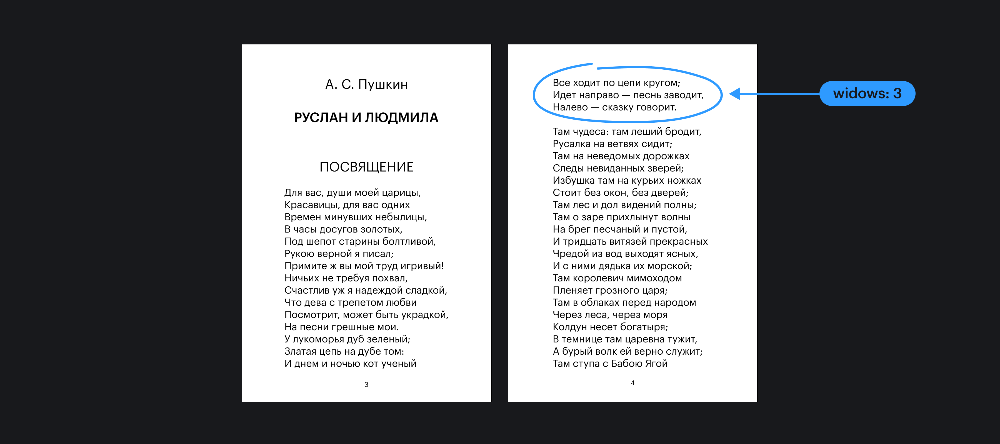

## Кратко

Свойство `widows` указывает, минимальное количество строк, которые можно переносить на новую страницу при печати, если не хватает места на текущей.

Работает только для внутри директивы [`@media`](/css/media/) со значением `print`. Отправьте страницу на печать, чтобы посмотреть, что получится.

## Пример

```css
@media print {
  p {
    widows: 2;
  }
}
```

## Как пишется

В качестве значения указывается число, означающее минимум переносимых строк на следующую страницу при печати. Не работает при отрицательном значении.

## Как понять

Свойство `widows` тесно связано другим свойством стилей для печати [`orphans`](/css/orphans/) и обозначает строки, которые остаются на предыдущей странице для печати.


Поэма А.С. Пушкина «Руслан и Людмила». Синим выделены перенесённые на другую страницу одни «вдовы».

Свойство `widows` [наследуемое](/css/inheritance/) и вместо положительного числа можно передать значение `inherit`, при этом в свойство нельзя передавать отрицательные значения. Они работать не будут.

## На что обратить внимание

Cвойство `widows` имеет преимущество перед `orphans`. Браузер выполнит это свойство, а затем постарается выполнить то, что указано в `orphans`.

По умолчанию в браузерах, кроме Mozilla Firefox `widows: 2`. В Firefox свойство не поддерживается.
