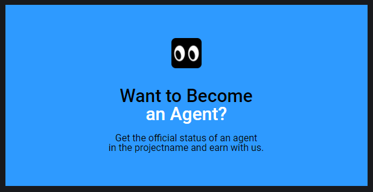

Свойство `width`, пожалуй, самое часто встречающееся свойство в коде. В работе вы будете манипулировать шириной очень часто.

🛠 Поскольку строчные (`inline`) и строчно-блочные (`inline-block`) элементы подстраиваются по ширине под вложенный контент, то в ситуациях, когда контента внутри нет, ширина такого элемента будет равна нулю. Но часто случается, что нам нужен декоративный элемент. В этом случае без зазрения совести задавайте ширину. И не забудь про высоту ([`height`](/css/height/)).

К примеру, часто декоративные иконки верстаются при помощи фона для элементов [`<i>`](/html/i/) или [`<span>`](/html/span/). Поскольку контента по факту в этих элементах нет, их ширина и высота будут равны 0. Пропишите `display` со значением `block` или `inline-block`, задайте ширину и высоту иконки и укажите путь до фонового изображения:

```html
<div class="card">
  <i class="card__icon"></i>
  <!-- Внимание на меня! -->
  <h2 class="card__title">Заголовок карточки</h2>
  <p class="card__text">Некий текст новостной карточки</p>
</div>
```

```css
.card__icon {
  display: inline-block;
  width: 50px;
  height: 50px;
  background: url('doka-eyes.svg') no-repeat center / cover;
}
```

<iframe title="Вёрстка иконки" src="../demos/icon/" height="360"></iframe>

🛠 Часто начинающие разработчики разбивают текст заголовка или абзаца на строки при помощи тега `<br>` чтобы было точно, как в макете. В таких случаях стоит помнить, что сайты редко остаются неприкосновенными и чаще всего в процессе жизни сайта тексты на нём меняются многократно. Поэтому нужно писать стили так, чтобы любой текст, вставленный в блок, выглядел хорошо.

**Пример макета:**



**Как не надо делать:**

```html
...
<p class="card__text">
  Get the official status of an agent<br>
  in the projectname and earn with us.
</p>
...
```

**Как можно сделать:**

Лучше задай максимальную ширину, которую должен занимать текст в элементе. Тогда любой текст будет смотреться хорошо. Ничего страшного, если перенос слов или строк не будет на 100% совпадать с макетом. Но такое решение будет дальновидным и владельцы сайта не столкнутся с проблемами при замене текстов.

```html
...
<p class="card__text">
  Get the official status of an agent in the projectname and earn with us.
</p>
...
```

```css
.card__text {
  max-width: 50%;
  margin: 0 auto; /* Для выравнивания по центру */
}
```

<iframe title="Перенос текста" src="../demos/text/" height="410"></iframe>

Теперь любой текст будет занимать не больше, чем 50% от ширины карточки 🎉
