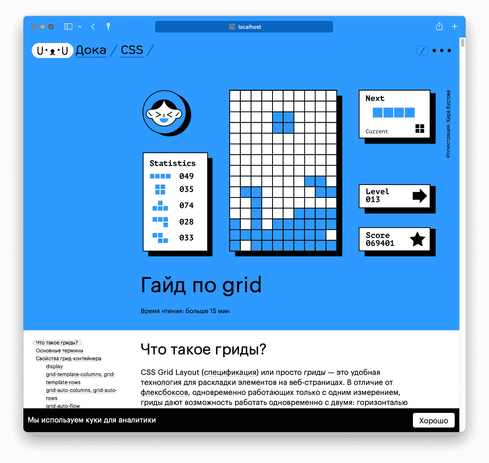

# Помощь проекту

## Чем вы можете помочь

### Реальные задачи

Загляните в [раздел Issues](https://github.com/doka-guide/content/issues) нашего репозитория, чтобы ознакомиться со списком актуальных задач. Мы будем рады, если вы поможете закрыть задачи из [🔥 Горящего бэклога](https://github.com/doka-guide/content/milestone/22) — эти статьи нам нужны в первую очередь.

**Не знаете с чего начать?** 🤔 Все задачи, которые подходят начинающим, собраны в [одном месте](https://github.com/doka-guide/content/issues?q=is%3Aopen+is%3Aissue+label%3A%22%D1%85%D0%BE%D1%80%D0%BE%D1%88%D0%B8%D0%B9+%D1%81%D1%82%D0%B0%D1%80%D1%82%22)!

Также мы будем постепенно выкладывать задачи посложнее, связанные с допиливанием сайта Доки. Дизайн и описание фичи — всё, как во взрослых опенсорсных проектах.

### Сообщество

Если вы уже трудитесь в разработке и хотите присоединиться к команде авторов, напишите нам на [hi@doka.guide](mailto:hi@doka.guide), мы всегда рады обсудить новые идеи, познакомиться и подумать, как сделать самую добрую Доку в интернете.

### Обратная связь

В каждой статье у нас есть форма обратной связи, которая помогает нам делать Доку лучше. Если вы прочитали статью, и она вам понравилась, смело жмите «лайк». Это не Инстаграм и не Юра Дудь, мы не будем спамить в ваши соцсети — вся обратная связь отправится только во внутреннюю форму фидбека для команды.

Если вы считаете тему нераскрытой или вам не понравился текст, жмите «дизлайк» и напишите в форме, чего вам не хватило. Команда авторов будет регулярно просматривать фидбек — это ляжет в основу нашей работы в дальнейшем. Мы делаем Доку для вас, поэтому давайте улучшать её вместе!

## Как мы пишем статьи

### Команда

У каждого из разделов есть ответственный редактор и ревьюеры. Они помогают авторам дорабатывать статьи так, чтобы они были понятными и хорошо раскрывали тему.

### Флоу

Выберите одну из интересных вам тем из списка задач. Напишите комментарий, что хотите взять задачу себе. Сделайте форк репозитория и напишите текст статьи. Пришлите пул-реквест в репозиторий Доки. Редактор раздела придёт в пул-реквест и предложит правки или сразу сольёт вашу статью. После этого она появится на сайте. Profit!

Другие авторы могут заглянуть в статью и дополнить раздел «На практике» — поделиться опытом о том, как эта штука используется в реальной жизни.

**Создать новую статью**

Чтобы создать новый материал, сделайте несколько шагов:

1. Форкните репозиторий.
1. Откройте форк в терминале и введите `./new.sh`. Ответьте на вопросы скрипта, он создаст необходимые папки и файлы и переключит ветку. Найдите созданный скриптом файл
    <details>
    <summary>или создайте статью вручную без скрипта</summary>

    - Определитесь с форматом материла.
    - Создайте новую ветку, назовите её как-нибудь просто, но понятно: tag-name, property-value, js-method.
    - Создайте папку с названием статьи на английском языке в нужном разделе (html, css, js, tools).
    - Создайте в ней файл _index.md_ по шаблону: [дока](examples/doka.md) или [статья](examples/article.md).

    </details>
1. Напишите статью в новом файле (не забывайте сверяться с [руководством по стилю](styleguide.md)). Всё, что хорошо выглядит в маркдауне, будет хорошо выглядеть на сайте. Если вы хотите предпросматривать статью локально, почитайте [инструкцию по предпросмотру](preview.md).
1. Дополнительные материалы: картинки, блок «На практике» сохраняйте в ту же папку, в подпапки _images_, _demos_, _practice_ и так далее.
1. Если вы хотите создать интерактивный пример, почитайте [инструкцию по демкам](demos/index.md).
1. Запустите автоматическую проверку орфографии командой `npx yaspeller --only-errors --file-extensions ".md,.html" *` (вы можете отредактировать это выражение, чтобы протестировать только те файлы, которые вы меняли).
1. Закоммитьте изменения и запушьте ветку в ваш форк. Описание коммита делаем на русском языке в формате «Добавляет что-то».
1. Создайте пул-реквест из вашего форка, его название и описание должны быть понятными. Дождитесь проверки и внесите исправления, если они потребуются по итогам ревью. Самостоятельно закрывайте ветки комментариев после внесения правок.

Все правки, которые может потребоваться внести, делайте в той же ветке — они появятся в пул-реквесте.

**Изменить существующую статью**

Чтобы изменить материал, который уже есть в репозитории, следуйте процессу:

1. Форкните репозиторий.
1. Создайте новую ветку от `main`. Назовите ветку просто, но понятно.
1. Внесите изменения. Описание коммита делаем на русском языке в формате «Добавляет что-то».
1. Сделайте пуш ветки.
1. Создайте пул-реквест. Его название и описание должны быть понятными. Дождитесь проверки и внесите исправления, если они потребуются по итогам ревью. Самостоятельно закрывайте ветки комментариев после внесения правок.

### Работа с правками

Редакторы или ревьюеры разделов могут предложить вам поправить или доработать статью. Все правки обсуждаются, не стесняйтесь высказывать своё мнение.

Ревьюер может предложить готовое исправление. В этом случае вы можете нажать кнопку <kbd>Commit suggestion</kbd> — будет создан новый коммит с правкой, файлы обновятся.

Ревьюер может предложить переформулировать какую-то часть текста или поменять порядок блоков, не предлагая конкретную правку. В этом случае внесите правки локально, отправьте коммит в ветку, с которой работали — изменения появятся в пул-реквесте.

### Дизайн

Если статья принята, она направляется команде дизайнеров, которые готовят иллюстрации, схемы и оформление для примеров кода. Параллельно с этим статья публикуется на GitHub и впоследствии проверяется редактором.

## Как работает Дока

Это мощный раздел, до конца дойдут не многие, но после — гарантируем вам базовое понимание того, на чём сделана Дока, и возможность действовать.

Дока состоит из двух репозиториев:

1. Контент, в котором вы находитесь сейчас.
1. [Платформа](https://github.com/doka-guide/platform), который собирает сайт на базе [Eleventy](https://www.11ty.dev/).

Контент Доки — это текстовые файлы в маркдауне и картинки. Если вы хотите сделать быструю правку, то можно сделать это прямо на GitHub — он поможет вам предложить их в пул-реквесте. Если вы пишете новую статью или делаете обширные правки, то лучше форкните репозиторий, склонируйте его себе локально и откройте в любимом редакторе кода.

Если вы хотите посмотреть, как ваша статья или правки выглядят и собираются в полноценный сайт, то вам [поможет инструкция](https://github.com/doka-guide/content/blob/main/docs/preview.md). Спойлер: вам потребуется Docker.

Если вы хотите посмотреть всю Доку локально без Docker, [в инструкции](https://github.com/doka-guide/platform/blob/main/docs/how-to-run.md) рассказано, как запустить платформу с симлинками.

### Где что лежит

У каждой статьи есть своя папка с подпапками для картинок, демок, видео, аудио и практик (блок «На практике»).

В контентном репозитории мы пишем относительные пути. Например, так выглядит ссылка на демку из блока «На практике», которая лежит на уровень выше:

```markdown
<iframe title="Блок с рваным краем, но без пробела" src="../demos/shadow/"></iframe>
```

Каждый тип контента кладётся в свою папку. Если вам нужна папка с видео, которой ещё нет, создайте её.

### Из чего состоит статья

Разберём это на примере гайда по flexbox.

```markdown
---
title: "Гайд по flexbox"
<!-- Описание для соцсетей и поисковиков, не больше 200 символов -->
description: "Всё, что нужно знать, чтобы верстать флексбоксами как боженька"
cover:
  <!-- имя автора -->
  author: nick_name
  <!-- адрес широкой картинки для десктопной обложки -->
  desktop: 'images/covers/desktop.svg'
  <!-- адрес узкой картинки для мобильной обложки -->
  mobile: 'images/covers/mobile.svg'
  <!-- альтернативное описание для обложки -->
  alt: 'Умная собака подозрительно смотрит'
<!-- ники авторов основного текста -->
authors:
  - solarrust
<!-- ники всех соавторов и тех, кто работал над текстом (дописали «На практике»? Переписали блок? Вам сюда) -->
contributors:
  - furtivite
  - skorobaeus
<!-- отмечаем, кто из редакторов уже прочитал, если вы видите такую отметку, добавьте редактора в новый PR -->
editors:
  - tachisis
<!-- ключевые слова для SEO: пишем сюда слова или фразы, которых нет в тексте статьи, но по ним могут искать этот материал -->
keywords:
  - флексы
<!-- материалы для дальнейшего чтения: сюда добавляем три ссылки на материалы Доки со связанной тематикой из любого раздела. Сюда не стоит добавлять материалы, которые идут следующей или предыдущей в списке -->
related:
  - css/grid-guide
  - css/box-model
  - css/columns
tags:
  <!-- тип материала: article или doka -->
  - article
---

<!-- далее обычная статья в markdown -->

## Что это?

Долгое время веб существовал в статичном виде…
```

Какого-то из полей в шапке может не хватать, потому что оно пока не используется. Если поле пустое: мы его не пишем, если нужно добавить новое, добавляем.

- [Посмотрите пример доки](./examples/doka.md)
- [Посмотрите пример статьи](./examples/article.md)

#### Как пользоваться полями

Используйте поля только там, где это необходимо. Если вам нечем заполнить поле — удалите его, не оставляйте его пустым.

#### Обложки

К статье можно добавить обложку (хиро-картинку), которая предваряет контент:



Если вы хотите добавить обложку, позовите [кого-нибудь из мейнтейнеров](https://github.com/doka-guide/content/blob/main/CODEOWNERS), мы закажем картинку у дизайнера. Картинки должны быть в формате SVG и с прозрачным фоном. Они размещаются в директории `images/covers` и называются: desktop.svg или mobile.svg.

Перед добавлением SVG-обложки в статью мы уменьшаем её вес вручную при помощи сервиса [SVGOMG](https://jakearchibald.github.io/svgomg/).

#### Подписи авторов

Также в статье используется ссылка на авторов раздела «На практике» и подписи статьи:

Создайте папку _practice_, если её ещё нет, и положите туда файл с вашим ником на Гитхабе. Например, _solarrust.md_.

Чтобы читатели могли узнать больше о наших авторах, мы храним их описания в папке _people_. Создайте собственную директорию и расскажите о себе, [читайте подробнее в документации](people.md).

#### Интерактивные примеры кода

В статьях мы используем интерактивные примеры, они встраиваются через `<iframe>`. Например:

```markdown
<iframe title="Блок с рваным краем, но без пробела" src="../demos/shadow/"></iframe>
```

Встроенные в страницу демки позволяют плавнее вести повествование и демонстрировать концепции.

Визуально такие демки — интерактивная часть в стандартной вёрстке, не выделенная явно. Это главное отличие инлайновых демок от интеграций с CodePen.

Подробнее про демки читайте [в отдельном документе](demos/index.md).

## Подписи к изображениям и видео

Можно добавить подпись к картинке или видео:


Для этого не отбивайте подпись пустой строкой от картинки или тега `<video>`:

```markdown

Пример изображения из статьи с подписью

<video controls width="700">
  <source src="video/tab-focus.mp4" type="video/mp4">
</video>
Пример видео с подписью со [ссылкой](http://doka.guide/), **жирным текстом**. А ещё тут есть _курсив_ и смайлик ♥️
```
