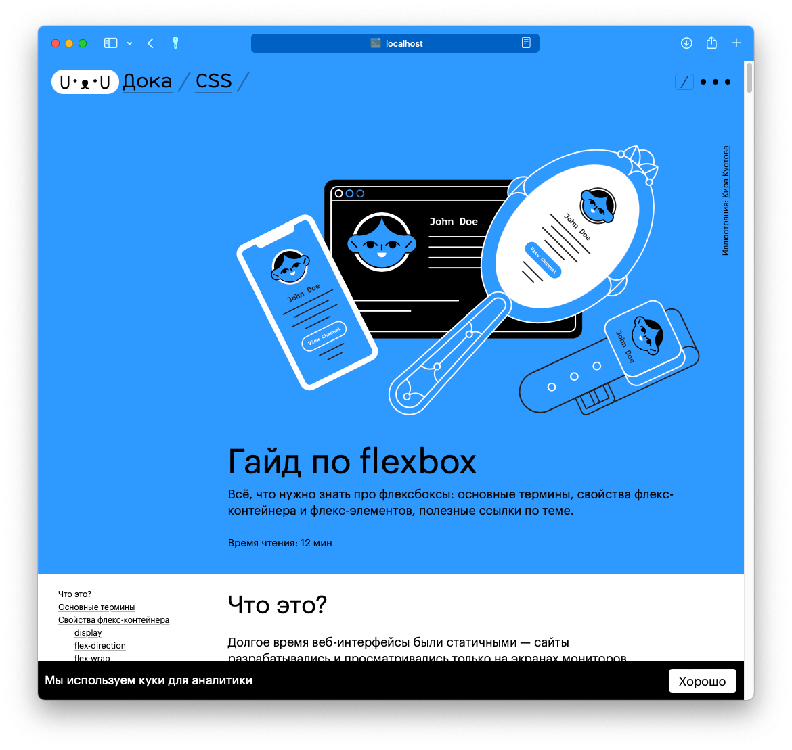

# Помощь проекту

## Чем вы можете помочь

### Реальные задачи

Загляните в [раздел Issues](https://github.com/doka-guide/content/issues) нашего репозитория, чтобы ознакомиться со списком актуальных задач. Мы будем рады, если вы поможете закрыть задачи с метками «[хороший старт](https://github.com/doka-guide/content/issues?q=is%3Aissue+is%3Aopen+label%3A%22хороший+старт%22)» — с ними можно справиться, даже если вы только начинаете.

Также мы будем постепенно выкладывать задачи посложнее, связанные с допиливанием сайта Доки. Дизайн и описание фичи — всё, как во взрослых опенсорсных проектах.

### Сообщество

Если вы уже трудитесь в разработке и хотите присоединиться к команде авторов, напишите нам на [hi@doka.guide](mailto:hi@doka.guide), мы всегда рады обсудить новые идеи, познакомиться и подумать, как сделать самую бодрую Доку в интернете.

### Обратная связь

В каждой статье у нас есть форма обратной связи, которая помогает нам делать Доку лучше. Если вы прочитали статью, и она вам понравилась, смело жмите «лайк». Это не Инстаграм и не Юра Дудь, мы не будем спамить в ваши соцсети — вся обратная связь отправится только во внутреннюю форму фидбека для команды.

Если вы считаете тему нераскрытой или вам не понравился текст, жмите «дизлайк» и напишите в форме, чего вам не хватило. Команда авторов будет регулярно просматривать фидбек — это ляжет в основу нашей работы в следующем году. Мы делаем Доку для вас, поэтому давайте улучшать её вместе!

## Как мы пишем статьи

### Команда

Авторы Доки работают в командах по вёрстке (HTML и CSS), и JavaScript (плюс инструменты). У каждой команды есть свой тимлид, который организует работу и составляет план статей.

### Флоу

Автор выбирает статью из списка задач, пишет текст, создаёт примеры кода, после чего статья отдаётся тимлиду, который её проверяет.
Другие авторы могут заглянуть в статью и дополнить раздел «В работе» — поделиться опытом о том, как эта штука используется в реальной жизни.

Чтобы добавить или изменить материал, следуйте процессу:

1. Создайте форк от репозитория и клонируйте его себе на компьютер.
1. Создайте новую ветку от `main`. Назовите ветку по правилам:
  - новая статья — `part/название-статьи`, где _part_ — это раздел (css, html, js или tools);
  - доработки — `update/название-статьи`;
  - редакторские правки — `edit/название-статьи`;
  - исправления — `fix/название-бага`;
  - новая фича — `feature/название-фичи`.
1. Внесите изменения. Описание коммита делаем на русском языке в формате «Добавляет что-то».
1. Запушьте ветку.
1. Создайте пул-реквест. Его название и/или описание должны быть понятными. Дождитесь проверки и внесите исправления, если они потребуются по итогам ревью.


### Дизайн

Если статья принята, она направляется команде дизайнеров, которые готовят иллюстрации, схемы и оформление для примеров кода. Параллельно с этим статья публикуется на GitHub и впоследствии проверяется редактором.

## Как работает Дока

Это мощный раздел, до конца дойдут не многие, но после — гарантируем вам базовое понимание того, на чём сделана Дока, и возможность действовать.

Дока состоит из двух репозиториев:

1. Контент, в котором вы находитесь сейчас.
1. [Платформа](https://github.com/doka-guide/platform), который собирает сайт на базе [Eleventy](https://www.11ty.dev/).

Контент Доки — это текстовые файлы в маркдауне и картинки. Если вы хотите сделать быструю правку, то можно сделать это прямо на GitHub — он поможет вам предложить их в пул-реквесте. Если вы пишете новую статью или делаете обширные правки, то лучше форкните репозиторий, склонируйте его себе локально и откройте в любимом редакторе кода.

Если вы хотите посмотреть, как ваша статья или правки выглядят и собираются в полноценный сайт, то вам [поможет инструкция](https://github.com/doka-guide/content/blob/main/docs/preview.md). Спойлер: вам потребуется Docker.

Если вы хотите посмотреть всю Доку локально без Docker, [в инструкции](https://github.com/doka-guide/platform/blob/main/docs/how-to-run.md) рассказано, как запустить платформу с симлинками.

### Где что лежит

У каждой статьи есть своя папка с подпапками для картинок, демок, видео, аудио и практик (блок «В работе»).

В контентном репозитории мы пишем относительные пути. Например, так выглядит ссылка на демку из блока «В работе», которая лежит на уровень выше:

```markdown
<iframe title="Блок с рваным краем, но без пробела" src="../demos/shadow/" sandbox></iframe>
```

Каждый тип контента кладётся в свою папку. Если вам нужна папка с видео, которой ещё нет, создайте её.

### Из чего состоит статья

Разберём это на примере гайда по flexbox.

```markdown
---
title: "Гайд по flexbox"
<!-- Описание для соцсетей и поисковиков, не больше 200 символов -->
description: "Всё, что нужно знать, чтобы верстать флексбоксами как боженька"
cover:
  <!-- адрес широкой картинки для десктопной обложки -->
  desktop: images/covers/desktop.svg
  <!-- адрес узкой картинки для мобильной обложки -->
  mobile: images/covers/mobile.svg
  <!-- альтернативное описание для обложки -->
  alt: 'Умная собака подозрительно смотрит'
<!-- ники авторов основного текста -->
authors:
  - solarrust
<!-- ники всех соавторов и тех, кто работал над текстом (дописали «В работе»? Переписали блок? Вам сюда) -->
contributors:
  - furtivite
  - skorobaeus
<!-- отмечаем, кто из редакторов уже прочитал, если вы видите такую отметку, добавьте редактора в новый PR -->
editors:
  - tachisis
<!-- ключевые слова для SEO -->
keywords:
  - флексбокс
  - flexbox
tags:
  <!-- тип материала: article или doka -->
  - article
---

<!-- далее обычная статья в markdown -->

## Что это?

Долгое время веб существовал в статичном виде. Сайты разрабатывались и просматривались только на экранах мониторов стационарных компьютеров. В масштабах истории совсем недавно у нас появилось огромное разнообразие различных экранов — от мобильных телефонов, до телевизоров — на которых мы можем взаимодействовать с сайтами. Отсюда появилась необходимость в гибких системах раскладки.

Идея флексбоксов появилась ещё в 2009 году и по сей день этот стандарт развивается и прорабатывается. Основная идея флексов — гибкое распределение места между элементами, гибкая расстановка, выравнивание, гибкое управление. Ключевое слово **гибкое**, что и отражено в названии (_flex — англ. гибко_).
```

Какого-то из полей в шапке может не хватать, потому что оно пока не используется. Если поле пустое: мы его не пишем, если нужно добавить новое, добавляем.

- [Посмотрите пример доки](./examples/doka.md)
- [Посмотрите пример статьи](./examples/article.md)

#### Как пользоваться полями

Используйте поля только там, где это необходимо. Если вам нечем заполнить поле — удалите его, не оставляйте его пустым.

#### Обложки

К статье можно добавить обложку (хиро-картинку), которая предваряет контент:



Если вы хотите добавить обложку, позовите [кого-нибудь из мейнтейнеров](https://github.com/doka-guide/content/blob/main/CODEOWNERS), мы закажем картинку у дизайнера. Картинки должны быть в формате SVG и с прозрачным фоном. Они размещаются в директории `images/covers` и называются: desktop.svg или mobile.svg.

Перед добавлением SVG-обложки в статью мы уменьшаем её вес вручную при помощи сервиса [SVGOMG](https://jakearchibald.github.io/svgomg/).

#### Подписи авторов

Также в статье используется ссылка на авторов раздела «В работе» и подписи статьи:

Создайте папку _practice_, если её ещё нет, и положите туда файл с вашим ником на гитхабе. Например _solarrust.md_.

Чтобы читатели могли узнать больше о наших авторах, мы храним их описания в папке _people_. Создайте собственную директорию и расскажите о себе, [читайте подробнее в документации](people.md).

#### Интерактивные примеры кода

В статьях мы используем интерактивные примеры, они встраиваются через `<iframe>`. Например:

```markdown
<iframe title="Блок с рваным краем, но без пробела" src="../demos/shadow/" sandbox></iframe>
```

Встроенные в страницу демки позволяют плавнее вести повествование и демонстрировать концепции.

Визуально такие демки — интерактивная часть в стандартной вёрстке, не выделенная явно. Это главное отличие инлайновых демок от интеграций с CodePen.

Подробнее про демки читайте [в отдельном документе](demos.md).
