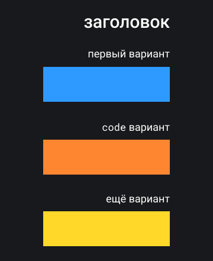

# Руководство по стилю демок

Демки добавляются в Доку, когда нужно что-то обьяснить на практическом примере. Как правило, получается HTML-страничка с минимумом необходимых элементов и встроенными браузерными стилями. Со временем демки преобразуются и в них появляется дизайн, поддерживающий дизайн платформы, схем и иллюстраций.

Если вам интересно самостоятельно создавать демки сразу в дизайне Доки, это руководство для вас.

Если вы хотите сначала разобраться, как создать демку, вам поможет это [руководство](https://github.com/doka-guide/content/blob/main/docs/demos.md).

## Содержание

- [Шаблон](#шаблон)
- [С чего начать](#с-чего-начать)
- [Цвета](#цвета)
- [Текст и типографика](#текст-и-типографика)
- [Списки](#списки)
- [Текстовые демо](#текстовые-демо)
- [Элементы форм](#элементы-форм)
- [Текст с элементами управления](#текст-с-элементами-управления)
- [Показать несколько вариантов](#показать-несколько-вариантов)
- [Всплывающие элементы](#всплывающие-элементы)
- [Разделы страницы](#разделы-страницы)
- [Акценты](#акценты)

## Шаблон

Люблю, когда под рукой есть готовый шаблон. Вот:

```html
<!DOCTYPE html>
<html lang="ru">
<head>
  <title>Название демо — Title статьи — Дока</title>
  <meta charset="utf-8">
  <meta name="viewport" content="width=device-width, initial-scale=1">
  <link rel="preconnect" href="https://fonts.googleapis.com">
  <link rel="preconnect" href="https://fonts.gstatic.com" crossorigin>
  <link rel="stylesheet" href="https://fonts.googleapis.com/css2?family=Roboto:wght@400;500&display=swap">
  <style>
    *, *::before, *::after {
      margin: 0;
      padding: 0;
      box-sizing: border-box;
    }

    body {
      min-height: 100vh;
      padding: 50px;
      display: flex;
      align-items: center;
      justify-content: center;
      background-color: #18191c;
      color: #FFFFFF;
      font-family: "Roboto", sans-serif;
    }

    @media (max-width: 768px) {
      body {
        padding: 30px;
      }
    }
  </style>
</head>
<body>
  <div class="container">

  </div>
</body>
</html>
```

А теперь подробнее :)

## С чего начать

Демо, как и схемы, выполняются в тёмной теме. Это решение визуально выделяет их в светлой теме, и не режет глаза в теме тёмной.


Задайте тёмно-серый цвет фона для `<body>` и белый цвет для текста и начало положено:

```css
*, *::before, *::after {
  margin: 0;
  padding: 0;
  box-sizing: border-box;
}

body {
  padding: 50px;
  background-color: #18191c;
  color: #FFFFFF;
}
```

### Центр внимания

Каждую демку можно открыть в новой вкладке браузера, нажав на соответствующую ссылку под демкой. Чтобы контент не ютился в левом верхнем углу, выровняйте его по центру страницы любым удобным способом, например, при помощи флексов:

```css
body {
  min-height: 100vh;
  padding: 50px;
  display: flex;
  align-items: center;
  justify-content: center;
}
```

### Что делать с мобильными?

У Доки щедрый дизайн, который хорошо выглядит на десктопе. У демок — тоже, поэтому они верстаются в подходе Desktop first. При необходимости стили для мобильных задаются отдельно с использованием того же брейкпоинта, что и на самом сайте: `max-width: 768px`.

Стили для мобильных будут приводиться внизу.

```css
@media (max-width: 768px) {
  body {
    padding: 30px;
  }
}
```

## Цвета

Цвет фона тёмно-серый: `#18191C`. Цвет текста белый: `#FFFFFF`.

### Цвета разделов

У каждого раздела Дока есть свой фирменный цвет: у HTML — оранжевый, у CSS — голубой, у JS — жёлтый, у Инструментов — зелёный, у Рецептов — фиолетовый. В этот цвет окрашиваются шапки статей, а также карточки и ссылки на главной.


Если в демо нужно покрасить элемент, используйте основной цвет раздела, к которому относится статья. Если окрашенных элементов много и нужно некоторые из них выделить визуально — подключите вспомогательный цвет.

HTML: Основной `#FF8630`, вспомогательный `#2E9AFF`.

CSS: Основной `#2E9AFF`, вспомогательный `#F498AD`.

JS: Основной `#FFD829`, вспомогательный `#41E847`.

Инструменты: Основной `#41E847`, вспомогательный `#FF8630`.

Рецепты: Основной `#C56FFF`, вспомогательный `#41E847`.

## Текст и типографика

### Пишите по-русски

Дока — добрый справочник на русском языке. Добавляя текст в демо, пожалуйста, пишите по-русски и избегайте откровенной "рыбы". Часто нужен просто массив текста, смысл которого не важен; можно в этом случае использовать цитаты из [классики](https://kartaslov.ru/%D1%86%D0%B8%D1%82%D0%B0%D1%82%D1%8B-%D0%B8%D0%B7-%D1%80%D1%83%D1%81%D1%81%D0%BA%D0%BE%D0%B9-%D0%BA%D0%BB%D0%B0%D1%81%D1%81%D0%B8%D0%BA%D0%B8/%D1%81%D0%BE-%D1%81%D0%BB%D0%BE%D0%B2%D0%BE%D0%BC/%D0%BA%D0%BB%D0%B0%D1%81%D1%81%D0%B8%D0%BA%D0%B0) — это лампово и не вызывает проблем с правами на текст.

### Стили текста

В демках используется шрифт Roboto, он подключается с сервиса Google Fonts. Помимо нормального начертания (400), используются также начертания: 300 — для полей ввода и кнопок, 500 — для заголовков. Если в демо есть такие элементы, начертания 300 и 500 нужно подключить отдельно.

```HTML
<link rel="preconnect" href="https://fonts.googleapis.com">
<link rel="preconnect" href="https://fonts.gstatic.com" crossorigin>
<link rel="stylesheet" href="https://fonts.googleapis.com/css2?family=Roboto:wght@300;400;500&display=swap">
```

```css
body {
  font-family: "Roboto", sans-serif;
}
```

Вот размеры шрифта и отступов для заголовков разных уровней и параграфов:

```css
body {
  font-size: 16px;
}

p {
  margin: 7px 0;
  font-size: 1rem;
  line-height: 1.4;
}

h1 {
  margin-bottom: 17px;
  font-weight: 500;
  font-size: 1.625rem;
}

h2 {
  margin-top: 40px;
  margin-bottom: 17px;
  font-weight: 500;
  font-size: 1.375rem;
}

h3 {
  margin-top: 40px;
  margin-bottom: 17px;
  font-weight: 500;
  font-size: 1.25rem;
}

h4 {
  margin-top: 40px;
  margin-bottom: 17px;
  font-weight: 500;
  font-size: 1.125rem;
}

h5 {
  margin-top: 40px;
  margin-bottom: 17px;
  font-weight: 500;
  font-size: 1.0625rem;
}

h6 {
  margin-top: 40px;
  margin-bottom: 17px;
  font-weight: 500;
  font-size: 1rem;
}
/* в демо редко бывает больше одного уровня заголовков,
   поэтому я дублирую свойства для удобства копирования */
```

Бывают демки, которые состоят только из небольшого параграфа размером в 2-4 строки. Чтобы такое демо не выглядело сиротливо, можно пропорционально увеличить размер текста на всей странице:

```css
body {
  font-size: 18px;
}
```

### Стили исходного кода

Если в демо нужно вставить код (указать название тега или свойства, привести выполняемую функцию), то подключаем моноширинный шрифт Roboto Mono.

```html
<link rel="preconnect" href="https://fonts.googleapis.com">
<link rel="preconnect" href="https://fonts.gstatic.com" crossorigin>
<link rel="stylesheet" href="https://fonts.googleapis.com/css2?family=Roboto+Mono:wght@400;500&display=swap">
```

```css
code {
  font-family: "Roboto Mono", monospace;
  font-size: calc(1em - 1px);
}
```

Когда Roboto и Roboto Mono соседствуют в тексте, при одинаковом значении свойства `font-size` Roboto Mono выглядит крупнее. Поэтому размер шрифта уменьшен на 1 пиксель.

### Инлайновые элементы

Если нужно визуально выделить несколько слов в тексте, а курсивное и полужирное начертания исчерпали свои семантические возможности, можно использовать выделение основным цветом раздела (`mainColor`):

```css
span {
  border-radius: 3px;
  background-color: mainColor;
}
```


Скругление краёв декоративное и используется для поддержания общего стиля.

Такая же заливка фона используется как ховер-эффект для ссылок. В дефолтном состоянии ссылки отличаются цветным жирным подчёркиванием:

```css
a {
  border-radius: 3px;
  color: inherit;
  -webkit-text-decoration-color: mainColor;
  text-decoration-color: mainColor;
  text-decoration-thickness: 2px;
  transition: background-color 0.2s linear;
}

a:hover, a:focus {
  background-color: mainColor;
  transition: background-color 0.2s linear;
  outline-width: 0;
}
```


## Списки

### Навигация

Ссылки в списке, представляющем собой навигацию, оформляются так же, как инлайновые ссылки в предыдущем разделе.

Будьте стильными, придумайте для списка название и подпишите его:

```html
<ul>
  <li><a href="#">навигация</a></li>
  <li><a href="#">по сайту</a></li>
  <li><a href="#">в виде списка, например</a></li>
</ul>
```

```css
ul {
  position: relative;
  list-style-type: none;
  font-size: 24px;
}

ul::before {
  content: 'меню';
  position: absolute;
  right: calc(100% + 25px); /* размещаем у левого края + отступ 25 пикселей */
  top: 7px;
  padding: 2px 7px;
  background-color: mainColor;
  color: #000000;
  font-size: 14px;
}
```


### Нумерованные и маркированные списки

Когда список является частью литературного текста, гораздо важнее соблюсти семантику, чем придать списку нарядный вид.

Нумерованные списки используются, когда важен порядок элементов; в таком списке каждый пункт начинается с большой буквы и заканчивается точкой. Маркированные списки используются, когда порядок не важен; каждый пункт списка начинается с маленькой буквы и оканчивается точкой с запятой. Последний пункт завершается точкой.

Свои стили для маркеров у нас, конечно, тоже есть:

```css
ul {
  list-style-type: none;
}

li {
  position: relative;
  padding-left: 25px;
  text-transform: lowercase;
}

li::before {
  content: "";
  position: absolute;
  top: 5px;
  left: 0;
  width: 14px;
  height: 14px;
}

li::after {
  content: ";";
}

li:last-of-type::after {
  content: ".";
}
```

И стили для нумерации тоже:

```css
ol {
  list-style-type: none;
  counter-reset: num;
}

li {
  position: relative;
  padding-left: 10px;
  counter-increment: num;
}

li::before {
  content: counter(num);
  position: absolute;
  top: 3px;
  right: 100%;
  width: 14px;
  height: 14px;
  padding: 2px 5px;
  font-size: 14px;
  line-height: 1;
  color: #000000;
}

li::after {
  content: ".";
}
```


## Текстовые демо

Если в демо нет совсем ничего, кроме текста, поместите его в блок со щедрыми полями и фоновым цветом. Так из плавающих в чёрном кофе букв получится карточка :)

```css
div {
  width: 65%;
  padding: 55px 40px;
  background-color: #2E9AFF;
}

@media (max-width: 768px) {
  div {
    width: 100%;
    padding: 55px 30px;
  }
}
```


Если в демо не только нет ничего, кроме текста, но ещё и текста этого всего одна строчка (или одно слово), то смело увеличивайте размер шрифта до 24px.

```css
div {
  font-size: 24px;
}
```


### Не текст, а код

Если нужно оформить не параграф текста, а блок исходного кода, такой блок оформляется нижней рамкой:

```css
code {
  border-bottom: 1px solid #979797;
  padding: 15px 0;
}
```


## Элементы форм

### Кнопки

Кнопки окрашиваются в основной цвет раздела, имеют ховер- и фокус-эффекты.

```html
<button class="button button-blue">Скорее нажать!</button>
```

```css
.button {
  display: block;
  min-width: 210px;
  border: 2px solid transparent;
  border-radius: 6px;
  padding: 9px 15px;
  color: #000000;
  font-size: 18px;
  font-weight: 300;
  font-family: inherit;
  transition: background-color 0.2s linear;
}

.button:hover {
  background-color: #FFFFFF;
  cursor: pointer;
  transition: background-color 0.2s linear;
}

.button:focus-visible {
  border: 2px solid #ffffff;
  outline: none;
}

.button:focus {
  border: 2px solid #ffffff;
  outline: none;
}
```

Цвет для кнопки задаётся отдельным классом:

```css
.button-orange {
  background-color: #FF8630;
}

.button-blue {
  background-color: #2E9AFF;
}

.button-yellow {
  background-color: #FFD829;
}

.button-green {
  background-color: #41E847;
}

.button-pink {
  background-color: #F498AD;
}
```


### Поля ввода

Однострочные и многострочные поля ввода оформляются в одном стиле:

```css
input {
  width: 300px;
  border: 1px solid #ffffff;
  border-radius: 6px;
  padding: 10px 15px;
  background-color: transparent;
  color: #ffffff;
  font-size: 18px;
  font-weight: 300;
  font-family: inherit;
  -webkit-appearance: none;
  appearance: none;
}

input:focus {
  border-color: mainColor;
  outline: none;
}

textarea {
  min-width: 300px;
  max-width: 300px;
  min-height: 100px;
  max-height: 300px;
  border: 1px solid #ffffff;
  border-radius: 6px;
  padding: 10px 15px;
  background-color: transparent;
  color: #ffffff;
  font-size: 18px;
  font-weight: 300;
  font-family: inherit;
}

textarea:focus {
  border-color: mainColor;
  outline: none;
}
```


Размер шрифта у кнопок и полей ввода постоянный — 18px.

### Чекбоксы и радиокнопки

Радиокнопки круглые и чёрно-белые:

```html
<label class="radio-label">
  <input class="radio" name="additional" type="radio">
  <span class="radio-title">Корица</span>
</label>
```

```css
.radio-label {
  position: relative;
  display: flex;
  align-items: center;
  cursor: pointer;
}

.radio-title::before {
  content: "";
  position: absolute;
  left: 0;
  top: calc(50% - 12px);
  width: 25px;
  height: 25px;
  border: 1px solid #FFFFFF;
  border-radius: 50%;
}

.radio {
  width: 25px;
  height: 25px;
  opacity: 0;
  margin-right: 15px;
}

.radio:checked + .radio-title::before {
  background-color: #FFFFFF;
  background: radial-gradient(
    circle,
    #FFFFFF 0%,
    #FFFFFF 40%,
    transparent 50%,
    transparent 100%
  );
}
```


Чекбоксы квадратные и цветные:

```html
<label class="checkbox-label">
  <input class="checkbox" name="must-have" type="checkbox">
  <span class="checkbox-title">Турка</span>
</label>
```

```css
.checkbox-label {
  position: relative;
  display: flex;
  align-items: center;
  cursor: pointer;
}

.checkbox {
  width: 24px;
  height: 24px;
  opacity: 0;
  margin-right: 15px;
}

.checkbox + .checkbox-title::before {
  content: '';
  position: absolute;
  left: 0;
  top: calc(50% - 12px);
  width: 24px;
  height: 24px;
  border: 1px solid #FFFFFF;
  border-radius: 6px;
}

.checkbox:checked + .checkbox-title::after {
  content: '';
  position: absolute;
  left: 5px;
  top: calc(50% - 7px);
  width: 14px;
  height: 14px;
  border-radius: 3px;
  background-color: mainColor;
}
```


### Форма в сборе

В десктопе демо — сущность горизонтальная, поэтому подписи для полей размещаются сбоку.

```html
<form>
  <div class="form-row">
    <label class="row-label" for="city">Этот город:</label>
    <input class="input" type="text" id="city" placeholder="Например, Москва">
  </div>
  <div class="form-row">
    <span class="row-label">Лучший город на Земле?</span>
    <div class="container">
      <label class="radio-label">
        <input class="radio" type="radio" name="best" value="true">
        <span class="radio-title">Да</span>
      </label>
      <label class="radio-label">
        <input class="radio" type="radio" name="best" value="false">
        <span class="radio-title">Нет</span>
      </label>
    </div>
  </div>
  <div class="form-row">
    <span class="row-label">Нарисован мелом на стене?</span>
    <div class="container">
      <label class="checkbox-label">
        <input class="checkbox" name="chalk" type="checkbox">
        <span class="checkbox-title"></span>
      </label>
    </div>
  </div>
  <div class="form-row">
    <button class="button button-blue">Спеть</button>
  </div>
</form>
```

```css
.form-row {
  display: flex;
  align-items: center;
  justify-content: space-between;
}

.form-row + .form-row {
  margin-top: 25px;
}

.row-label {
  margin-right: 55px;
  font-size: 24px;
  font-weight: 500;
  line-height: 1;
}

.input, .container, .button {
  width: 350px; /* одинаковая ширина для элементов в правой части */
}
```


В мобильной версии, для компактности, подписи и элементы идут друг под другом:

```css
@media (max-width: 768px) {
  .form-row {
    display: block;
  }

  .row-label {
    margin-right: 0;
    margin-bottom: 10px;
  }

  .input, .container, .button {
    width: 100%;
  }
}
```


## Текст с элементами управления

Если нужно продемонстрировать что-то на примере текстового блока и прокомментировать это, комментарий разместите на тёмном фоне над или под текстовым блоком.

Если нужно добавить какие-то элементы управления, например кнопки, то, чтобы в глазах не пестрило, для текстового блока предусмотрена серая неконтрастная гамма. Так внимание будет отдано контролам.

```html
div {
  background-color: #282A2E;
  color: #E6E6E6;
}
```


### Скроллящийся текст

Если нужен массив текста, но нет желания растягивать демо до безумия, ограничьте высоту текстового блока и включите скролл. Стилизовать скролл не нужно.

```css
div {
  height: 350px;
  overflow-y: scroll;
  background-color: #282A2E;
  color: #E6E6E6;
}
```

## Показать несколько вариантов

Чтобы не растягивать демо по высоте больше, чем необходимо, демки, где нужно продемонстрировать несколько вариантов — например, разные значения одного CSS-свойства — опции и подписи к ним мы размещаем бок о бок. Заголовок сдвинут вровень с подписями вариантов ради эстетики :)

```html
<div class="container">
  <h1><code>font-style</code></h1>
  <div class="option-container">
    <span class="option-title"><code>normal</code></span>
    <span class="option">Ничего на свете лучше нету</span>
  </div>
  <div class="option-container">
    <span class="option-title"><code>italic</code></span>
    <span class="option">Чем бродить друзьям по белу свету</span>
  </div>
  <div class="option-container">
    <span class="option-title"><code>oblique</code></span>
    <span class="option">Тем, кто дружен, не страшны тревоги</span>
  </div>
</div>
```

```css
h1 {
  font-size: 30px;
  font-weight: 500;
  line-height: 1;
}

h1, .option-title {
  width: 260px;
  text-align: right;
  text-transform: lowercase;
}

.option-title {
  margin-right: 50px;
  font-size: 18px;
}

.option-container {
  display: flex;
  align-items: flex-end;
  margin-top: 30px;
}
```


Но на мобильных нам ничего не остаётся, кроме как размещать элементы друг под другом:

```css
@media (max-width: 768px) {
  .option-title {
    margin-right: 0;
    margin-bottom: 10px;
  }
  .option-container {
    flex-direction: column;
  }
}
```



## Всплывающие элементы

Всплывающие элементы отличаются строгой черно-белой гаммой и вытянутой геометрией (добавьте большие отступы на бóльшую сторону).

```html
<p>Ваш рейтинг: <span>212</span></p>
```

```css
span {
  position: relative;
}

span::after {
  content: "Вычисляется на основе активности";
  position: absolute;
  padding: 10px 40px;
  background-color: #FFFFFF;
  color: #000000;
  font-size: calc(1rem - 2px); /* на 2px меньше, чем основной шрифт демо */
  text-align: left;
  opacity: 0;
  visibility: hidden;
  transition: opacity 0.2s, visibility 0.2s;
}

span:hover::after {
  opacity: 1;
  visibility: visible;
}
```


Если во всплывающем окне есть элементы, которые обычно цветные (подчеркивания для ссылок, кнопки), здесь они лишены цвета:

```css
a {
  border-radius: 3px;
  color: #ffffff;
  -webkit-text-decoration-color: #000000;
  text-decoration-color: #000000;
  text-decoration-thickness: 2px;
  transition: background-color 0.2s linear;
}

a:hover, a:focus {
  background-color: #000000;
  transition: background-color 0.2s linear;
  outline-width: 0;
}

.button:focus-visible {
  border: 2px solid mainColor;
  outline: none;
}

.button:focus {
  border: 2px solid mainColor;
  outline: none;
}

.button-black {
  background-color: #000000;
}
```


## Разделы страницы

Если нужно добавить в демо элементы, по смыслу похожие на хэдер, навигацию или футер, такие элементы от визуально отделяются нижним или верхним бордером и курсивом.

```css
header {
  border-bottom: 2px solid mainColor;
  padding-bottom: 10px;
  font-size: 14px; /* на 2px меньше, чем основной шрифт демо */
  font-style: italic;
}
```

Если такой элемент содержит ссылки — например, вы верстаете навигацию — то подчеркиваний у них не будет. Слишком много черточек это нехорошо.

```css
footer {
  border-top: 2px solid mainColor;
  padding-top: 10px;
  font-size: 14px; /* на 2px меньше, чем основной шрифт демо */
  font-style: italic;
}

a {
  color: mainColor;
  text-decoration: none;
}
```


## Акценты

Если вы сверстали демо и оно выглядит невероятно скучно, попробуйте увеличить ключевой элемент в несколько раз.

```css
.accent {
  font-size: 100px;
  font-weight: 500;
}
```


