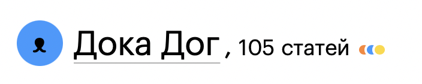

# Наши люди

Мы ценим вклад каждого, кто помогает нам создавать Доку. Чтобы читатели могли узнать больше о наших авторах, мы храним их описания в папке _people_. Благодаря этому они появляются на [сайте](https://doka.guide/people/) Доки.

## Зачем нужно

Когда делаете вклад в Доку, вы добавляете свой ник на Гитхабе в одно из полей в мете статьи (читайте подробнее [в руководстве для контрибьюторов](contributing.md#из-чего-состоит-статья)).

Каждый контрибьютор в своём личном файле может рассказать о себе, оставить ссылку на свой проект и написать имя, которое отобразится в подписи. Так у каждой статьи будет отображаться автор, контрибьюторы и редакторы.

## Как сделать

1. Создайте в директории _people_ папку. Её название должно совпадать с никнеймом, который указан в качестве подписи в статье или доке (рекомендуется использовать ваш ник на Гитхабе в нижнем регистре).
1. Положите в неё файл _index.md_ со следующим содержанием:

    ```markdown
    ---
    name: 'NAME'
    url: URL
    photo: photo.jpg
    photoAlt: 'Описание вашей фотографии'
    ---

    Краткий рассказ о вас
    ```

    Где `NAME` это ваше имя или ник, а `URL` ссылка на ваш сайт или профиль в социальной сети.

    | ⚠️ Мы просим ответственно отнестись к выбору ссылок для профиля. Наш проект должен оставаться доступным для читателей из всех стран и регионов, поэтому мы не размещаем ссылки на ресурсы, которые в этих странах и регионах признаны нежелательными или запрещены на законодательном уровне.|
    | --- |

1. Можете добавить в эту же папку фотографию или картинку-аватар. Имя файла укажите в поле `photo`. Если хотите, можете описать себя на аватаре в поле `photoAlt`. Так пользователи скринридеров узнают, как вы выглядите.

    Аватар по умолчанию — малый логотип Доки, который красится в цвет одного из разделов Доки. Он отображается, если нет файла с изображением или в мете отсутствует тег `photo`.

    

## Про наименование папок

Мы просим указывать название папок в `/people/` строчными буквами. Это связано с тем, что наш сервер работает на операционной системе, чувствительной к регистру символов, а так же с тем, что у Доки есть пользователи с Linux или macOS.

Мы рекомендуем использовать ваш ник в Гитхабе в качестве названия папки. Тогда в вашей карточке будет отображена информация о количестве ваших пулреквестов и ишью.

Поэтому, например, если бы на Гитхабе вы использовали ник Doka-Dog, то назвали бы свою папку:

```
/people/doka-dog/index.md
```

Придерживайтесь этого наименования [в мете статей](contributing.md#из-чего-состоит-статья) и [в названиях папок в ответах рубрики «На собеседовании»](interviews.md#как-написать-ответ).

### Что делать, если нужно переименовать папку?

Если нужно переименовать папку и единственное, что будет отличаться — это регистр символов, то:

1. Переименуйте папку в промежуточное название из `DokaDog` в `dokadog1`. Сделайте коммит с изменением.
1. Переименуйте папку в финальное название из `dokadog1` в `dokadog`. Сделайте коммит с изменением.

Теперь изменения применены и всё соберётся правильно.

Также существует способ не требующий создания отдельного коммита — он описан в [совете к статье про Git CLI](/tools/git-cli#e-kucheriavyi-sovetuet).

Спасибо за ваш вклад!
