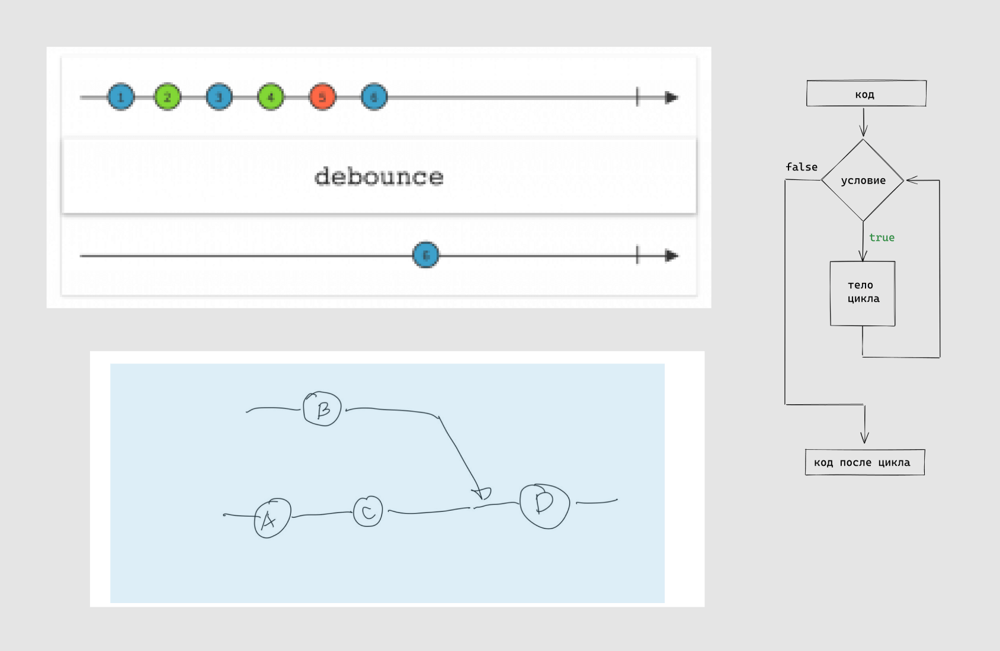
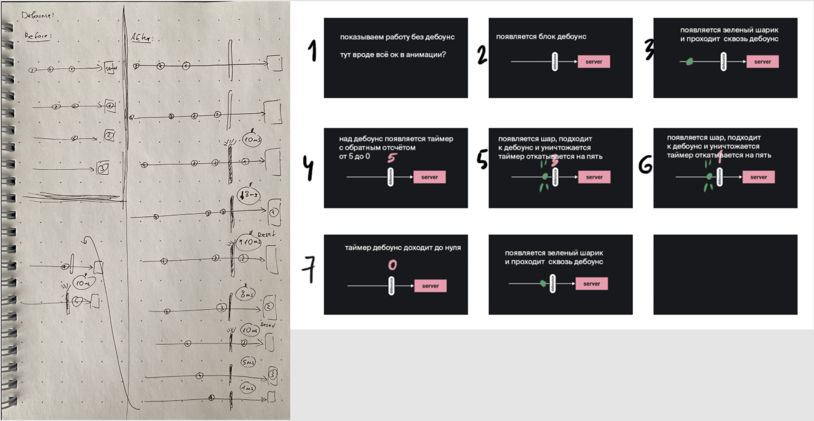
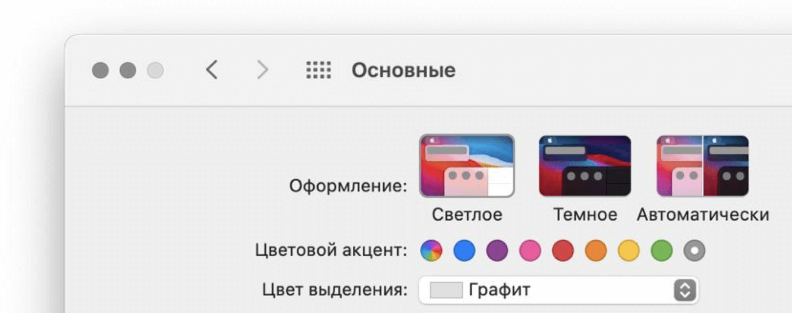
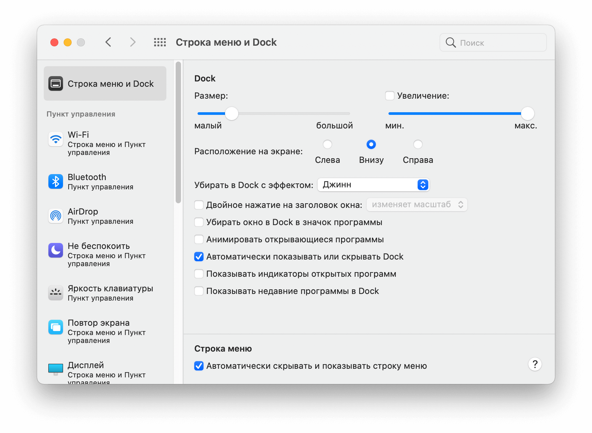
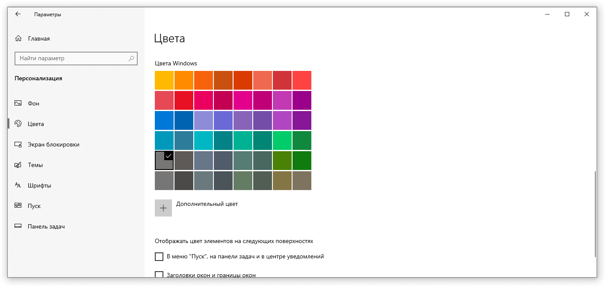
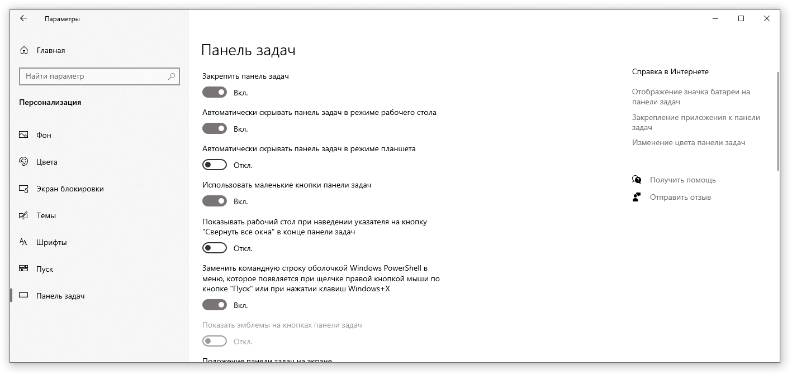

# Как добавить картинку в текст

В статьях есть два типа иллюстраций: обложка и контентная графика.

1. **Обложка** — интересная метафора по мотивам текста. Её делает иллюстратор и вы можете предложить метафору или шутку, которая поможет её нарисовать. Опишите ваши идеи в пул-реквесте. Если в статье есть нюансы, важно рассказать о них, чтобы иллюстрация получилась актуальной и в ней не было фактических ошибок.
2. **Графика** — любые иллюстрации к статье: скриншот, схема, анимация процесса. Лучше всего сделать картинку самостоятельно, а не просто взять из интернета, чтобы не было сложностей с правами.

## Подготовка вводных для инфографики

Если в статье нужна статичная картинка, то приложите скетч с тем, что нужно изобразить. Скетч может быть от руки, картинка из интернета и т.п. Плюс, если чувствуете необходимость, напишите словами.

Пожалуйста, воспользуйтесь сервисом для уменьшения веса картинки, например [tinypng](https://tinypng.com/). Примеры скетчей:

Если в статье нужна анимированная инфографика, то приложите раскадровку (идеальный вариант). Или покажите референс, или опишите процесс по шагам словами. Например:

## Запись скринкастов, скриншотов, любая демонстрация интерфейса

- Пользуйтесь оформлением системы по-умолчанию (светлая тема, системные шрифты).
- Убирайте цветные элементы интерфейса. Так интерфейс привлекает к себе меньше внимания. Только монохром (оттенки серого).
- Делайте скриншот хорошего качества, включите сглаживание шрифтов. Ширина не меньше 600px.
- Текст на скриншоте должен быть читабельным без увеличения.
- По возможности скриншот содержит только значимые зоны интерфейса. Делайте скриншоты выделенной области.
- Не отрезайте части элементов по краям скриншота.
- Если снимаете полный скриншот браузера, проверьте, нет ли там во вкладках лишнего (интернет магазинов, вики и т.п.) Идеально, если открыта только нужная вкладка.
- Убирайте со скриншотов элементы операционной системы (батарейка, часы, панель программ и т.п.)
- Постарайтесь делать скриншоты одинаковой ширины и высоты в рамках одной статьи, когда делаете скриншот выделенной области.
- Сохраняйте скриншоты в png (так меньше потери в качестве).

**Перс данные в скриншотах**

- Основное правильно — в скриншотах не должно быть никаких реальных персональных данных.
- Личными данными считаются любые данные, по которым вас можно найти: имя, фамилия, логин, ник, 7 цифр номера телефона.
- Личные данные на всех скриншотах закрываются черной плашкой. (Не делайте размытия, смазывания, пикселизацию и прочее). На каждое слово кладется собственная черная плашка.
- Если личные данные придуманы специально для этого примера, то можно их не закрывать.
- Убирайте личные аватарки автора. На аватарке должен быть логотип Дока. Вот файл лого для использования в аватарках.

[Логотип](images/pictures/3.png)

**Скриншоты с пояснениями**

Если на скриншоте нужны поясняющие стрелочки, то приложите скриншот с вашими стрелочками и чистый скриншот (чтобы дизайнер мог сделать стрелки в стиле Доки по вашему референсу).

## Настройке ОС под скриншоты

### macOS

Убрать цвет элементов интерфейса

Убрать панели

Для создания скриншотов стоит пользоваться системными сочетаниями клавиш <kbd>Cmd Shift 4</kbd>.

Для создания видео [OBS](https://obsproject.com) или QuickTime.

### Windows

Зайдите в Панель управления > Персонализация

- Тема: Windows
- Рабочий стол: по-умолчанию
- Шрифты > Настройка текста ClearType: Включено
- Цвета: Серый

Панель задач:

- Автоматически скрывать панель задач в режиме рабочего стола: Включено
- Включение и выключение системных значков: включены только громкость, сеть и индикатор ввода, для ноутбуков батарея. (На случай, если потребуется показывать панель задач)

Для создания скриншотов рекомендуется использовать предустановленный набросок на фрагменте экрана (режим «Оконный фрагмент»).

Для создания видео стоит использовать [OBS](https://obsproject.com).

### Linux

На примере Manjaro Linux с интерфейсом XFCE.

Правый клик на любой панели, например внизу > параметры панели > удаляем ненужные элементы.

Можно сохранить:

1. Меню Whisker
2. Разделители
3. Раскладки клавиатуры

- Настройки > Внешний вид > Шрифты > Включить сглаживание шрифта > Хинтинг: Полный, Распределение внутри пикселя: Отсутствует. DPI — 96.
- Тема: Matcha-light-sea
- На дефолтном рабочем столе логотип Manjaro должен быть скрыт вашей основной программой.

Для создания скриншотов приложение Screenshot в разделе Accessories

Для создания видео стоит использовать [OBS](https://obsproject.com).
