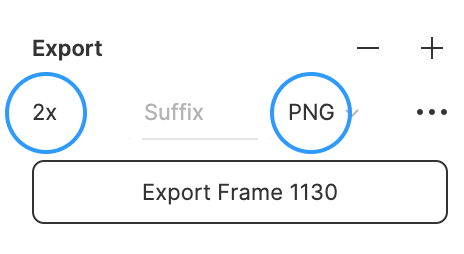

# Схемы

Бывает, объясняешь что-то, и вдруг спотыкаешься: «тут не расскажешь, это надо показывать». Если это случилось с вами при написании доки или статьи, значит, пришло время нарисовать схему.

Можно сделать набросок в любом удобном графическом редакторе или даже на бумаге. Разместите изображение в подпапке _images/_ в папке материала и добавьте в статью при помощи Markdown-синтаксиса. Со временем мы отрисуем вашу схему в дизайне Доки и обновим её.

Или творческий путь: если вы умеете работать с Figma, то можете создать схему в стиле Доки самостоятельно.

Это [публичная Figma](https://www.figma.com/file/QkdJkiqJDWpQFCfY2AU6Pp/%D0%9F%D1%83%D0%B1%D0%BB%D0%B8%D1%87%D0%BD%D0%B0%D1%8F-%D0%94%D0%BE%D0%BA%D0%B0%3A-%D0%A1%D1%85%D0%B5%D0%BC%D1%8B?node-id=0%3A1&t=jnGKTOqGRk6Bbelm-1) со схемами Доки. Она открыта для комментирования. Вы можете просматривать и копировать стили элементов, а также скопировать себе всё целиком для дальнейшей работы.

Две самые важные вещи размещены на странице «Guide»:

1. Пошаговая инструкция по созданию схемы с нуля.
1. Компоненты схем — мельчайшие кирпичики, из которых можно собрать свою схему. Их можно копировать, также они доступны в меню Assets.

На странице «Примеры» находятся уже собранные схемы. В них можно подсмотреть, как представить ту или иную информацию.

Не бойтесь, что нарисуете схему «как-то не так». Мы поможем в процессе ревью.

## Технические требования

Созданную в Figma схему экспортируйте в формате _PNG_ в масштабе _2x_:

Для схем, созданных в иных редакторах, придерживайтесь следующих требований:

* формат _PNG_,
* ширина изображения не менее _1200px_,
* текст достаточно крупный, чтобы прочитать его, не приближая картинку,
* тёмная цветовая тема, щадящая зрение при ночной работе.
