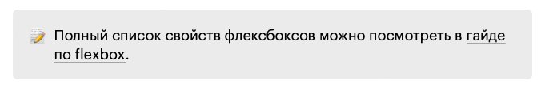

# Руководство по оформлению

Материалы Доки пишутся в разметке Markdown с небольшими вкраплениями HTML-кода при необходимости. У нас есть некоторые соглашения по оформлению.

Если на этой странице вы не нашли ответа на вопрос, как оформляется тот или иной элемент текста, посмотрите на портале «[Грамота](http://gramota.ru/)». Если нет и там — оформите, как считаете нужным, редактор разберётся.

## Разметка

1. Используйте заголовки от `<h2>` до `<h4>`.

    ```markdown
    ## Заголовок раздела
    ### Заголовок подраздела
    #### Самый маленький заголовок
    *жирный текст как совсем маленькое выделение*
    ```

    Не используйте заголовок первого уровня. На странице он всегда один и указывается в начале статьи в поле `title`.

    ```markdown
    ---
    title: "Я — название статьи"
    ---
    ```

1. Для выделения **жирным** используйте две звёздочки: `**болд**`, а для _курсива_ — одно нижнее подчёркивание: `_италик_`.

1. Выделяйте код и цифровые значения в тексте при помощи обратных апострофов (бэктиков):

    ⛔ По умолчанию значение свойства order равно 0.

    ✅ По умолчанию значение свойства `order` равно `0`.

    Блоки кода выделяются при помощи трёх бэктиков с указанием нужного языка:

    <pre>
    ```css
    .container {
      display: flex;
    }
    ```</pre>

1. Выделяйте блоки, на которые стоит обратить внимание:

    

    Это делается при помощи блока callout:

    ```markdown
    ::: callout 🥨
    ### Может быть заголовок
    
    Да что угодно, в принципе, может быть ¯\_(ツ)_/¯
    :::
    ```

1. Вся дополнительная информация к сведению должна скрываться в блок с подробностями при помощи тегов `<details>` и `<summary>`:

    ```html
    <details>
        <summary>Подробнее про блок с подробностями</summary>

        Здесь может быть длинный текст для тех, кто заинтересовался и раскрыл блок.

    </details>
    ```

1. Не используйте HTML там, где можно обойтись маркдауном. Особенности этого языка разметки вы можете найти в [официальной документации](https://daringfireball.net/projects/markdown/).

    Если вам нужен HTML, то между маркдауном и HTML-кодом должна быть пустая строка, чтобы движок правильно обработал страницу.

1. Для картинок укажите альтернативные описания.

1. Используйте эмодзи в разумных пределах. Удобно искать и копировать их поможет [сайт с набором эмодзи](https://ru.piliapp.com/emoji/list/).

1. Шорткаты оборачивайте в тег `<kbd>`, названия кнопок пишите через пробел, а не через плюс:

    ⛔ `Ctrl + T`

    ✅  <kbd>Ctrl T</kbd>

1. Юникод добавляйте живыми символами, а не мнемоникой:

    ⛔ `&rarr;`

    ✅  →

1. Теги пишем всегда в угловых скобках, чтобы не путать их с другими служебными словами:

    ⛔ `cite`

    ✅ `<cite>`

## Примеры кода

1. Если нужен пример кода, то для HTML и CSS воспользуйтесь стилями [БЭМ](https://ru.bem.info/) и [Airbnb CSS / Sass Styleguide](https://github.com/airbnb/css), а для JavaScript — [Airbnb JavaScript Style Guide() {](https://github.com/airbnb/javascript).

1. Комментируйте вставки кода — они должны быть понятны. Постарайтесь дать хорошее описание примера перед вставкой кода вместо большого количества комментариев в самом примере:

    ⛔ Плохо:

    При отсутствии точки с запятой можно случайно вернуть неверный результат из функции:

    ```js
    function getValue () {
      return
      42
    }
    // Функция возвращает `undefined`, а не `42`,
    // потому что JavaScript считает перенос за конец строки
    ```

    ✅ Хорошо:

    При отсутствии точки с запятой можно случайно вернуть неверный результат из функции. Вот пример функции, которая возвращает `undefined`, а не `42`, потому что JavaScript считает перенос за конец строки:

    ```js
    function getValue () {
      return
      42
    }
    ```

1. Избегайте ненастоящего кода: оформление комментариев не по правилам того языка, на котором ваш пример, многоточия посреди кода и т. п. Если вам нужно сократить код, напишите, что там должно было быть. Допустим, вы показываете тег `<title>` и хотите опустить прочие теги в `<head>`:

    ```html
    <head>
      <!-- Здесь что-то про кодировку, заголовок, фавиконку -->
      <title>Заголовок</title>
    </head>
    ```

1. Если вы приводите пример неправильного кода, объясните почему и чётко обозначьте, что **так делать нельзя**:

    ⛔ Так делать нельзя: модификатор не следует использовать без блока.

    ```html
    <!-- Не используйте этот код! -->
    <p>
        Обычный текст, <span class="text_red">красный текст</span>
    </p>
    ```

1. Комментарии в коде пишите над комментируемой строкой. Предложения в комментарии начинаются с заглавной буквы, точка в конце не ставится. По смысле можно поставить двоеточие. Не злоупотребляйте «закрывающими» комментариями — пользуйтесь ими только в случаях сложной структуры.

```css
li::before {
  /* Не забываем о свойстве content */
  content: "";
  width: 15px;
  height: 15px;
  border-radius: 50%;
  background-color: #ed6742;
  /* Задаём позиционирование: */
  position: absolute;
  left: -25px;
  top: 5px;
}
```

## Орфография и пунктуация

1. В конце предложения всегда ставится точка. Вместо точки можно закончить эмодзи 😀

    👆 В заголовках точки не ставятся!

1. В сокращениях ставится пробел:

    ⛔ т.к.

    ✅ т. к.

1. Оформляйте списки при помощи цифры с точкой или наборного знака (в маркдауне это дефис). В этом случае пункт пишется с прописной (большой) буквы, а в конце пункта ставится точка:

    1. Один.
    2. Два.

    - Один.
    - Два.

    Списки в подбор (как в этом предложении) оформляются а) при помощи буквы русского алфавита со скобкой; б) начинаются со строчной (маленькой) буквы; в) разделяются точкой с запятой.

1. Используйте букву Ё. Мы её любим ❤️

1. При написании вариантов через косую черту (`/`) пробелы не ставятся:

    ⛔ да / нет

    ✅ да/нет

1. Как оформлять математические символы:

    - Оси координат: «ось _x_» (строчная латинская буква, набранная италиком).

    - Точка: «точка A» (прописная латинская буква).

1. Единицы измерения в тексте отделяются от цифры пробелом. Принятые сокращения для -байтов: Гб и Гбайт (гигабайт). Допустимо также писать латиницей: Gb.

    ⛔ <!-- yaspeller ignore:start -->1Гб<!-- yaspeller ignore:end -->

    ✅ 1 Гб
