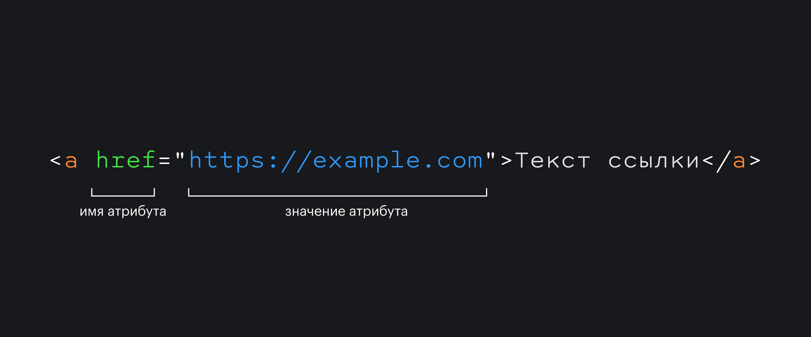

## Кратко

Тег `<a>` превращает любой объект в ссылку.

## Пример

```html
<a href="https://www.yandex.ru/">Яндекс</a>
```

<iframe title="Обычная ссылка" src="demos/basic/" height="140"></iframe>

## Как понять

Разместите текст, картинку или другой элемент внутри тега `<a>`, чтобы сделать его ссылкой. Ссылка может вести на любую страницу, файл, электронную почту или телефон. Для этого пропишите обязательный атрибут `href="URL"`, где URL — любой адрес.



Бывает, что ссылка ведёт не на другую страницу, а на раздел внутри текущей страницы. Тогда такая ссылка называется якорной или просто «якорем». Чтобы её создать, вместо URL укажите идентификатор `#id` элемента, к которому должна вести ссылка. Например, `<a href="#chapter1">Глава 1</a>`. Идентификатор можно задать для любого тега, то есть «бросить якорь» в любую часть страницы.

## Как пишется

```html
<a href="URL">...</a>
```

## Атрибуты

`download` — если кликнуть по такой ссылке, браузер предложит пользователю скачать то, что по ней находится. Это может быть файл или другая страница — главное, чтобы они находились на том же домене, что и ссылка. Если добавить атрибуту значение, можно задать название скачиваемому файлу. Например, `<a href="/?z=484c08ca" download="фотки.zip">` предложит скачать файл с названием _фотки.zip_. Пользователь сможет изменить название при скачивании.

`href` — обязательный атрибут, содержащий адрес, по которому перейдёт пользователь, нажав на ссылку. Это может быть либо URL-адрес, либо якорная ссылка `#id`. Якорная ссылка ведёт на элемент с таким же `#id` на этой странице. URL может вести не только на привычные страницы в интернете, но также на почту или телефон, например `href="mailto:name@domain.com"` или `href="tel:+70001234567"`. Для этого добавьте в значение атрибута один из протоколов, например, `file:`, `mailto:` или `tel:`.

`hreflang` — указывает язык документа, на который ведёт ссылка. Этот атрибут нужен, только если у вашей страницы есть версия на другом языке. `hreflang` помогает поисковикам выдавать версию на нужном языке, в зависимости от того, в какой стране находится пользователь.

`ping` — этот коварный атрибут следит, что пользователь перешёл по тому URL-адресу, который в нём указан.

`rel` — определяет отношение между страницей, где находится ссылка, и страницей или файлом, куда она ведёт. Обычно это очень техническая информация, которая нужна браузерам и разработчикам, чтобы определять, что находится по ссылке, и, в некоторых случаях, какое действие нужно выполнить сайту, который открывается по ссылке.

`target` — определяет, где откроется ссылка: в том же окне, в новой вкладке или в новом окне браузера. Без этого атрибута содержимое ссылки откроется в той же вкладке. Вот все варианты, где можно открыть URL-ссылку:

- `_self`: на той же странице. Значение по умолчанию, если именно оно вам нужно, то можно не указывать этот атрибут.
- `_blank`: в новой вкладке или в новом окне браузера — это зависит от настроек браузера, но чаще всего это именно вкладка.
- `_parent`: на родительской странице от текущей, то есть уровнем вложенности выше. Например, если на страницу вставлен фрейм, а внутри него такая ссылка, то она откроется не внутри фрейма, а на той странице, куда вставлен этот фрейм. Если родительской страницы нет, то ссылка откроется вместо текущей страницы.
- `_top`: в самой высокой «корневой» странице. Например, если есть страница, куда вставлен фрейм, в который вставлен фрейм, в котором ссылка c `target="_top"`, то ссылка откроется в самой-самой верхней странице, насколько глубоко она бы ни находилась.

Используйте этот атрибут, только если указан `href`.

💡 Вместе с атрибутом `target` обязательно используйте `rel="noopener noreferrer"`, чтобы в момент открытия внешние сайты не узнали лишнего про текущую страницу.

`type` — определяет, к какому типу относится документ по ссылке. Речь идёт о типах по стандарту MIME. Это чисто техническая информация, но её можно указать, чтобы применить общий стиль к ссылкам одного типа.

`title` — это глобальный атрибут, который можно использовать и для ссылок. Он содержит текст, который будет виден при наведении на ссылку.

## Подсказки

💡 Чтобы отправить пользователя в самый верх страницы, используйте `href="#top"` или `href="#"`.

💡 Обязательно указывайте атрибут `href` для ссылок, без него они неотличимы от `<span>` и перестают иметь смысл. Спецификация HTML допускает «логические» ссылки без `href` для текущих или будущих ссылок, но практической пользы в этом мало.

💡 Якорная ссылка может также вести и на нужный раздел внешней страницы. Для этого используйте URL-ссылку, а в конце,  после знака `#`, добавьте ID якоря. Например: `https://yoursite.com/how-to-make-cookies#alternative-recipe`

## Ещё примеры

Сделаем так, чтобы ссылка открывалась в новой вкладке браузера:

```html
<a href="https://doka.guide/" target="_blank">
  
</a>
```

<iframe title="Ссылка на изображении" src="demos/image/" height="300"></iframe>

Сделаем ссылку для отправки письма на почту:

```html
<a href="mailto:nowhere@yandex.ru">Отправить сообщение в никуда</a>
```

<iframe title="Ссылка mailto" src="demos/mail/" height="140"></iframe>
