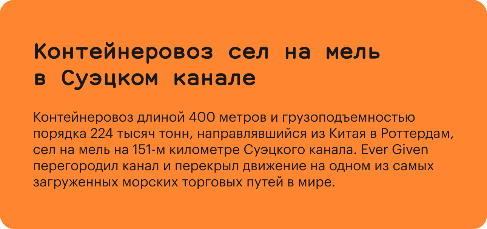

По мере развития стандарта HTML в него добавлялись новые теги и убирались [неактуальные](/html/deprecated-tags/). В HTML5 большой упор был сделан на семантический смысл тегов, а всё, что касалось визуальной составляющей, было отдано на откуп CSS. То есть теперь использование тех или иных тегов определяется их функциональным назначением, а не тем, как тег влияет на внешний вид элемента.

С переходом на стандарт HTML5 из перечня тегов были исключены практически все оформительские (например, [`<small>`](/html/small/) или `<font>`). При этом разработчики стандарта оставили довольно спорный тег `<br>`. Спорный потому, что часто у разработчиков нет полного понимания, когда его следует применять.

## Правильное применение тега

Стандарт однозначно описывает назначение этого тега и ситуации, в которых уместно его применение: этот тег указывает на место разрыва строки и принудительного переноса текста на новую строку. И только для этих целей он должен применяться. Яркий пример — деление стихотворения по строкам:

```html
<p>
  Мой дядя самых честных правил,<br>
  Когда не в шутку занемог,<br>
  Он уважать себя заставил<br>
  И лучше выдумать не мог.
</p>
```

Ещё одним примером может служить вёрстка почтового адреса, когда принципиально разнести части адреса по разным строкам:

```html
<address>
  432000<br>
  г. Ульяновск<br>
  ул. Ленина, д. 34
</address>
```

Обратите внимание: в обоих примерах текст является связанным. Другими словами, каждая новая строка по смыслу является частью всего текста.

## Случаи неправильного применения тега

### Неправильное объединение элементов в группу

А вот такое употребление `<br>` будет неверным, потому что каждая строка по сути является самостоятельной группой и должна быть выделена в отдельный абзац:

Неправильно:

```html
<p>
  <label>Имя: <input name="name"></label><br>
  <label>Адрес: <input name="address"></label>
</p>
```

Правильно:

```html
<p><label>Имя: <input name="name"></label></p>
<p><label>Адрес: <input name="address"></label></p>
```

### Вертикальные отступы

Ещё один пример неправильного употребления тега — использование его в декоративных целях: для задания вертикальных отступов между элементами. Вертикальные отступы — часть визуального оформления страницы, и должны задаваться исключительно в CSS.

Неправильно:

```html
<article>
  <h2>Контейнеровоз сел на мель в Суэцком канале</h2>
  <p>...</p>
</article>
<br>
<br>
<article>
  <h2>Во всём мире наблюдается дефицит чипов</h2>
  <p>...</p>
</article>
```

Правильно с использованием CSS:

```html
<article>
  <h2>Контейнеровоз сел на мель в Суэцком канале</h2>
  <p>...</p>
</article>
<article>
  <h2>Во всём мире наблюдается дефицит чипов</h2>
  <p>...</p>
</article>
```

```css
article {
  margin-bottom: 2em;
}
```

Важно упомянуть, что при использовании `<br>` для вертикальных отступов между блочными элементами величина отступа напрямую зависит от размера шрифта родителя.

<iframe title="Зависимость размера br от размера шрифта родителя" src="demos/dependence-of-size/" height="450"></iframe>

## Переносы в заголовках

Зачастую на вёрстку приходят макеты, в которых дизайнер размещает текст в заголовках таким образом, чтобы он красиво смотрелся. Переносит слова и балансирует длину строк так, чтобы макет смотрелся опрятно.



И верстальщик воплощает задумку дизайнера, добавляя `<br>` в заголовок, чтобы вёрстка смотрелась в точности как на макете. Это, в целом, нормальная практика, но нужно помнить о том, что это может быть не всегда уместно.

Например, при адаптивной вёрстке слова в заголовке перестроятся, а разрыв строки никуда не денется. В результате заголовок будет вести себя неестественно: слова перенесутся не там, где должны.

<iframe title="Переносы текста" src="demos/basic/" height="300"></iframe>

Попробуйте поизменять ширину окна в примере выше. Во втором блоке мы видим, что заголовок неестественно разрывает строки на малой ширине. Всё потому, что через CSS мы не можем управлять поведением `<br>`, и этот тег продолжает разрывать строку, несмотря ни на что.

Таким образом, использовать `<br>` можно, но с осторожностью, с оглядкой на спецификацию и здравый смысл.
