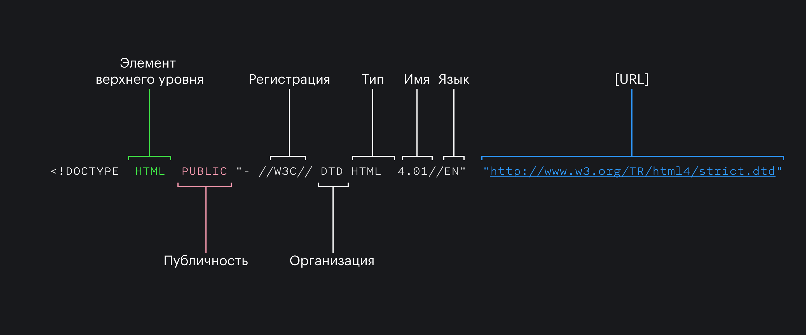

## Кратко

`<!DOCTYPE>` или «доктайп» — это сокращение от «тип документа» (document type). Доктайп говорит браузеру: «работай со страницей в стандартном режиме, пожалуйста». Единственный доктайп, который вам нужно знать — это `<!DOCTYPE html>`. Поставьте его первой строчкой HTML-документа, и браузер обработает страницу правильно.

## Пример

```html
<!DOCTYPE html>
<html lang="ru">
  <head>
    <meta charset="UTF-8">
    <meta name="viewport" content="width=device-width,initial-scale=1">
    <title>Дока</title>
    <link rel="stylesheet" href="/assets/styles/main.css">
  </head>
</html>
```



## Как пишется

```html
<!DOCTYPE html>
```

## Как понять

Есть несколько исторических версий HTML, включая специальную — XHTML. Все они обозначались своими доктайпами и их вариациями, которые вы можете встретить в старом коде:

```html
<!DOCTYPE HTML PUBLIC "-//W3C//DTD HTML 3.2 Final//EN">
<!DOCTYPE HTML PUBLIC "-//W3C//DTD HTML 4.01 Transitional//EN" "http://www.w3.org/TR/html4/loose.dtd">
<!DOCTYPE html PUBLIC "-//W3C//DTD XHTML 1.0 Strict//EN" "http://www.w3.org/TR/xhtml1/DTD/xhtml1-strict.dtd">
```

Сегодня доктайп [по спецификации](https://html.spec.whatwg.org/multipage/syntax.html#the-doctype) нужен исключительно потому, что без него браузеры переключатся в режим совместимости со старым кодом (quirks mode). Поверьте, вы не хотите оказаться в режиме совместимости. Чтобы переключить браузер в стандартный режим (standards mode), достаточно написать в самом начале документа: `<!DOCTYPE html>`. Это единственный стандартный доктайп для современного HTML. Всё, что сверх этого — только риск лишней путаницы и для автора, и для браузера.

Теги и атрибуты в HTML не зависят от регистра (хотя доктайп это не тег, строго говоря), поэтому все вариации ниже абсолютно равнозначны, даже последняя — но лучше не надо так писать.

```html
<!DOCTYPE html>
<!DOCTYPE HTML>
<!doctype HTML>
<!doctype html>
<!DoCtYPe hTMl>
```

Доктайп стал для HTML чем-то вроде [`use strict`](/js/use-strict/) в JS.
