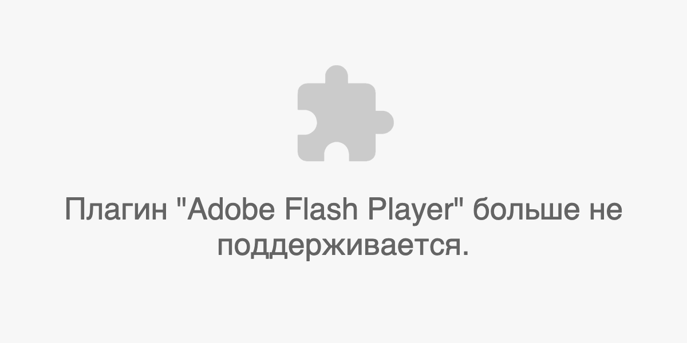

## Кратко

Магический блок для вставки на страницу контента в сторонних форматах, которые браузер отображает с помощью плагинов. Чаще всего используется для видео- и аудиоконтента.

Отображение вставленного контента будет зависеть от атрибутов тега `<embed>`, типа загружаемого контента и плагинов, установленных в браузере.

## Пример

```html
<embed src="sample.pdf" type="application/pdf">
```

<iframe title="Вставка PDF" src="demos/embed-pdf/" height="400"></iframe>

## Как понять

Тег `<embed>` создаёт своеобразное окошко, в котором отображается подгружаемый контент.
Чем-то его поведение похоже на теги [`<object>`](/html/object/) и [`<iframe>`](/html/iframe/).

## Как пишется

Тег `<embed>` одиночный, его не нужно закрывать.

### Атрибуты

- `src` — ссылка на загружаемый контент.
- `type` — тип загружаемого контента в формате [MIME](https://ru.wikipedia.org/wiki/Список_MIME-типов). Тип указывать не обязательно, но желательно. Так браузер будет точно знать, какой плагин использовать для отображения контента.
- `width` — ширина в пикселях.
- `height` — высота в пикселях.

При указании ширины и высоты проценты недопустимы. Указывается только число, без единиц измерения.

Помимо этих атрибутов можно использовать любые [глобальные атрибуты](/html/global-attrs/).

## Подсказки

💡 Тег `<embed>` довольно старый. Некоторые современные браузеры отказались от его поддержки. Лучше использовать вместо него `<object>`.

💡 Если на компьютере пользователя не установлен нужный для отображения контента плагин, то он увидит в окне предупреждение:


```html
<embed src="player.swf" type="application/x-shockwave-flash">
```


