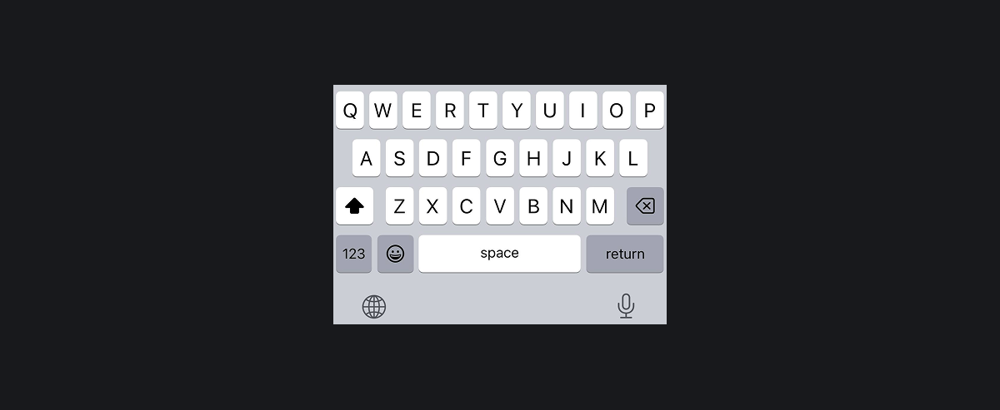
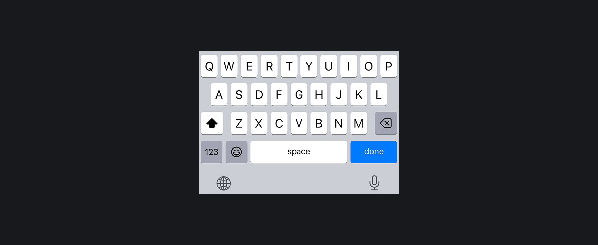
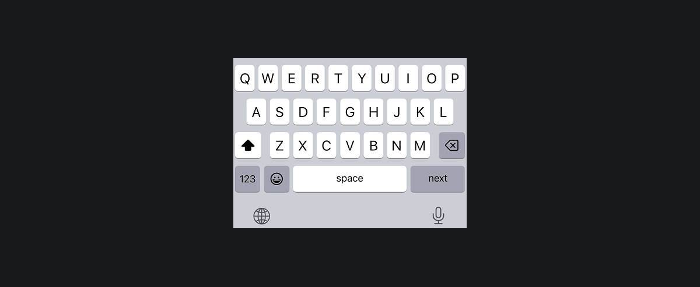
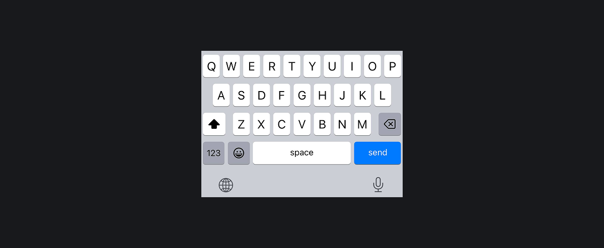

## Кратко

[Глобальный атрибут](/html/global-attrs/) `enterkeyhint` применяется к элементам формы (например, [`<input>`](/html/input/), [`<textarea>`](/html/textarea/)) или для любых элементов с атрибутом [`contenteditable`](/html/global-attrs/#contenteditable). Подсказывает браузеру, как должна выглядеть клавиша ввода на экранной клавиатуре.

## Пример

```html
<input type="text" enterkeyhint="search">

<p contenteditable enterkeyhint="enter"></p>
```

## Как пишется

Атрибут `enterkeyhint` принимает одно из следующих значений:

### `enter`

Значение по умолчанию. Метка будет изменена на текст <kbd>return</kbd> или иконку <kbd>↵</kbd>. Означает переход на новую строку.



### `done`

Метка изменится на текст <kbd>done</kbd> или иконку <kbd>✓</kbd>. Означает, что больше нечего вводить и виртуальная клавиатура закроется.



### `go`

Метка изменится на текст <kbd>go</kbd> или иконку <kbd>→</kbd>. Означает переход к следующему целевому объекту введённого текста.


### `next`

Метка изменится на текст <kbd>next</kbd> или иконку <kbd>⇥</kbd>. Означает переход к следующему полю ввода.



### `previous`

Метка изменится на текст <kbd>return</kbd> или иконку <kbd>⇤</kbd>. Означает переход к предыдущему полю ввода.


### `search`

Метка изменится на текст <kbd>search</kbd> или иконку <kbd>🔍</kbd>. Означает переход к результатам поиска.


### `send`

Метка изменится на текст <kbd>send</kbd>. Означает отправку текста.



## Как понять

Чтобы улучшить работу с формами, у элементов управления можно указать атрибут [`inputmode`](/html/inputmode/) — он задаёт тип экранной клавиатуры. Дополнительно атрибут `enterkeyhint` позволяет выбрать надпись или иконку на клавише ввода, подсказывая пользователю, что произойдёт при нажатии.

Посмотрите на смартфоне или планшете, как будет изменяться клавиша ввода в каждом из полей:

<iframe title="Поля с разными метками клавиши ввода" src="demos/basic/" height="720"></iframe>

## Подсказки

💡 Если атрибут `enterkeyhint` не указан, пользовательский агент использует контекстную информацию из атрибутов `inputmode`, [`type`](/html/input/#type) или [`pattern`](/html/pattern/) для отображения подходящего значения.
💡 Несмотря на значения `next` и `previous`, клавиша <kbd>enter</kbd> всё равно отправит форму. Поэтому лучше использовать их там, где пользователь просто переходит между полями.
